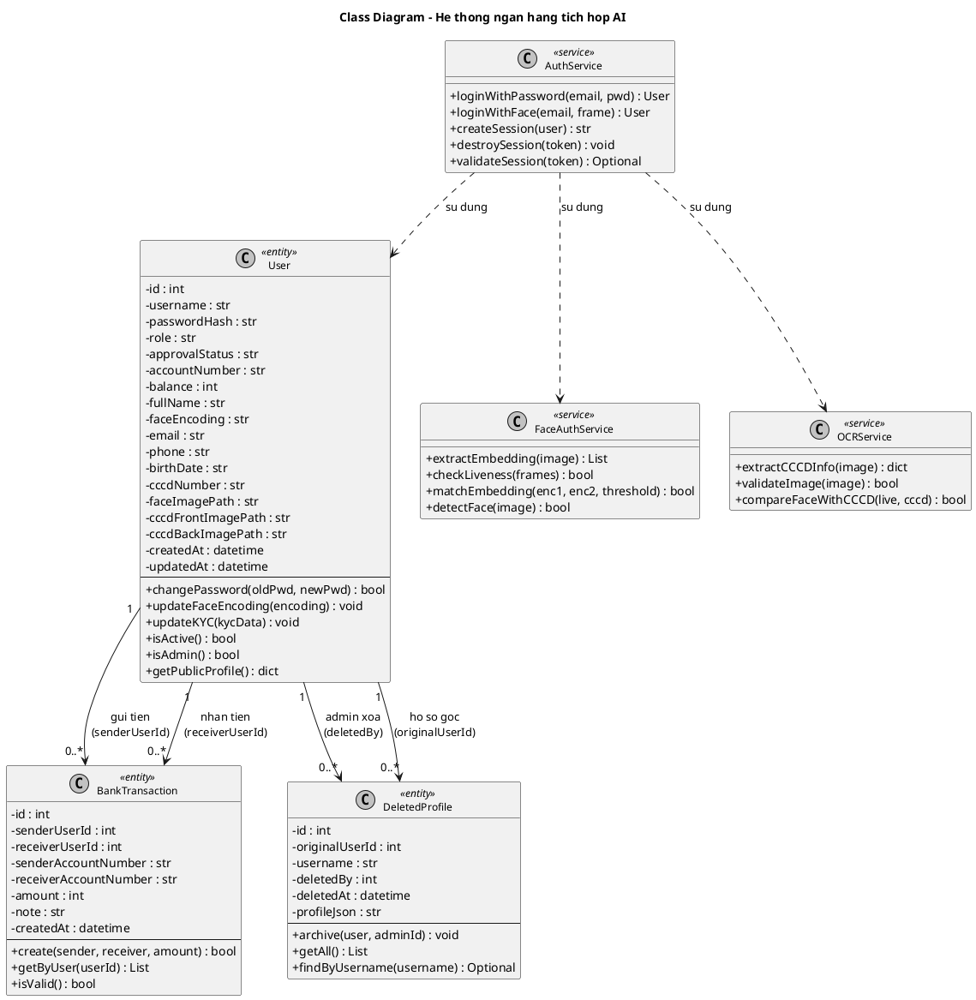

# TIEU LUAN

## De tai

Xay dung he thong ngan hang co tich hop AI trong nhan dien khuon mat.

## Thong tin sinh vien

- Ho va ten: [Dien ho ten]
- MSSV: [Dien MSSV]
- Lop: [Dien lop]
- Mon hoc: [Dien ten mon]
- Giang vien huong dan: [Dien ten GV]
- Ngay nop: [Dien ngay]

## Tom tat

[Tom tat 150-250 tu ve muc tieu, phuong phap, ket qua va dong gop cua de tai.]

## Tu khoa

- Ngan hang so
- Nhan dien khuon mat
- AI
- OCR CCCD
- Xac thuc sinh trac hoc

---

## Chương 1. Giới thiệu

### 1.1 Lý do chọn dự án

Trong những năm gần đây, chuyển đổi số trong lĩnh vực tài chính - ngân hàng diễn ra rất nhanh.
Người dùng có xu hướng thực hiện phần lớn giao dịch trên kênh số thay vì đến quầy truyền thống.
Khi lưu lượng giao dịch trực tuyến tăng, bài toán xác thực danh tính trở thành yêu cầu cốt lõi.
Nếu xác thực không tốt, hệ thống dễ bị gian lận, chiếm đoạt tài khoản và lộ dữ liệu nhạy cảm.
Nếu xác thực quá phức tạp, người dùng dễ bỏ cuộc vì trải nghiệm không thuận tiện.
Do đó, cần có giải pháp vừa an toàn vừa dễ sử dụng.

Phương thức xác thực bằng mật khẩu vẫn phổ biến nhưng có nhiều hạn chế.
Mật khẩu có thể bị đoán, bị lộ, bị tái sử dụng giữa nhiều nền tảng.
Người dùng thường đặt mật khẩu dễ nhớ, dẫn đến giảm mức độ bảo mật.
Trong bối cảnh tấn công mạng ngày càng tinh vi, chỉ dùng mật khẩu là không đủ.

Xác thực sinh trắc học, đặc biệt là nhận diện khuôn mặt, mở ra hướng tiếp cận mới.
Khuôn mặt là đặc điểm gắn liền với mỗi người, khó chia sẻ hơn so với mật khẩu.
Khi kết hợp với kiểm tra liveness, hệ thống có thể giảm nguy cơ giả mạo bằng ảnh hoặc video.
Ngoài ra, với người dùng cuối, việc đưa mặt vào camera thường nhanh và tự nhiên hơn việc nhập mật khẩu dài.

Bên cạnh xác thực khuôn mặt, bài toán onboarding/KYC cũng là phần quan trọng.
Nếu nhập tay thông tin từ CCCD, tỉ lệ sai sót cao và tốn nhiều thời gian xử lý.
OCR có thể hỗ trợ đọc thông tin từ giấy tờ tự động, giảm công việc thủ công.
Khi kết hợp OCR với đối chiếu khuôn mặt CCCD và ảnh chụp live, độ tin cậy của đăng ký được nâng cao.

Từ những lý do trên, dự án "Xây dựng hệ thống ngân hàng có tích hợp AI trong nhận diện khuôn mặt" được lựa chọn.
dự án nhằm giải quyết đồng thời ba bài toán.
Một là xác thực người dùng an toàn hơn.
Hai là tối ưu trải nghiệm đăng ký và đăng nhập.
Ba là xây dựng khung hệ thống có tính thực tiễn để mở rộng.

Ngoài giá trị học thuật, dự án còn có ý nghĩa thực hành kỹ thuật.
Sinh viên có cơ hội kết hợp kiến thức backend, frontend, AI/CV, cơ sở dữ liệu và an toàn thông tin.
Qua đó, sản phẩm cuối cùng không chỉ là mô tả lý thuyết mà là một hệ thống có thể chạy thử và đánh giá được.

### 1.2 Mục tiêu dự án

Mục tiêu tổng quát của dự án là xây dựng một hệ thống mô phỏng ngân hàng số có tích hợp AI.
Hệ thống phải thể hiện được quy trình nghiệp vụ rõ ràng, có khả năng vận hành ổn định trong môi trường thử nghiệm.
Đồng thời, hệ thống phải chứng minh được giá trị của thành phần AI trong bài toán xác thực.

Từ mục tiêu tổng quát, dự án đặt ra các mục tiêu cụ thể như sau.

1. Xây dựng được bộ chức năng cốt lõi của một hệ thống ngân hàng mô phỏng.
2. Hỗ trợ đăng ký tài khoản, đăng nhập, quản lý hồ sơ, quản trị người dùng.
3. Hỗ trợ giao dịch chuyển khoản nội địa và lưu vết lịch sử giao dịch.
4. Tích hợp nhận diện khuôn mặt vào luồng đăng nhập.
5. Tích hợp kiểm tra liveness để giảm nguy cơ gian lận bằng hình ảnh giả.
6. Tích hợp OCR CCCD để trích xuất thông tin và hỗ trợ KYC.
7. Thiết kế hệ thống theo hướng có thể mở rộng trong các giai đoạn tiếp theo.

Mục tiêu kỹ thuật của dự án được cụ thể hóa thành các nhóm.

Nhóm 1 là mục tiêu về kiến trúc hệ thống.
Hệ thống cần tách được lớp giao diện, lớp xử lý nghiệp vụ và lớp dữ liệu.
Cần có cơ chế session và phân quyền để đảm bảo đúng vai trò user/admin.

Nhóm 2 là mục tiêu về AI/CV.
Hệ thống cần trích xuất được đặc trưng khuôn mặt từ ảnh đầu vào.
Hệ thống cần so khớp embedding với ngưỡng xác định để quyết định chấp nhận hay từ chối.
Hệ thống cần có bước kiểm tra sống (liveness) trước khi thực hiện verify.

Nhóm 3 là mục tiêu về nghiệp vụ và trải nghiệm.
Người dùng phải có luồng thao tác rõ ràng, dễ hiểu, ít bước dư thừa.
Trạng thái tài khoản (pending, approved, rejected, locked) phải được thể hiện minh bạch.
Admin phải có công cụ duyệt và quản trị dữ liệu thuận tiện.

Nhóm 4 là mục tiêu về đánh giá.
Hệ thống cần được kiểm thử thông qua các tình huống nghiệp vụ chính.
Kết quả cần cho thấy các chức năng vận hành đúng và dữ liệu được lưu trữ nhất quán.

Với các mục tiêu trên, dự án hướng đến một sản phẩm hoàn chỉnh ở mức học tập - ứng dụng.
Sản phẩm không thay thế hệ thống core banking thực tế.
Tuy nhiên, sản phẩm đủ để chứng minh hướng tiếp cận tích hợp AI trong xác thực ngân hàng số.

### 1.3 Phạm vi dự án

Phạm vi dự án được xác định rõ để đảm bảo tính khả thi trong thời gian thực hiện.
Việc xác định phạm vi giúp tránh tình trạng mở rộng quá lớn, dẫn đến không hoàn thành được sản phẩm.

Trong phạm vi "có thực hiện", dự án bao gồm:

1. Xây dựng giao diện đăng ký, đăng nhập, dashboard user, dashboard admin.
2. Hỗ trợ đăng ký với thông tin cơ bản và ảnh khuôn mặt.
3. Hỗ trợ upload CCCD mặt trước, mặt sau và OCR trích xuất thông tin.
4. Kiểm tra trùng tài khoản và trùng thông tin CCCD ở mức nghiệp vụ cần thiết.
5. Hỗ trợ đăng nhập bằng mật khẩu.
6. Hỗ trợ đăng nhập bằng khuôn mặt kết hợp kiểm tra liveness.
7. Hỗ trợ cập nhật khuôn mặt sau đăng nhập.
8. Hỗ trợ cập nhật KYC và đổi mật khẩu.
9. Hỗ trợ chuyển khoản nội địa giữa hai tài khoản trong hệ thống.
10. Hỗ trợ xem lịch sử giao dịch và thống kê cơ bản.
11. Hỗ trợ admin duyệt tài khoản, khóa/mở khóa, reset dữ liệu khuôn mặt, xóa tài khoản.
12. Hỗ trợ lưu vết hồ sơ đã xóa để phục vụ kiểm tra.

Trong phạm vi "không thực hiện" hoặc "chưa đạt mức độ sẵn sàng":

1. Không tích hợp trực tiếp với core banking thực tế.
2. Không kết nối liên ngân hàng, không xử lý chuyển khoản liên ngân hàng.
3. Không triển khai hạ tầng production quy mô lớn.
4. Không bao gồm đầy đủ yêu cầu tuân thủ pháp lý như một tổ chức tài chính thật.
5. Không bao gồm quy trình vận hành 24/7 với SLA chuẩn doanh nghiệp lớn.
6. Không bao gồm hệ thống phòng thủ bảo mật đa lớp ở mức cao nhất.
7. Không thay thế các cơ chế xác thực bắt buộc của ngân hàng thương mại.

Phạm vi trên phù hợp với đặc thù dự án học phần/tiểu luận.
Mục tiêu là xây dựng prototype có giá trị chuyên môn, không phải triển khai thương mại ngay lập tức.

Ngoài ra, dự án tập trung vào tính đúng đắn về nghiệp vụ và luồng xử lý dữ liệu.
Do đó, các tiêu chí giao diện sẽ được ưu tiên ở mức "dễ sử dụng" thay vì "tối ưu mỹ thuật".
Tiêu chí hiệu năng được đánh giá trên dữ liệu và lưu lượng tải hợp lý cho môi trường học tập.

Việc quy định rõ phạm vi cũng giúp người đọc đánh giá đúng kết quả dự án.
Nếu đánh giá theo tiêu chí production banking, dự án sẽ chưa đầy đủ.
Nếu đánh giá theo tiêu chí hệ thống mô phỏng có tích hợp AI và có khả năng chạy thực tế, dự án là phù hợp.

### 1.4 Cấu trúc báo cáo

Báo cáo được tổ chức thành các chương theo trình tự từ lý thuyết đến triển khai.
Mỗi chương có vai trò riêng và liên kết logic với nhau.

Chương 1 trình bày bối cảnh, tính cấp thiết, mục tiêu, phạm vi và hướng tiếp cận của dự án.
Đây là nền tảng để người đọc hiểu vì sao dự án được hình thành và dự án giải quyết vấn đề gì.

Chương 2 trình bày phân tích yêu cầu và nghiệp vụ của hệ thống.
Nội dung bao gồm xác định các bên liên quan, yêu cầu chức năng theo từng vai trò, yêu cầu phi chức năng và các luồng nghiệp vụ chính.
Chương này là cơ sở để thiết kế và triển khai ở các chương sau.

Chương 3 trình bày phân tích và thiết kế hệ thống.
Người đọc sẽ thấy được yêu cầu chức năng, yêu cầu phi chức năng, kiến trúc tổng thể, thiết kế dữ liệu và các luồng nghiệp vụ chính.
Mục đích của chương này là xác lập bản thiết kế rõ ràng trước khi vào triển khai.

Chương 4 trình bày quá trình triển khai hệ thống.
Nội dung gồm công nghệ sử dụng, mô tả module, API tiêu biểu và cách chạy thử.
Chương này cho thấy sản phẩm được hiện thực như thế nào trong thực tế.

Chương 5 trình bày đánh giá kết quả.
Bao gồm kết quả đạt được, ưu điểm, hạn chế và hướng phát triển.
Đây là phần kết nối giữa sản phẩm hiện tại và các mở rộng trong tương lai.

Phần kết luận tổng hợp lại đóng góp chính của dự án.
Phần tài liệu tham khảo và phụ lục cung cấp bằng chứng và nguồn thông tin bổ trợ.

Với cấu trúc trên, người đọc có thể theo dõi dự án theo hướng từ "tại sao" đến "làm gì", rồi đến "làm như thế nào", và cuối cùng là "đạt được gì".

### 1.5 Đối tượng nghiên cứu và đối tượng áp dụng

dự án hướng đến đối tượng nghiên cứu là mô hình xác thực người dùng trong ứng dụng ngân hàng số.
Trong mô hình này, hệ thống phải cân bằng giữa ba yếu tố.
Một là mức độ an toàn.
Hai là trải nghiệm người dùng.
Ba là khả năng triển khai thực tế ở quy mô vừa và nhỏ.

Đối tượng áp dụng trực tiếp của hệ thống bao gồm:

1. Người dùng cuối có nhu cầu đăng ký và giao dịch trên nền tảng số.
2. Quản trị viên cần công cụ duyệt và quản lý tài khoản.
3. Nhóm phát triển cần một bộ mẫu hệ thống để nghiên cứu mở rộng.

Trong bối cảnh học tập, đối tượng áp dụng có thể là lớp học, phòng thí nghiệm hoặc nhóm nghiên cứu nhỏ.
Trong bối cảnh nghiên cứu, hệ thống có thể làm mẫu đối sánh với các phương án xác thực khác.

dự án không chỉ tập trung vào một thủ tục kỹ thuật đơn lẻ.
Thay vào đó, dự án xem toàn bộ vòng đời sử dụng tài khoản.
Từ đăng ký, duyệt, đăng nhập, cập nhật thông tin, đến giao dịch và giám sát.

Cần tiếp cận theo hướng hệ thống như vậy để thấy được giá trị thực sự của AI.
Nếu chỉ tách riêng module nhận diện khuôn mặt, ta khó đánh giá được tác động lên nghiệp vụ tổng thể.

### 1.6 Phương pháp thực hiện dự án

dự án được thực hiện theo phương pháp kết hợp giữa nghiên cứu lý thuyết và xây dựng sản phẩm.

Bước 1 là khảo sát vấn đề.
Nhóm nghiên cứu tổng hợp các hạn chế của xác thực truyền thống.
Đồng thời tìm hiểu các hướng tiếp cận sinh trắc học trong ứng dụng tài chính.

Bước 2 là định nghĩa yêu cầu.
Từ bối cảnh thực tế, nhóm xác lập danh sách chức năng cần có.
Các chức năng được phân thành nhóm user, admin và hệ thống AI.

Bước 3 là thiết kế kiến trúc.
Nhóm lựa chọn mô hình frontend - backend - database để đảm bảo dễ triển khai và dễ mở rộng.
Thành phần AI được tích hợp thành các endpoint riêng để dễ bảo trì.

Bước 4 là triển khai module.
Tiến hành lập trình backend xử lý nghiệp vụ.
Lập trình frontend cho các màn hình và luồng thao tác.
Tích hợp OCR, face verification và liveness vào các bước cần thiết.

Bước 5 là kiểm thử và hiệu chỉnh.
Nhóm xây dựng các tình huống test cho từng luồng nghiệp vụ.
Kiểm tra lỗi đầu vào, phân quyền, tính nhất quán dữ liệu và kết quả phản hồi.

Bước 6 là đánh giá kết quả.
Tổng hợp những gì đạt được.
Đối chiếu với mục tiêu ban đầu.
Xác định hạn chế và đề xuất hướng phát triển.

Phương pháp trên phù hợp với dự án ứng dụng.
Nó đảm bảo sản phẩm cuối cùng vừa có nền tảng lý thuyết, vừa có bằng chứng triển khai cụ thể.

### 1.7 Đóng góp chính của dự án

dự án có các đóng góp chính sau đây.

Đóng góp thứ nhất là xây dựng được một hệ thống mô phỏng nghiệp vụ ngân hàng có khả năng chạy thực tế.
Hệ thống không dừng ở mức mô tả ý tưởng, mà đã hiện thực thành các luồng thao tác cụ thể.

Đóng góp thứ hai là chứng minh khả năng tích hợp AI vào bài toán xác thực.
AI được áp dụng đúng vị trí nghiệp vụ.
Không chỉ để trình diễn kỹ thuật, mà để nâng cao chất lượng xác thực.

Đóng góp thứ ba là kết hợp OCR CCCD với quy trình đăng ký.
Điều này giúp giảm nhập liệu thủ công và tăng tính nhất quán thông tin.

Đóng góp thứ tư là bổ sung vai trò quản trị viên rõ ràng.
Admin có thể duyệt tài khoản, khóa/mở khóa và can thiệp dữ liệu khi cần.
Thành phần này phản ánh đúng đặc thù quản lý trong hệ thống tài chính.

Đóng góp thứ năm là tạo ra bộ nền để mở rộng.
Với kiến trúc hiện tại, có thể tiếp tục thêm MFA, thông báo, audit, bảo mật nâng cao và tối ưu hiệu năng.

Ngoài đóng góp sản phẩm, dự án còn đóng góp về mặt học tập.
Nó giúp kết nối kiến thức đa lĩnh vực thành một bài toán liên ngành.
Quá trình này tạo kinh nghiệm thực tiễn cho người thực hiện.

### 1.8 Hạn chế và định hướng nghiên cứu tiếp theo

Mặc dù đạt được nhiều kết quả tích cực, dự án vẫn có các giới hạn.

Thứ nhất, hệ thống mới ở mức prototype.
Khả năng đáp ứng tải cao và khả năng chống tấn công nâng cao chưa được kiểm chứng đầy đủ.

Thứ hai, chất lượng nhận diện khuôn mặt phụ thuộc vào chất lượng camera và điều kiện ánh sáng.
Trong môi trường thực tế phức tạp, độ chính xác có thể dao động.

Thứ ba, OCR CCCD có thể gặp khó với ảnh mờ, lệch hoặc bị che mất thông tin.
Cần có cơ chế kiểm tra và can thiệp bổ sung để đảm bảo dữ liệu đúng.

Thứ tư, dự án chưa bao gồm đầy đủ các tiêu chuẩn tuân thủ ngành tài chính ở mức thương mại.
Ví dụ, quản trị khóa mã hóa tập trung, audit chi tiết theo chuẩn doanh nghiệp và quy trình vận hành sự cố.

Từ các hạn chế trên, một số định hướng tiếp theo được đề xuất:

1. Tích hợp xác thực đa yếu tố (MFA) với OTP hoặc token.
2. Nâng cấp mô hình anti-spoofing chuyên sâu hơn.
3. Bổ sung mã hóa dữ liệu nhạy cảm ở mức trường thông tin và kênh truyền.
4. Xây dựng hệ thống log và audit đầy đủ cho mục đích truy vết.
5. Thiết lập bộ test tự động và bộ benchmark hiệu năng.
6. Nghiên cứu mở rộng sang mô hình triển khai microservices khi quy mô tăng.

Nhìn chung, hạn chế là điều thường gặp trong dự án học tập.
Quan trọng là dự án đã tạo được khung nền đúng để tiếp tục nâng cấp.
Đó cũng là giá trị có ý nghĩa nhất của hướng nghiên cứu này.

### 1.9 Tiểu kết chương

Chương 1 đã trình bày bối cảnh, tính cấp thiết, mục tiêu, phạm vi và hướng tiếp cận của dự án.
Nội dung chương xác lập rõ ràng rằng dự án hướng đến một hệ thống ngân hàng mô phỏng có tích hợp AI nhận diện khuôn mặt.
Đồng thời, chương này cũng chỉ ra giới hạn và hướng mở rộng để tránh kỳ vọng sai lệch.
Trên cơ sở đó, các chương tiếp theo sẽ đi sâu vào lý thuyết nền, phân tích thiết kế, triển khai và đánh giá kết quả.

---

## Chương 2. Phân tích yêu cầu và nghiệp vụ

### 2.1 Xác định các bên liên quan

Trước khi phân tích yêu cầu, cần xác định rõ các bên liên quan (stakeholders) và kỳ vọng của từng bên đối với hệ thống.

**Bảng 2.1 – Danh sách các bên liên quan**

| STT | Bên liên quan          | Vai trò                             | Kỳ vọng chính                                                   |
| --- | ---------------------- | ----------------------------------- | --------------------------------------------------------------- |
| 1   | Khách vãng lai (Guest) | Truy cập trang đăng ký, đăng nhập   | Giao diện rõ ràng, đăng ký nhanh chóng                          |
| 2   | Người dùng (User)      | Thực hiện giao dịch, quản lý hồ sơ  | Đăng nhập an toàn, chuyển khoản dễ dàng, thông tin minh bạch    |
| 3   | Quản trị viên (Admin)  | Duyệt tài khoản, quản lý người dùng | Công cụ quản lý đầy đủ, dữ liệu rõ ràng, thao tác nhanh         |
| 4   | Hệ thống AI            | Xử lý nhận diện khuôn mặt, OCR CCCD | Tốc độ phản hồi tốt, độ chính xác phù hợp môi trường thử nghiệm |
| 5   | Nhóm phát triển        | Xây dựng và bảo trì hệ thống        | Kiến trúc rõ ràng, dễ mở rộng và bảo trì                        |

Mỗi bên liên quan có ràng buộc và ưu tiên khác nhau.
Người dùng cuối ưu tiên trải nghiệm mượt mà và phản hồi nhanh.
Quản trị viên ưu tiên tính đầy đủ và độ tin cậy của dữ liệu.
Nhóm phát triển ưu tiên kiến trúc module hóa để dễ bảo trì và nâng cấp.

---

### 2.2 Biểu đồ phân rã chức năng (BFD)

Biểu đồ phân rã chức năng thể hiện toàn bộ các chức năng của hệ thống được tổ chức theo cấp bậc.
Mức cao nhất là tên hệ thống, các mức dưới phân rã theo nhóm chức năng và chức năng cụ thể.

```
HỆ THỐNG NGÂN HÀNG TÍCH HỢP AI
│
├── 1. Quản lý tài khoản
│   ├── 1.1 Đăng ký tài khoản
│   ├── 1.2 Duyệt tài khoản (pending → approved)
│   ├── 1.3 Từ chối tài khoản (pending → rejected)
│   ├── 1.4 Khóa tài khoản (approved → locked)
│   ├── 1.5 Mở khóa tài khoản (locked → approved)
│   └── 1.6 Xóa tài khoản (lưu archive)
│
├── 2. Xác thực người dùng
│   ├── 2.1 Đăng nhập bằng mật khẩu
│   ├── 2.2 Đăng nhập bằng khuôn mặt
│   │   ├── 2.2.1 Kiểm tra liveness
│   │   └── 2.2.2 Trích xuất và so khớp embedding
│   └── 2.3 Đăng xuất
│
├── 3. KYC & Hồ sơ cá nhân
│   ├── 3.1 Upload CCCD (mặt trước / mặt sau)
│   ├── 3.2 OCR trích xuất thông tin CCCD
│   ├── 3.3 Đối chiếu khuôn mặt CCCD với ảnh live
│   ├── 3.4 Cập nhật khuôn mặt mới
│   ├── 3.5 Đổi mật khẩu
│   └── 3.6 Xem thông tin hồ sơ và số dư
│
├── 4. Giao dịch tài chính
│   ├── 4.1 Tra cứu tài khoản nhận
│   ├── 4.2 Chuyển khoản nội địa
│   └── 4.3 Xem lịch sử giao dịch
│
└── 5. Quản trị hệ thống
    ├── 5.1 Xem danh sách toàn bộ người dùng
    ├── 5.2 Lọc theo trạng thái tài khoản
    ├── 5.3 Reset dữ liệu khuôn mặt
    └── 5.4 Xem danh sách hồ sơ đã xóa
```

**Mô tả các nhóm chức năng chính:**

**Nhóm 1 – Quản lý tài khoản** bao gồm toàn bộ vòng đời của một tài khoản người dùng, từ lúc đăng ký, chờ duyệt, được kích hoạt, đến khi bị khóa hoặc xóa. Đây là nhóm chức năng nền tảng của hệ thống.

**Nhóm 2 – Xác thực người dùng** xử lý các phương thức xác minh danh tính. Hệ thống hỗ trợ hai phương thức độc lập: mật khẩu truyền thống và khuôn mặt kết hợp liveness. Mỗi phương thức có luồng xử lý riêng nhưng đều dẫn đến cùng kết quả là cấp hoặc từ chối phiên làm việc.

**Nhóm 3 – KYC & Hồ sơ cá nhân** hỗ trợ người dùng hoàn thiện thông tin định danh. OCR giảm thao tác nhập liệu thủ công. Đối chiếu ảnh CCCD với ảnh chụp live tăng độ tin cậy của quá trình đăng ký.

**Nhóm 4 – Giao dịch tài chính** cung cấp chức năng chuyển khoản cốt lõi và tra cứu lịch sử giao dịch. Chuyển khoản chỉ thực hiện được khi tài khoản đã được duyệt và số dư đủ điều kiện.

**Nhóm 5 – Quản trị hệ thống** tập hợp các công cụ dành riêng cho admin. Admin có quyền can thiệp toàn bộ vòng đời tài khoản và dữ liệu sinh trắc học.

---

### 2.3 Sơ đồ Use Case

#### 2.3.1 Danh sách Use Case

**Bảng 2.2 – Danh sách Use Case theo Actor**

| Mã UC | Tên Use Case                    | Actor chính         |
| ----- | ------------------------------- | ------------------- |
| UC-01 | Đăng ký tài khoản               | Khách vãng lai      |
| UC-02 | Đăng nhập bằng mật khẩu         | Khách vãng lai      |
| UC-03 | Đăng nhập bằng khuôn mặt        | Khách vãng lai + AI |
| UC-04 | Xem thông tin tài khoản         | Người dùng          |
| UC-05 | Cập nhật KYC (upload CCCD, OCR) | Người dùng + AI     |
| UC-06 | Cập nhật khuôn mặt              | Người dùng + AI     |
| UC-07 | Đổi mật khẩu                    | Người dùng          |
| UC-08 | Chuyển khoản nội địa            | Người dùng          |
| UC-09 | Xem lịch sử giao dịch           | Người dùng          |
| UC-10 | Đăng xuất                       | Người dùng          |
| UC-11 | Xem danh sách người dùng        | Admin               |
| UC-12 | Duyệt tài khoản                 | Admin               |
| UC-13 | Từ chối tài khoản               | Admin               |
| UC-14 | Khóa / Mở khóa tài khoản        | Admin               |
| UC-15 | Reset dữ liệu khuôn mặt         | Admin               |
| UC-16 | Xóa tài khoản                   | Admin               |
| UC-17 | Xem hồ sơ đã xóa                | Admin               |

#### 2.3.2 Sơ đồ Use Case – Tổng quát

```
+================================================================+
|           HỆ THỐNG NGÂN HÀNG TÍCH HỢP AI                      |
|                                                                |
|  +--[UC-01] Đăng ký tài khoản                                 |
|  +--[UC-02] Đăng nhập mật khẩu                                |
|  +--[UC-03] Đăng nhập khuôn mặt                               |
|       |--- <<include>> [Kiểm tra liveness]                    |
|       |--- <<include>> [Trích xuất & so khớp embedding]       |
|                                                                |
|  +--[UC-04] Xem thông tin tài khoản                           |
|  +--[UC-05] Cập nhật KYC                                      |
|       |--- <<include>> [OCR trích xuất CCCD]                  |
|  +--[UC-06] Cập nhật khuôn mặt                                |
|  +--[UC-07] Đổi mật khẩu                                      |
|  +--[UC-08] Chuyển khoản nội địa                              |
|       |--- <<include>> [Tra cứu tài khoản nhận]               |
|  +--[UC-09] Xem lịch sử giao dịch                             |
|  +--[UC-10] Đăng xuất                                         |
|                                                                |
|  +--[UC-11] Xem danh sách người dùng                          |
|  +--[UC-12] Duyệt tài khoản                                   |
|  +--[UC-13] Từ chối tài khoản                                 |
|  +--[UC-14] Khóa / Mở khóa tài khoản                         |
|  +--[UC-15] Reset dữ liệu khuôn mặt                           |
|  +--[UC-16] Xóa tài khoản                                     |
|  +--[UC-17] Xem hồ sơ đã xóa                                  |
+================================================================+
        |                    |                      |
  Khách vãng lai        Người dùng           Quản trị viên
  (UC-01, 02, 03)    (UC-04 → UC-10)       (UC-11 → UC-17)
                                                    |
                                             Hệ thống AI
                                         (UC-03, UC-05, UC-06)
```

#### 2.3.3 Sơ đồ Use Case – Nhóm Khách vãng lai

Khách vãng lai là người chưa có tài khoản hoặc chưa đăng nhập.
Các use case dành cho nhóm này tập trung vào onboarding và xác thực đầu vào.

```
Khách vãng lai -----> [UC-01] Đăng ký tài khoản
                       |--- <<include>> Trích xuất embedding khuôn mặt (AI)

Khách vãng lai -----> [UC-02] Đăng nhập mật khẩu

Khách vãng lai -----> [UC-03] Đăng nhập khuôn mặt
                       |--- <<include>> [Kiểm tra liveness] (AI)
                       |--- <<include>> [So khớp embedding] (AI)
```

Quan hệ `<<include>>` với AI nghĩa là mỗi khi UC-03 được thực thi, hệ thống AI bắt buộc phải tham gia vào xử lý.
Nếu hệ thống AI không phản hồi, use case sẽ thất bại.

#### 2.3.4 Sơ đồ Use Case – Nhóm Người dùng

Người dùng đã đăng nhập thành công và tài khoản đang ở trạng thái `approved`.
Nhóm này có quyền truy cập toàn bộ chức năng dành cho end-user.

```
Người dùng -----> [UC-04] Xem thông tin tài khoản và số dư
Người dùng -----> [UC-05] Cập nhật KYC
                   |--- <<include>> [OCR trích xuất CCCD] (AI)
Người dùng -----> [UC-06] Cập nhật khuôn mặt mới
                   |--- <<include>> [Trích xuất embedding mới] (AI)
Người dùng -----> [UC-07] Đổi mật khẩu
Người dùng -----> [UC-08] Chuyển khoản nội địa
                   |--- <<include>> [Tra cứu tài khoản nhận]
Người dùng -----> [UC-09] Xem lịch sử giao dịch
Người dùng -----> [UC-10] Đăng xuất
```

#### 2.3.5 Sơ đồ Use Case – Nhóm Quản trị viên

Quản trị viên đăng nhập bằng tài khoản có trường `role = admin`.
Admin kế thừa toàn bộ quyền người dùng và có thêm quyền quản trị.

```
Admin -----> [UC-11] Xem danh sách toàn bộ người dùng
              |--- <<extend>> Lọc theo trạng thái (pending/approved/locked/rejected)

Admin -----> [UC-12] Duyệt tài khoản (pending → approved)
Admin -----> [UC-13] Từ chối tài khoản (pending → rejected)
Admin -----> [UC-14] Khóa tài khoản   (approved → locked)
              |--- <<extend>> Mở khóa tài khoản (locked → approved)
Admin -----> [UC-15] Reset dữ liệu khuôn mặt
Admin -----> [UC-16] Xóa tài khoản
              |--- <<include>> Lưu archive vào deleted_profiles
Admin -----> [UC-17] Xem danh sách hồ sơ đã xóa
```

---

### 2.4 Đặc tả Use Case

#### UC-01: Đăng ký tài khoản

| Trường             | Nội dung                                                         |
| ------------------ | ---------------------------------------------------------------- |
| **Mã UC**          | UC-01                                                            |
| **Tên**            | Đăng ký tài khoản                                                |
| **Actor**          | Khách vãng lai                                                   |
| **Mục tiêu**       | Tạo tài khoản mới và gửi yêu cầu chờ admin duyệt                 |
| **Tiền điều kiện** | Người dùng chưa có tài khoản trong hệ thống                      |
| **Hậu điều kiện**  | Tài khoản được tạo với trạng thái `pending`, chờ admin xét duyệt |

**Luồng chính (Basic Flow):**

| Bước | Actor                                       | Hệ thống                                                   |
| ---- | ------------------------------------------- | ---------------------------------------------------------- |
| 1    | Truy cập trang đăng ký                      | Hiển thị form đăng ký                                      |
| 2    | Nhập họ tên, email, số điện thoại, mật khẩu | —                                                          |
| 3    | Chụp hoặc upload ảnh khuôn mặt              | —                                                          |
| 4    | —                                           | Gọi AI trích xuất embedding khuôn mặt                      |
| 5    | —                                           | Kiểm tra email chưa tồn tại trong hệ thống                 |
| 6    | —                                           | Hash mật khẩu (bcrypt), tạo tài khoản trạng thái `pending` |
| 7    | —                                           | Hiển thị thông báo đăng ký thành công, nhắc chờ duyệt      |

**Luồng thay thế (Alternative Flow):**

- **3a.** Không phát hiện khuôn mặt trong ảnh → hệ thống thông báo lỗi, yêu cầu chụp lại.
- **5a.** Email đã tồn tại → hệ thống thông báo email trùng, không tạo tài khoản mới.

**Luồng ngoại lệ (Exception Flow):**

- Mất kết nối trong quá trình upload → thông báo lỗi mạng, giữ nguyên dữ liệu đã nhập trên form.

**Yêu cầu dữ liệu:**

- Email: định dạng hợp lệ, chưa được sử dụng.
- Mật khẩu: tối thiểu 6 ký tự.
- Ảnh khuôn mặt: phải phát hiện được ít nhất một khuôn mặt rõ nét.

---

#### UC-02: Đăng nhập bằng mật khẩu

| Trường             | Nội dung                                                          |
| ------------------ | ----------------------------------------------------------------- |
| **Mã UC**          | UC-02                                                             |
| **Tên**            | Đăng nhập bằng mật khẩu                                           |
| **Actor**          | Khách vãng lai                                                    |
| **Mục tiêu**       | Xác thực danh tính bằng email và mật khẩu, cấp phiên làm việc     |
| **Tiền điều kiện** | Tài khoản tồn tại, trạng thái `approved`                          |
| **Hậu điều kiện**  | Phiên làm việc được tạo trong session, chuyển hướng đến dashboard |

**Luồng chính:**

| Bước | Actor                  | Hệ thống                                         |
| ---- | ---------------------- | ------------------------------------------------ |
| 1    | Nhập email và mật khẩu | Hiển thị form đăng nhập                          |
| 2    | Nhấn "Đăng nhập"       | —                                                |
| 3    | —                      | Truy vấn tài khoản theo email                    |
| 4    | —                      | So khớp mật khẩu với hash đã lưu (bcrypt.verify) |
| 5    | —                      | Kiểm tra trạng thái tài khoản                    |
| 6    | —                      | Tạo session, ghi `user_id` vào session storage   |
| 7    | —                      | Chuyển hướng đến `/dashboard`                    |

**Luồng thay thế:**

- **4a.** Mật khẩu sai → trả về thông báo chung "Email hoặc mật khẩu không đúng" (không phân biệt lỗi).
- **5a.** Tài khoản `pending` → thông báo "Tài khoản đang chờ xét duyệt".
- **5b.** Tài khoản `locked` → thông báo "Tài khoản đã bị khóa, liên hệ quản trị viên".
- **5c.** Tài khoản `rejected` → thông báo "Đăng ký đã bị từ chối".

**Ghi chú bảo mật:**

Thông báo lỗi không phân biệt "sai email" và "sai mật khẩu" để tránh user enumeration attack.

---

#### UC-03: Đăng nhập bằng khuôn mặt

| Trường             | Nội dung                                                                     |
| ------------------ | ---------------------------------------------------------------------------- |
| **Mã UC**          | UC-03                                                                        |
| **Tên**            | Đăng nhập bằng khuôn mặt                                                     |
| **Actor**          | Khách vãng lai, Hệ thống AI                                                  |
| **Mục tiêu**       | Xác thực danh tính bằng sinh trắc học, cấp phiên làm việc                    |
| **Tiền điều kiện** | Tài khoản tồn tại, trạng thái `approved`, đã có `face_encoding` lưu trong DB |
| **Hậu điều kiện**  | Phiên làm việc được tạo, chuyển hướng đến dashboard                          |
| **Include**        | UC-03a: Kiểm tra liveness; UC-03b: Trích xuất và so khớp embedding           |

**Luồng chính:**

| Bước | Actor                                             | Hệ thống / AI                                                     |
| ---- | ------------------------------------------------- | ----------------------------------------------------------------- |
| 1    | Nhập email                                        | Kiểm tra email tồn tại và có face encoding                        |
| 2    | Cho phép truy cập camera                          | Hiển thị khung camera, hướng dẫn thực hiện liveness               |
| 3    | Thực hiện hành động liveness (nháy mắt / gật đầu) | —                                                                 |
| 4    | —                                                 | AI phân tích chuỗi frame, xác nhận người thật (anti-spoofing)     |
| 5    | —                                                 | AI trích xuất embedding từ frame khuôn mặt hiện tại               |
| 6    | —                                                 | So sánh embedding mới với embedding đã lưu theo ngưỡng similarity |
| 7    | —                                                 | Kết quả khớp (distance < threshold) → tạo session                 |
| 8    | —                                                 | Chuyển hướng đến dashboard                                        |

**Luồng thay thế:**

- **4a.** Liveness thất bại (phát hiện ảnh giả / video phát lại) → từ chối, không xử lý tiếp.
- **6a.** Embedding không khớp (similarity dưới ngưỡng) → từ chối đăng nhập, gợi ý dùng mật khẩu.

**Luồng ngoại lệ:**

- Camera không khả dụng hoặc bị chặn quyền → thông báo lỗi quyền truy cập camera, gợi ý đăng nhập bằng mật khẩu.

---

#### UC-04: Xem thông tin tài khoản

| Trường             | Nội dung                                                                  |
| ------------------ | ------------------------------------------------------------------------- |
| **Mã UC**          | UC-04                                                                     |
| **Tên**            | Xem thông tin tài khoản                                                   |
| **Actor**          | Người dùng đã đăng nhập                                                   |
| **Mục tiêu**       | Theo dõi hồ sơ cá nhân, số tài khoản, số dư và trạng thái tài khoản       |
| **Tiền điều kiện** | Người dùng đã đăng nhập hợp lệ                                            |
| **Hậu điều kiện**  | Thông tin hồ sơ được hiển thị đầy đủ, không làm thay đổi dữ liệu hệ thống |

**Luồng chính:**

| Bước | Actor                              | Hệ thống                                                |
| ---- | ---------------------------------- | ------------------------------------------------------- |
| 1    | Truy cập trang dashboard/hồ sơ     | Kiểm tra session đăng nhập                              |
| 2    | —                                  | Truy vấn dữ liệu hồ sơ theo `user_id` trong session     |
| 3    | —                                  | Hiển thị họ tên, email, số tài khoản, số dư, trạng thái |
| 4    | Xem và đối chiếu thông tin cá nhân | —                                                       |

**Luồng thay thế:**

- **2a.** Không tìm thấy hồ sơ theo session hiện tại → buộc đăng nhập lại.

**Luồng ngoại lệ:**

- Session hết hạn trong lúc thao tác → chuyển về trang đăng nhập, thông báo phiên đã hết hạn.

---

#### UC-05: Cập nhật KYC

| Trường             | Nội dung                                                          |
| ------------------ | ----------------------------------------------------------------- |
| **Mã UC**          | UC-05                                                             |
| **Tên**            | Cập nhật KYC (xác minh CCCD)                                      |
| **Actor**          | Người dùng đã đăng nhập, Hệ thống AI (OCR)                        |
| **Mục tiêu**       | Upload CCCD, trích xuất thông tin bằng OCR, lưu vào hồ sơ         |
| **Tiền điều kiện** | Người dùng đã đăng nhập, tài khoản trạng thái `approved`          |
| **Hậu điều kiện**  | Thông tin CCCD được lưu vào bảng `users`, trạng thái KYC cập nhật |
| **Include**        | UC-05a: OCR trích xuất thông tin CCCD                             |

**Luồng chính:**

| Bước | Actor                                 | Hệ thống / AI                                              |
| ---- | ------------------------------------- | ---------------------------------------------------------- |
| 1    | Vào trang hồ sơ, chọn mục KYC         | Hiển thị form upload CCCD                                  |
| 2    | Upload ảnh CCCD mặt trước             | —                                                          |
| 3    | Upload ảnh CCCD mặt sau               | —                                                          |
| 4    | —                                     | Gọi OCR engine phân tích ảnh mặt trước                     |
| 5    | —                                     | OCR trả về: số CCCD, họ tên, ngày sinh, địa chỉ thường trú |
| 6    | —                                     | Kiểm tra số CCCD chưa được đăng ký bởi tài khoản khác      |
| 7    | Xem thông tin đã trích xuất, xác nhận | —                                                          |
| 8    | —                                     | Lưu thông tin vào bảng `users`, đánh dấu KYC hoàn tất      |

**Luồng thay thế:**

- **4a.** OCR không nhận dạng được ảnh (mờ, lệch, thiếu ánh sáng) → thông báo ảnh không đạt yêu cầu, yêu cầu chụp lại.
- **6a.** Số CCCD đã tồn tại trong hệ thống ở tài khoản khác → thông báo lỗi trùng CCCD.

**Luồng ngoại lệ:**

- Ảnh quá lớn hoặc định dạng không hỗ trợ → thông báo yêu cầu ảnh JPG/PNG, dung lượng hợp lệ.

---

#### UC-06: Cập nhật khuôn mặt

| Trường             | Nội dung                                                                             |
| ------------------ | ------------------------------------------------------------------------------------ |
| **Mã UC**          | UC-06                                                                                |
| **Tên**            | Cập nhật khuôn mặt mới                                                               |
| **Actor**          | Người dùng đã đăng nhập, Hệ thống AI                                                 |
| **Mục tiêu**       | Thay thế dữ liệu khuôn mặt cũ bằng embedding mới để dùng cho đăng nhập sinh trắc học |
| **Tiền điều kiện** | Người dùng đã đăng nhập, camera hoạt động, tài khoản hợp lệ                          |
| **Hậu điều kiện**  | Trường `face_encoding` của người dùng được cập nhật bằng dữ liệu mới                 |

**Luồng chính:**

| Bước | Actor                      | Hệ thống / AI                                  |
| ---- | -------------------------- | ---------------------------------------------- |
| 1    | Vào mục cập nhật khuôn mặt | Hiển thị giao diện camera                      |
| 2    | Chụp ảnh khuôn mặt mới     | —                                              |
| 3    | —                          | AI phát hiện khuôn mặt và trích xuất embedding |
| 4    | —                          | Kiểm tra embedding hợp lệ                      |
| 5    | Xác nhận cập nhật          | —                                              |
| 6    | —                          | Ghi đè `face_encoding` mới vào bảng `users`    |
| 7    | —                          | Thông báo cập nhật thành công                  |

**Luồng thay thế:**

- **3a.** Không phát hiện khuôn mặt rõ nét → yêu cầu chụp lại.
- **4a.** Embedding không đạt chất lượng tối thiểu → yêu cầu chụp ở điều kiện ánh sáng tốt hơn.

**Luồng ngoại lệ:**

- Mất kết nối API AI trong quá trình xử lý → thông báo lỗi hệ thống, không cập nhật dữ liệu cũ.

---

#### UC-07: Đổi mật khẩu

| Trường             | Nội dung                                                      |
| ------------------ | ------------------------------------------------------------- |
| **Mã UC**          | UC-07                                                         |
| **Tên**            | Đổi mật khẩu                                                  |
| **Actor**          | Người dùng đã đăng nhập                                       |
| **Mục tiêu**       | Cập nhật mật khẩu mới để tăng an toàn tài khoản               |
| **Tiền điều kiện** | Người dùng đã đăng nhập, biết mật khẩu hiện tại               |
| **Hậu điều kiện**  | Mật khẩu mới được hash và lưu; mật khẩu cũ không còn hiệu lực |

**Luồng chính:**

| Bước | Actor                         | Hệ thống                                     |
| ---- | ----------------------------- | -------------------------------------------- |
| 1    | Vào mục đổi mật khẩu          | Hiển thị form mật khẩu cũ/mới/xác nhận       |
| 2    | Nhập thông tin và gửi yêu cầu | —                                            |
| 3    | —                             | Kiểm tra mật khẩu cũ đúng                    |
| 4    | —                             | Kiểm tra mật khẩu mới đạt chính sách độ mạnh |
| 5    | —                             | Hash mật khẩu mới và cập nhật DB             |
| 6    | —                             | Thông báo đổi mật khẩu thành công            |

**Luồng thay thế:**

- **3a.** Mật khẩu cũ sai → từ chối cập nhật, thông báo lỗi.
- **4a.** Mật khẩu mới yếu hoặc không khớp xác nhận → yêu cầu nhập lại.

**Luồng ngoại lệ:**

- Lỗi ghi dữ liệu → giữ nguyên mật khẩu cũ, thông báo thử lại sau.

---

#### UC-08: Chuyển khoản nội địa

| Trường             | Nội dung                                                                    |
| ------------------ | --------------------------------------------------------------------------- |
| **Mã UC**          | UC-08                                                                       |
| **Tên**            | Chuyển khoản nội địa                                                        |
| **Actor**          | Người dùng đã đăng nhập                                                     |
| **Mục tiêu**       | Chuyển tiền giữa hai tài khoản trong cùng hệ thống                          |
| **Tiền điều kiện** | Người dùng đã đăng nhập, tài khoản `approved`, số dư > 0                    |
| **Hậu điều kiện**  | Số dư tài khoản nguồn giảm, tài khoản đích tăng, bản ghi giao dịch được lưu |
| **Include**        | UC-08a: Tra cứu tài khoản nhận                                              |

**Luồng chính:**

| Bước | Actor                                              | Hệ thống                                                |
| ---- | -------------------------------------------------- | ------------------------------------------------------- |
| 1    | Vào trang chuyển khoản                             | Hiển thị form chuyển khoản                              |
| 2    | Nhập số tài khoản hoặc email người nhận            | —                                                       |
| 3    | —                                                  | Tra cứu tài khoản nhận, trả về tên hiển thị để xác nhận |
| 4    | Xác nhận đúng người nhận, nhập số tiền và nội dung | —                                                       |
| 5    | Nhấn "Chuyển khoản"                                | —                                                       |
| 6    | —                                                  | Kiểm tra số dư tài khoản nguồn ≥ số tiền                |
| 7    | —                                                  | Thực hiện atomic transaction: trừ nguồn, cộng đích      |
| 8    | —                                                  | Lưu bản ghi vào bảng `bank_transactions`                |
| 9    | —                                                  | Hiển thị thông báo giao dịch thành công, cập nhật số dư |

**Luồng thay thế:**

- **3a.** Số tài khoản không tồn tại → thông báo "Không tìm thấy tài khoản".
- **3b.** Tài khoản nhận trùng tài khoản gửi → thông báo không hợp lệ.
- **3c.** Tài khoản nhận không ở trạng thái `approved` → thông báo tài khoản nhận không hoạt động.
- **6a.** Số dư không đủ → thông báo số dư không đủ để thực hiện giao dịch.

**Luồng ngoại lệ:**

- Lỗi database trong quá trình ghi → rollback toàn bộ, giữ nguyên số dư hai tài khoản, thông báo lỗi.

**Yêu cầu nghiệp vụ:**

- Số tiền chuyển khoản phải > 0.
- Số tiền không được vượt quá số dư hiện tại.

---

#### UC-09: Xem lịch sử giao dịch

| Trường             | Nội dung                                                                           |
| ------------------ | ---------------------------------------------------------------------------------- |
| **Mã UC**          | UC-09                                                                              |
| **Tên**            | Xem lịch sử giao dịch                                                              |
| **Actor**          | Người dùng đã đăng nhập                                                            |
| **Mục tiêu**       | Theo dõi toàn bộ giao dịch vào/ra để kiểm soát tài chính cá nhân                   |
| **Tiền điều kiện** | Người dùng đã đăng nhập, có quyền truy cập lịch sử giao dịch của chính mình        |
| **Hậu điều kiện**  | Danh sách giao dịch được hiển thị theo thứ tự thời gian, không thay đổi dữ liệu DB |

**Luồng chính:**

| Bước | Actor                            | Hệ thống                                               |
| ---- | -------------------------------- | ------------------------------------------------------ |
| 1    | Vào mục lịch sử giao dịch        | Truy vấn `bank_transactions` theo tài khoản người dùng |
| 2    | —                                | Sắp xếp giao dịch mới nhất lên trước                   |
| 3    | —                                | Hiển thị số tiền, loại giao dịch, thời gian, nội dung  |
| 4    | Lọc hoặc tìm kiếm theo điều kiện | Hiển thị kết quả theo bộ lọc                           |

**Luồng thay thế:**

- **1a.** Chưa có giao dịch nào → hiển thị trạng thái rỗng và hướng dẫn sử dụng.

**Luồng ngoại lệ:**

- Truy vấn DB lỗi tạm thời → thông báo không tải được dữ liệu, cho phép tải lại.

---

#### UC-10: Đăng xuất

| Trường             | Nội dung                                           |
| ------------------ | -------------------------------------------------- |
| **Mã UC**          | UC-10                                              |
| **Tên**            | Đăng xuất                                          |
| **Actor**          | Người dùng đã đăng nhập                            |
| **Mục tiêu**       | Kết thúc phiên làm việc an toàn                    |
| **Tiền điều kiện** | Phiên đăng nhập còn hiệu lực                       |
| **Hậu điều kiện**  | Session bị hủy, người dùng quay về trang đăng nhập |

**Luồng chính:**

| Bước | Actor                | Hệ thống                                |
| ---- | -------------------- | --------------------------------------- |
| 1    | Nhấn nút "Đăng xuất" | Gửi yêu cầu logout                      |
| 2    | —                    | Xóa dữ liệu session phía server         |
| 3    | —                    | Thu hồi trạng thái đăng nhập ở frontend |
| 4    | —                    | Chuyển về trang đăng nhập               |

**Luồng thay thế:**

- **2a.** Session đã hết hạn trước đó → vẫn chuyển về trang đăng nhập bình thường.

**Luồng ngoại lệ:**

- Mất kết nối khi logout → frontend xóa phiên cục bộ và yêu cầu đăng nhập lại khi thao tác tiếp.

---

#### UC-11: Xem danh sách người dùng (Admin)

| Trường             | Nội dung                                                                     |
| ------------------ | ---------------------------------------------------------------------------- |
| **Mã UC**          | UC-11                                                                        |
| **Tên**            | Xem danh sách người dùng                                                     |
| **Actor**          | Quản trị viên                                                                |
| **Mục tiêu**       | Theo dõi toàn bộ tài khoản để phục vụ duyệt, khóa/mở khóa và bảo trì dữ liệu |
| **Tiền điều kiện** | Admin đã đăng nhập, có quyền truy cập trang quản trị                         |
| **Hậu điều kiện**  | Danh sách người dùng hiển thị đầy đủ theo bộ lọc yêu cầu                     |

**Luồng chính:**

| Bước | Actor                    | Hệ thống                                                |
| ---- | ------------------------ | ------------------------------------------------------- |
| 1    | Truy cập trang quản trị  | Kiểm tra quyền `role = admin`                           |
| 2    | —                        | Truy vấn danh sách người dùng từ bảng `users`           |
| 3    | —                        | Hiển thị thông tin chính: tên, email, trạng thái, số dư |
| 4    | Chọn lọc theo trạng thái | Cập nhật danh sách theo điều kiện lọc                   |

**Luồng thay thế:**

- **1a.** Người dùng thường truy cập URL admin → từ chối quyền và trả về 403.

**Luồng ngoại lệ:**

- Lỗi truy vấn dữ liệu quản trị → thông báo lỗi và ghi log hệ thống.

---

#### UC-12: Duyệt tài khoản (Admin)

| Trường             | Nội dung                                                                 |
| ------------------ | ------------------------------------------------------------------------ |
| **Mã UC**          | UC-12                                                                    |
| **Tên**            | Duyệt tài khoản chờ                                                      |
| **Actor**          | Quản trị viên                                                            |
| **Mục tiêu**       | Phê duyệt tài khoản đang ở trạng thái `pending` để kích hoạt             |
| **Tiền điều kiện** | Admin đã đăng nhập, có tài khoản `pending` trong hệ thống                |
| **Hậu điều kiện**  | Tài khoản chuyển sang trạng thái `approved`, người dùng có thể đăng nhập |

**Luồng chính:**

| Bước | Actor                                                  | Hệ thống                                     |
| ---- | ------------------------------------------------------ | -------------------------------------------- |
| 1    | Vào trang quản trị người dùng                          | Hiển thị danh sách người dùng                |
| 2    | Lọc theo trạng thái `pending`                          | Hiển thị danh sách chờ duyệt                 |
| 3    | Chọn tài khoản, xem thông tin đăng ký và ảnh khuôn mặt | —                                            |
| 4    | Nhấn "Duyệt"                                           | Cập nhật `approval_status = approved`        |
| 5    | —                                                      | Hiển thị cập nhật trạng thái trong danh sách |

**Luồng thay thế:**

- **4a.** Admin nhấn "Từ chối" → tài khoản chuyển sang `rejected` (UC-13).

---

#### UC-13: Từ chối tài khoản (Admin)

| Trường             | Nội dung                                                             |
| ------------------ | -------------------------------------------------------------------- |
| **Mã UC**          | UC-13                                                                |
| **Tên**            | Từ chối tài khoản chờ                                                |
| **Actor**          | Quản trị viên                                                        |
| **Mục tiêu**       | Loại bỏ các hồ sơ đăng ký không hợp lệ trước khi kích hoạt tài khoản |
| **Tiền điều kiện** | Admin đã đăng nhập, tồn tại tài khoản trạng thái `pending`           |
| **Hậu điều kiện**  | Tài khoản chuyển sang trạng thái `rejected`, không thể đăng nhập     |

**Luồng chính:**

| Bước | Actor                              | Hệ thống                                |
| ---- | ---------------------------------- | --------------------------------------- |
| 1    | Lọc danh sách trạng thái `pending` | Hiển thị hồ sơ chờ duyệt                |
| 2    | Chọn tài khoản cần từ chối         | Hiển thị chi tiết hồ sơ                 |
| 3    | Nhấn "Từ chối"                     | Cập nhật `approval_status = rejected`   |
| 4    | —                                  | Hiển thị trạng thái mới trong danh sách |

**Luồng thay thế:**

- **2a.** Admin đổi ý, quay lại thao tác duyệt → chuyển sang UC-12.

**Luồng ngoại lệ:**

- Tài khoản đã đổi trạng thái do admin khác xử lý trước đó → thông báo dữ liệu đã thay đổi, yêu cầu tải lại danh sách.

---

#### UC-14: Khóa / Mở khóa tài khoản (Admin)

| Trường             | Nội dung                                                     |
| ------------------ | ------------------------------------------------------------ |
| **Mã UC**          | UC-14                                                        |
| **Tên**            | Khóa hoặc mở khóa tài khoản                                  |
| **Actor**          | Quản trị viên                                                |
| **Mục tiêu**       | Tạm thời vô hiệu hóa hoặc kích hoạt lại tài khoản người dùng |
| **Tiền điều kiện** | Admin đã đăng nhập                                           |
| **Hậu điều kiện**  | Trạng thái tài khoản chuyển đổi giữa `approved` ↔ `locked`   |

**Luồng chính:**

| Bước | Actor                       | Hệ thống                                              |
| ---- | --------------------------- | ----------------------------------------------------- |
| 1    | Tìm tài khoản cần can thiệp | —                                                     |
| 2    | Nhấn "Khóa"                 | Cập nhật `approval_status = locked`                   |
| 3    | —                           | Tài khoản không thể đăng nhập cho đến khi được mở lại |

**Luồng thay thế:**

- **2a.** Nhấn "Mở khóa" trên tài khoản `locked` → chuyển về `approved`.

**Yêu cầu nghiệp vụ:** Admin không thể tự khóa chính tài khoản admin đang sử dụng.

---

#### UC-15: Reset dữ liệu khuôn mặt (Admin)

| Trường             | Nội dung                                                                                                             |
| ------------------ | -------------------------------------------------------------------------------------------------------------------- |
| **Mã UC**          | UC-15                                                                                                                |
| **Tên**            | Reset dữ liệu khuôn mặt                                                                                              |
| **Actor**          | Quản trị viên                                                                                                        |
| **Mục tiêu**       | Xóa embedding khuôn mặt của người dùng để họ có thể cập nhật lại                                                     |
| **Tiền điều kiện** | Admin đã đăng nhập, người dùng tồn tại trong hệ thống                                                                |
| **Hậu điều kiện**  | Trường `face_encoding` của người dùng bị xóa; người dùng không thể đăng nhập bằng khuôn mặt cho đến khi cập nhật lại |

**Luồng chính:**

| Bước | Actor                                     | Hệ thống                                       |
| ---- | ----------------------------------------- | ---------------------------------------------- |
| 1    | Chọn người dùng cần reset                 | —                                              |
| 2    | Nhấn "Reset khuôn mặt", xác nhận thao tác | —                                              |
| 3    | —                                         | Xóa giá trị `face_encoding` trong bảng `users` |
| 4    | —                                         | Thông báo reset thành công                     |

**Yêu cầu nghiệp vụ:** Cần bước xác nhận trước khi thực hiện để tránh thao tác nhầm.

---

#### UC-16: Xóa tài khoản (Admin)

| Trường             | Nội dung                                                                                  |
| ------------------ | ----------------------------------------------------------------------------------------- |
| **Mã UC**          | UC-16                                                                                     |
| **Tên**            | Xóa tài khoản người dùng                                                                  |
| **Actor**          | Quản trị viên                                                                             |
| **Mục tiêu**       | Xóa tài khoản khỏi hệ thống hoạt động, đồng thời lưu vết hồ sơ đã xóa để kiểm tra sau này |
| **Tiền điều kiện** | Admin đã đăng nhập, tài khoản mục tiêu tồn tại trong bảng `users`                         |
| **Hậu điều kiện**  | Dữ liệu người dùng chuyển sang `deleted_profiles`, bản ghi gốc bị xóa khỏi `users`        |

**Luồng chính:**

| Bước | Actor                  | Hệ thống                                            |
| ---- | ---------------------- | --------------------------------------------------- |
| 1    | Chọn tài khoản cần xóa | Hiển thị hộp thoại xác nhận                         |
| 2    | Xác nhận thao tác xóa  | —                                                   |
| 3    | —                      | Sao lưu thông tin hồ sơ vào bảng `deleted_profiles` |
| 4    | —                      | Xóa bản ghi khỏi bảng `users`                       |
| 5    | —                      | Thông báo xóa thành công và cập nhật danh sách      |

**Luồng thay thế:**

- **2a.** Admin hủy thao tác xác nhận → dừng xử lý, dữ liệu giữ nguyên.

**Luồng ngoại lệ:**

- Bước archive thất bại → hủy xóa để tránh mất dữ liệu, thông báo lỗi và ghi log.

**Yêu cầu nghiệp vụ:**

- Phải đảm bảo archive thành công trước khi xóa bản ghi gốc.
- Không cho phép xóa tài khoản admin mặc định của hệ thống.

---

#### UC-17: Xem hồ sơ đã xóa (Admin)

| Trường             | Nội dung                                                                 |
| ------------------ | ------------------------------------------------------------------------ |
| **Mã UC**          | UC-17                                                                    |
| **Tên**            | Xem danh sách hồ sơ đã xóa                                               |
| **Actor**          | Quản trị viên                                                            |
| **Mục tiêu**       | Theo dõi lịch sử xóa tài khoản để phục vụ truy vết, kiểm tra và đối soát |
| **Tiền điều kiện** | Admin đã đăng nhập, có quyền truy cập dữ liệu lưu trữ đã xóa             |
| **Hậu điều kiện**  | Danh sách hồ sơ trong `deleted_profiles` được hiển thị                   |

**Luồng chính:**

| Bước | Actor               | Hệ thống                                                    |
| ---- | ------------------- | ----------------------------------------------------------- |
| 1    | Mở mục hồ sơ đã xóa | Truy vấn bảng `deleted_profiles`                            |
| 2    | —                   | Hiển thị thông tin: email, họ tên, thời điểm xóa, người xóa |
| 3    | Lọc/tìm kiếm hồ sơ  | Cập nhật danh sách theo điều kiện                           |

**Luồng thay thế:**

- **1a.** Chưa có hồ sơ nào bị xóa → hiển thị danh sách rỗng.

**Luồng ngoại lệ:**

- Lỗi truy vấn archive → thông báo không thể tải dữ liệu, cho phép thử lại.

---

### 2.5 Biểu đồ trạng thái tài khoản

Tài khoản người dùng trải qua các trạng thái sau trong vòng đời sử dụng.

```
                    +-----------+
        Đăng ký --> |  pending  |
                    +-----------+
                    /            \
          Admin duyệt        Admin từ chối
                /                  \
        +----------+           +----------+
        | approved |           | rejected |
        +----------+           +----------+
            |  ^
  Admin khóa|  |Admin mở khóa
            v  |
        +--------+
        | locked |
        +--------+
            |
       Admin xóa
            |
            v
    [deleted_profiles]
     (lưu archive)
```

**Bảng 2.3 – Mô tả các trạng thái tài khoản**

| Trạng thái | Mô tả                           | Đăng nhập | Giao dịch |
| ---------- | ------------------------------- | --------- | --------- |
| `pending`  | Chờ admin xét duyệt             | Không     | Không     |
| `approved` | Tài khoản hoạt động bình thường | Có        | Có        |
| `rejected` | Đăng ký bị từ chối              | Không     | Không     |
| `locked`   | Tạm thời bị vô hiệu hóa         | Không     | Không     |

---

### 2.6 Tiểu kết chương

Chương 2 đã phân tích toàn diện yêu cầu và nghiệp vụ của hệ thống thông qua các công cụ phân tích tiêu chuẩn.

Biểu đồ phân rã chức năng (BFD) trình bày cấu trúc chức năng từ tổng quan đến chi tiết, gồm 5 nhóm chức năng chính với 20 chức năng con.

Sơ đồ Use Case xác định ranh giới hệ thống, xác lập 17 use case phân bổ cho 3 actor chính (Khách vãng lai, Người dùng, Admin) và 1 actor hỗ trợ (Hệ thống AI).

Đặc tả Use Case đã được trình bày đầy đủ cho toàn bộ 17 use case, cung cấp thông tin về luồng chính, luồng thay thế, luồng ngoại lệ và yêu cầu nghiệp vụ để triển khai chính xác.

Biểu đồ trạng thái tài khoản làm rõ vòng đời và các điều kiện chuyển trạng thái, đảm bảo logic phân quyền nhất quán.

Trên cơ sở phân tích này, Chương 3 sẽ đi vào thiết kế kiến trúc tổng thể và cơ sở dữ liệu của hệ thống.

---

## Chuong 3. Phan tich va thiet ke he thong

### 3.1 Sơ đồ thực thể kết hợp (ERD) và chuyển ERD sang lược đồ cơ sở dữ liệu

#### 3.1.1 Cơ sở xây dựng ERD

ERD được xây dựng từ mô hình dữ liệu thực tế của hệ thống backend chạy trên SQLite.
Trong phiên bản hiện tại, dữ liệu nghiệp vụ tập trung vào 3 thực thể lõi:

1. users: lưu thông tin tài khoản, định danh, trạng thái duyệt và dữ liệu KYC.
2. bank_transactions: lưu lịch sử chuyển khoản nội địa giữa hai tài khoản.
3. deleted_profiles: lưu bản sao hồ sơ khi admin xóa người dùng (archive phục vụ truy vết).

Mặc dù SQLite cho phép không khai báo ràng buộc khóa ngoại vật lý, mô hình logic của hệ thống vẫn tồn tại các liên kết rõ ràng giữa các thực thể.
Vì vậy, trong phần phân tích ERD sẽ thể hiện cả:

- Ràng buộc logic (mức thiết kế nghiệp vụ).
- Ràng buộc vật lý đã có trong schema (PK, UNIQUE, chỉ mục).

#### 3.1.2 Xác định thực thể và thuộc tính

**Thực thể 1: USERS**

USERS là thực thể trung tâm của toàn hệ thống. Mỗi bản ghi biểu diễn một tài khoản có thể thuộc vai trò user hoặc admin.

**Bảng 3.1 - Thuộc tính chính của USERS**

| Thuộc tính            | Kiểu dữ liệu | Ràng buộc                           | Ý nghĩa                                                   |
| --------------------- | ------------ | ----------------------------------- | --------------------------------------------------------- |
| id                    | INTEGER      | PK, AUTOINCREMENT                   | Khóa chính định danh người dùng                           |
| username              | TEXT         | NOT NULL, UNIQUE                    | Tên đăng nhập duy nhất                                    |
| password_hash         | TEXT         | NOT NULL                            | Mật khẩu đã băm                                           |
| role                  | TEXT         | NOT NULL, DEFAULT 'user'            | Vai trò tài khoản (admin/user)                            |
| approval_status       | TEXT         | NOT NULL, DEFAULT 'approved'        | Trạng thái nghiệp vụ: pending, approved, rejected, locked |
| account_number        | TEXT         | UNIQUE                              | Số tài khoản ngân hàng nội bộ                             |
| balance               | INTEGER      | NOT NULL, DEFAULT 500000            | Số dư hiện tại                                            |
| full_name             | TEXT         | NULL                                | Họ tên người dùng                                         |
| face_encoding         | TEXT         | NULL                                | Dữ liệu embedding khuôn mặt                               |
| is_locked             | INTEGER      | NOT NULL, DEFAULT 0                 | Cờ khóa cũ (legacy), logic mới ưu tiên approval_status    |
| email                 | TEXT         | NULL                                | Email liên hệ                                             |
| phone                 | TEXT         | NULL                                | Số điện thoại                                             |
| birth_date            | TEXT         | NULL                                | Ngày sinh                                                 |
| cccd_number           | TEXT         | UNIQUE INDEX                        | Số CCCD (duy nhất toàn hệ thống)                          |
| gender                | TEXT         | NULL                                | Giới tính                                                 |
| hometown              | TEXT         | NULL                                | Quê quán                                                  |
| residence             | TEXT         | NULL                                | Nơi thường trú                                            |
| nationality           | TEXT         | NULL                                | Quốc tịch                                                 |
| valid_until           | TEXT         | NULL                                | Ngày hết hạn CCCD                                         |
| issued_date           | TEXT         | NULL                                | Ngày cấp CCCD                                             |
| issued_place          | TEXT         | NULL                                | Nơi cấp CCCD                                              |
| face_image_path       | TEXT         | NULL                                | Đường dẫn ảnh khuôn mặt                                   |
| cccd_front_image_path | TEXT         | NULL                                | Đường dẫn ảnh CCCD mặt trước                              |
| cccd_back_image_path  | TEXT         | NULL                                | Đường dẫn ảnh CCCD mặt sau                                |
| created_at            | TEXT         | NOT NULL, DEFAULT CURRENT_TIMESTAMP | Thời điểm tạo bản ghi                                     |
| updated_at            | TEXT         | NOT NULL, DEFAULT CURRENT_TIMESTAMP | Thời điểm cập nhật gần nhất                               |

**Thực thể 2: BANK_TRANSACTIONS**

BANK_TRANSACTIONS lưu mọi giao dịch chuyển khoản nội địa phát sinh trong hệ thống.

**Bảng 3.2 - Thuộc tính chính của BANK_TRANSACTIONS**

| Thuộc tính              | Kiểu dữ liệu | Ràng buộc                           | Ý nghĩa                                       |
| ----------------------- | ------------ | ----------------------------------- | --------------------------------------------- |
| id                      | INTEGER      | PK, AUTOINCREMENT                   | Khóa chính giao dịch                          |
| sender_user_id          | INTEGER      | NOT NULL                            | ID người gửi (tham chiếu logic đến users.id)  |
| receiver_user_id        | INTEGER      | NOT NULL                            | ID người nhận (tham chiếu logic đến users.id) |
| sender_account_number   | TEXT         | NOT NULL                            | Số tài khoản nguồn tại thời điểm giao dịch    |
| receiver_account_number | TEXT         | NOT NULL                            | Số tài khoản đích tại thời điểm giao dịch     |
| amount                  | INTEGER      | NOT NULL                            | Số tiền giao dịch                             |
| note                    | TEXT         | NULL                                | Nội dung chuyển khoản                         |
| created_at              | TEXT         | NOT NULL, DEFAULT CURRENT_TIMESTAMP | Thời điểm tạo giao dịch                       |

**Thực thể 3: DELETED_PROFILES**

DELETED_PROFILES đóng vai trò nhật ký lưu trữ hồ sơ đã xóa, hỗ trợ kiểm tra và đối soát sau này.

**Bảng 3.3 - Thuộc tính chính của DELETED_PROFILES**

| Thuộc tính       | Kiểu dữ liệu | Ràng buộc                           | Ý nghĩa                                                |
| ---------------- | ------------ | ----------------------------------- | ------------------------------------------------------ |
| id               | INTEGER      | PK, AUTOINCREMENT                   | Khóa chính bản ghi archive                             |
| original_user_id | INTEGER      | NULL                                | ID người dùng gốc trước khi bị xóa                     |
| username         | TEXT         | NULL                                | Username của tài khoản bị xóa                          |
| deleted_by       | INTEGER      | NULL                                | ID admin thực hiện xóa (tham chiếu logic đến users.id) |
| deleted_at       | TEXT         | NOT NULL, DEFAULT CURRENT_TIMESTAMP | Thời điểm xóa                                          |
| profile_json     | TEXT         | NOT NULL                            | Bản chụp JSON toàn bộ hồ sơ tại thời điểm xóa          |

#### 3.1.3 Xác định các mối quan hệ trong ERD

Từ ba thực thể trên, hệ thống có các quan hệ nghiệp vụ sau:

1. USERS (vai trò người gửi) - BANK_TRANSACTIONS:

- Một người dùng có thể phát sinh nhiều giao dịch gửi.
- Mỗi giao dịch gửi chỉ thuộc về đúng một người gửi.
- Bội số: USERS 1 - N BANK_TRANSACTIONS (theo sender_user_id).

2. USERS (vai trò người nhận) - BANK_TRANSACTIONS:

- Một người dùng có thể nhận nhiều giao dịch.
- Mỗi giao dịch nhận chỉ thuộc về đúng một người nhận.
- Bội số: USERS 1 - N BANK_TRANSACTIONS (theo receiver_user_id).

3. USERS (vai trò admin) - DELETED_PROFILES:

- Một admin có thể xóa nhiều hồ sơ.
- Mỗi bản ghi archive có tối đa một người xóa.
- Bội số: USERS 1 - N DELETED_PROFILES (theo deleted_by).

4. USERS (hồ sơ gốc) - DELETED_PROFILES:

- Một tài khoản người dùng khi bị xóa sẽ tạo một bản ghi archive tương ứng.
- Về logic có thể xem là 1 - 0..1 theo từng vòng đời tài khoản.
- Trong thiết kế lưu vết, biểu diễn thành USERS 1 - N DELETED_PROFILES (theo original_user_id) để vẫn tương thích trường hợp tái tạo tài khoản cùng username ở chu kỳ khác.

#### 3.1.4 Sơ đồ ERD mức logic

Sơ đồ dưới đây mô tả thực thể, khóa và liên kết ở mức logic nghiệp vụ.

```text
+-------------------------+
|          USERS          |
+-------------------------+
| PK id                   |
| UQ username             |
| password_hash           |
| role                    |
| approval_status         |
| UQ account_number       |
| balance                 |
| ... KYC fields ...      |
| UQ cccd_number (index)  |
| created_at, updated_at  |
+-------------------------+
    | 1                           1 |
    |                               |
    | N (sender_user_id)            | N (receiver_user_id)
    v                               v
+-------------------------+
|    BANK_TRANSACTIONS    |
+-------------------------+
| PK id                   |
| sender_user_id          | --> USERS.id (logic FK)
| receiver_user_id        | --> USERS.id (logic FK)
| sender_account_number   |
| receiver_account_number |
| amount, note            |
| created_at              |
+-------------------------+

USERS.id (admin) 1 -------- N DELETED_PROFILES.deleted_by
USERS.id (goc)   1 -------- N DELETED_PROFILES.original_user_id

+-------------------------+
|    DELETED_PROFILES     |
+-------------------------+
| PK id                   |
| original_user_id        | --> USERS.id (logic FK)
| username                |
| deleted_by              | --> USERS.id (logic FK)
| deleted_at              |
| profile_json            |
+-------------------------+
```

#### 3.1.5 Chuyển ERD sang lược đồ cơ sở dữ liệu quan hệ

Quy tắc chuyển đổi được áp dụng:

1. Mỗi thực thể mạnh chuyển thành một quan hệ (một bảng).
2. Khóa chính của thực thể giữ nguyên làm PK của bảng.
3. Quan hệ 1 - N chuyển bằng cách đưa khóa của phía 1 sang phía N làm FK logic.
4. Các thuộc tính đơn trị giữ nguyên thành cột.
5. Ràng buộc duy nhất nghiệp vụ chuyển thành UNIQUE hoặc UNIQUE INDEX.

Kết quả thu được lược đồ quan hệ như sau:

1. USERS(
   id PK,
   username UQ,
   password_hash,
   role,
   approval_status,
   account_number UQ,
   balance,
   full_name,
   face_encoding,
   is_locked,
   email,
   phone,
   birth_date,
   cccd_number UQ,
   gender,
   hometown,
   residence,
   nationality,
   valid_until,
   issued_date,
   issued_place,
   face_image_path,
   cccd_front_image_path,
   cccd_back_image_path,
   created_at,
   updated_at
   )

2. BANK_TRANSACTIONS(
   id PK,
   sender_user_id FK logic -> USERS.id,
   receiver_user_id FK logic -> USERS.id,
   sender_account_number,
   receiver_account_number,
   amount,
   note,
   created_at
   )

3. DELETED_PROFILES(
   id PK,
   original_user_id FK logic -> USERS.id,
   username,
   deleted_by FK logic -> USERS.id,
   deleted_at,
   profile_json
   )

#### 3.1.6 Ràng buộc toàn vẹn và chỉ mục quan trọng

Để đảm bảo dữ liệu nhất quán với nghiệp vụ ngân hàng mô phỏng, các ràng buộc chính gồm:

1. Toàn vẹn thực thể:

- Mọi bảng đều có khóa chính id tự tăng, không trùng lặp.

2. Toàn vẹn định danh tài khoản:

- username là duy nhất toàn hệ thống.
- account_number là duy nhất toàn hệ thống.
- cccd_number là duy nhất toàn hệ thống (qua unique index).

3. Toàn vẹn nghiệp vụ giao dịch:

- amount bắt buộc dương trong tầng xử lý nghiệp vụ.
- sender_user_id và receiver_user_id phải tồn tại ở thời điểm lập giao dịch (kiểm tra tại backend).

4. Toàn vẹn trạng thái tài khoản:

- approval_status phải nằm trong tập logic: pending, approved, rejected, locked.
- Admin luôn được cưỡng bức về trạng thái approved trong bước khởi tạo và migration.

5. Toàn vẹn lưu vết xóa:

- Trước khi xóa bản ghi ở USERS, hệ thống phải lưu snapshot vào DELETED_PROFILES.

#### 3.1.7 Nhận xét thiết kế ERD hiện tại

Ưu điểm:

1. Cấu trúc gọn, tập trung đúng 3 thực thể cốt lõi, phù hợp phạm vi prototype.
2. Đáp ứng đầy đủ luồng nghiệp vụ chính: đăng ký, xác thực, chuyển khoản, quản trị xóa hồ sơ.
3. Dễ mở rộng theo chiều ngang bằng cách bổ sung bảng mới (audit_logs, notifications, otp_sessions).

Hạn chế:

1. Khóa ngoại mới ở mức logic, chưa khai báo FK vật lý trong schema SQLite.
2. Chưa có CHECK constraint cho amount > 0 và miền giá trị approval_status.
3. Bảng USERS đang chứa nhiều thuộc tính KYC, có thể tách chuẩn hóa thành bảng user_kyc ở phiên bản sau.

Định hướng cải tiến:

1. Bổ sung FK vật lý và trigger đảm bảo toàn vẹn tham chiếu.
2. Tách bảng KYC và bảng ảnh tài liệu để giảm độ rộng của USERS.
3. Bổ sung bảng audit giao dịch quản trị để truy vết đầy đủ hơn.

### 3.2 Sơ đồ lớp (Class Diagram)

#### 3.2.1 Tổng quan các lớp trong hệ thống

Sơ đồ lớp mô tả cấu trúc tĩnh của hệ thống thông qua các lớp đối tượng, thuộc tính, phương thức và mối quan hệ giữa chúng.
Trong hệ thống ngân hàng tích hợp AI, các lớp được phân thành hai nhóm chính:

1. **Lớp thực thể (Entity Classes):** ánh xạ trực tiếp từ các bảng cơ sở dữ liệu, đại diện cho dữ liệu nghiệp vụ.
2. **Lớp dịch vụ (Service Classes):** đóng gói logic xử lý nghiệp vụ và tích hợp AI, không lưu trữ dữ liệu trực tiếp.

**Bảng 3.4 – Danh sách các lớp chính trong hệ thống**

| STT | Tên lớp         | Loại    | Mô tả                                                      |
| --- | --------------- | ------- | ---------------------------------------------------------- |
| 1   | User            | Entity  | Đại diện tài khoản người dùng hoặc quản trị viên           |
| 2   | BankTransaction | Entity  | Đại diện một giao dịch chuyển khoản nội địa                |
| 3   | DeletedProfile  | Entity  | Lưu trữ hồ sơ đã xóa phục vụ truy vết và kiểm tra          |
| 4   | AuthService     | Service | Xử lý xác thực người dùng và quản lý phiên làm việc        |
| 5   | FaceAuthService | Service | Trích xuất embedding, kiểm tra liveness, so khớp khuôn mặt |
| 6   | OCRService      | Service | Nhận dạng ký tự quang học từ ảnh CCCD                      |

#### 3.2.2 Mô tả chi tiết từng lớp

**Lớp 1: User**

Lớp `User` ánh xạ trực tiếp từ bảng `users` trong cơ sở dữ liệu. Đây là lớp trung tâm của toàn hệ thống, đại diện cho cả hai vai trò người dùng và quản trị viên.

**Bảng 3.5 – Thuộc tính lớp User**

| Thuộc tính         | Kiểu     | Phạm vi | Mô tả                                                |
| ------------------ | -------- | ------- | ---------------------------------------------------- |
| id                 | int      | private | Định danh duy nhất, tự tăng                          |
| username           | str      | private | Tên đăng nhập (duy nhất toàn hệ thống)               |
| passwordHash       | str      | private | Mật khẩu đã băm bằng bcrypt                          |
| role               | str      | private | Vai trò: 'admin' hoặc 'user'                         |
| approvalStatus     | str      | private | Trạng thái: pending / approved / rejected / locked   |
| accountNumber      | str      | private | Số tài khoản ngân hàng (duy nhất)                    |
| balance            | int      | private | Số dư tài khoản hiện tại (đơn vị: VNĐ)               |
| fullName           | str      | private | Họ và tên đầy đủ                                     |
| faceEncoding       | str      | private | Chuỗi JSON chứa vector embedding khuôn mặt 128 chiều |
| email              | str      | private | Địa chỉ email                                        |
| phone              | str      | private | Số điện thoại                                        |
| cccdNumber         | str      | private | Số CCCD / CMND (duy nhất toàn hệ thống)              |
| faceImagePath      | str      | private | Đường dẫn lưu ảnh khuôn mặt                          |
| cccdFrontImagePath | str      | private | Đường dẫn ảnh CCCD mặt trước                         |
| cccdBackImagePath  | str      | private | Đường dẫn ảnh CCCD mặt sau                           |
| createdAt          | datetime | private | Thời điểm tạo tài khoản                              |
| updatedAt          | datetime | private | Thời điểm cập nhật gần nhất                          |

**Bảng 3.6 – Phương thức lớp User**

| Phương thức                          | Kiểu trả về | Mô tả                                                |
| ------------------------------------ | ----------- | ---------------------------------------------------- |
| changePassword(oldPwd, newPwd): bool | bool        | Đổi mật khẩu, xác minh mật khẩu cũ trước khi lưu mới |
| updateFaceEncoding(encoding): void   | void        | Ghi đè embedding khuôn mặt mới                       |
| updateKYC(kycData): void             | void        | Cập nhật thông tin CCCD và các trường KYC            |
| isActive(): bool                     | bool        | Kiểm tra tài khoản có trạng thái `approved`          |
| isAdmin(): bool                      | bool        | Kiểm tra tài khoản có quyền quản trị                 |
| getPublicProfile(): dict             | dict        | Trả về thông tin hồ sơ, loại trừ các trường nhạy cảm |

---

**Lớp 2: BankTransaction**

Lớp `BankTransaction` đại diện cho một giao dịch chuyển khoản đã hoàn thành. Mỗi bản ghi là bất biến sau khi được tạo.

**Bảng 3.7 – Thuộc tính lớp BankTransaction**

| Thuộc tính            | Kiểu     | Phạm vi | Mô tả                                      |
| --------------------- | -------- | ------- | ------------------------------------------ |
| id                    | int      | private | Định danh giao dịch, tự tăng               |
| senderUserId          | int      | private | ID người gửi (FK logic đến User.id)        |
| receiverUserId        | int      | private | ID người nhận (FK logic đến User.id)       |
| senderAccountNumber   | str      | private | Số tài khoản nguồn tại thời điểm giao dịch |
| receiverAccountNumber | str      | private | Số tài khoản đích tại thời điểm giao dịch  |
| amount                | int      | private | Số tiền giao dịch (phải > 0, đơn vị: VNĐ)  |
| note                  | str      | private | Nội dung / lý do chuyển khoản              |
| createdAt             | datetime | private | Thời điểm thực hiện giao dịch              |

**Bảng 3.8 – Phương thức lớp BankTransaction**

| Phương thức                              | Kiểu trả về | Mô tả                                            |
| ---------------------------------------- | ----------- | ------------------------------------------------ |
| create(sender, receiver, amount): bool   | bool        | Tạo giao dịch mới, kiểm tra số dư trước khi ghi  |
| getByUser(userId): List[BankTransaction] | list        | Lấy toàn bộ giao dịch liên quan đến tài khoản    |
| isValid(): bool                          | bool        | Kiểm tra tính hợp lệ: amount > 0, hai bên hợp lệ |

---

**Lớp 3: DeletedProfile**

Lớp `DeletedProfile` lưu bản sao đóng băng của hồ sơ tại thời điểm xóa, phục vụ kiểm tra và đối soát sau này.

**Bảng 3.9 – Thuộc tính lớp DeletedProfile**

| Thuộc tính     | Kiểu     | Phạm vi | Mô tả                                         |
| -------------- | -------- | ------- | --------------------------------------------- |
| id             | int      | private | Định danh bản ghi archive, tự tăng            |
| originalUserId | int      | private | ID người dùng gốc (FK logic đến User.id)      |
| username       | str      | private | Username của tài khoản đã xóa                 |
| deletedBy      | int      | private | ID admin thực hiện xóa (FK logic đến User.id) |
| deletedAt      | datetime | private | Thời điểm xóa                                 |
| profileJson    | str      | private | Toàn bộ hồ sơ dưới dạng chuỗi JSON snapshot   |

**Bảng 3.10 – Phương thức lớp DeletedProfile**

| Phương thức                        | Kiểu trả về | Mô tả                                       |
| ---------------------------------- | ----------- | ------------------------------------------- |
| archive(user, adminId): void       | void        | Tạo bản sao lưu hồ sơ trước khi xóa bản gốc |
| getAll(): List[DeletedProfile]     | list        | Lấy toàn bộ danh sách hồ sơ đã xóa          |
| findByUsername(username): Optional | optional    | Tìm kiếm hồ sơ archive theo tên đăng nhập   |

---

**Lớp 4: AuthService**

Lớp `AuthService` là điểm vào chính cho toàn bộ luồng xác thực, điều phối các lớp dịch vụ bên dưới.

**Bảng 3.11 – Phương thức lớp AuthService**

| Phương thức                            | Kiểu trả về    | Mô tả                                                  |
| -------------------------------------- | -------------- | ------------------------------------------------------ |
| loginWithPassword(email, pwd): User    | User           | Xác thực bằng email và mật khẩu, trả về đối tượng User |
| loginWithFace(email, frame): User      | User           | Xác thực bằng khuôn mặt, gọi FaceAuthService           |
| createSession(user): str               | str            | Tạo phiên làm việc, trả về session token               |
| destroySession(token): void            | void           | Hủy phiên khi người dùng đăng xuất                     |
| validateSession(token): Optional[User] | Optional[User] | Kiểm tra phiên hợp lệ, trả về User nếu còn hiệu lực    |

---

**Lớp 5: FaceAuthService**

Lớp `FaceAuthService` bao gói toàn bộ logic nhận diện khuôn mặt, sử dụng thư viện `face_recognition` và `OpenCV`.

**Bảng 3.12 – Phương thức lớp FaceAuthService**

| Phương thức                           | Kiểu trả về | Mô tả                                               |
| ------------------------------------- | ----------- | --------------------------------------------------- |
| extractEmbedding(image): List[float]  | List[float] | Trích xuất vector đặc trưng 128 chiều từ ảnh        |
| checkLiveness(frames): bool           | bool        | Xác nhận người thật qua phân tích chuyển động frame |
| matchEmbedding(enc1, enc2, thr): bool | bool        | So sánh hai embedding theo ngưỡng khoảng cách       |
| detectFace(image): bool               | bool        | Kiểm tra có phát hiện ít nhất một khuôn mặt         |

---

**Lớp 6: OCRService**

Lớp `OCRService` xử lý nhận dạng ký tự quang học từ ảnh CCCD, sử dụng EasyOCR hoặc Google Vision API.

**Bảng 3.13 – Phương thức lớp OCRService**

| Phương thức                           | Kiểu trả về | Mô tả                                           |
| ------------------------------------- | ----------- | ----------------------------------------------- |
| extractCCCDInfo(image): dict          | dict        | Trích xuất số CCCD, họ tên, ngày sinh, địa chỉ  |
| validateImage(image): bool            | bool        | Kiểm tra chất lượng và định dạng ảnh hợp lệ     |
| compareFaceWithCCCD(live, cccd): bool | bool        | Đối chiếu khuôn mặt chụp live với ảnh trên CCCD |

#### 3.2.3 Sơ đồ lớp dạng văn bản (ASCII)

```text
+-------------------+          +-------------------------+
|   <<entity>>      |          |   <<entity>>            |
|      User         |          |    BankTransaction      |
+-------------------+          +-------------------------+
| -id: int          | 1    0..* | -id: int                |
| -username: str    |---------->| -senderUserId: int      |
| -passwordHash: str| (sender)  | -receiverUserId: int    |
| -role: str        |           | -senderAccountNumber    |
| -approvalStatus   | 1    0..* | -receiverAccountNumber  |
| -accountNumber    |---------->| -amount: int            |
| -balance: int     | (receiver)| -note: str              |
| -faceEncoding     |           | -createdAt: datetime    |
| -email: str       |           +-------------------------+
| -phone: str       |           | +create(): bool         |
| -cccdNumber: str  |           | +getByUser(): list      |
| -createdAt        |           | +isValid(): bool        |
+-------------------+          +-------------------------+
| +changePassword() |
| +updateFace()     |          +-------------------------+
| +updateKYC()      |          |   <<entity>>            |
| +isActive(): bool |          |    DeletedProfile       |
| +isAdmin(): bool  |          +-------------------------+
| +getPublicProfile |          | -id: int                |
+-------------------+          | -originalUserId: int    |
        | 1                    | -username: str          |
        | 0..* (deletedBy)     | -deletedBy: int         |
        +--------------------->| -deletedAt: datetime    |
        | 1                    | -profileJson: str       |
        | 0..* (originalUserId)+-------------------------+
        +--------------------->| +archive(): void        |
                               | +getAll(): list         |
                               | +findByUsername(): opt  |
                               +-------------------------+

+------------------+   uses   +------------------+   uses   +------------------+
|   <<service>>    |--------->|   <<service>>    |          |   <<service>>    |
|   AuthService    |          | FaceAuthService  |          |   OCRService     |
+------------------+          +------------------+          +------------------+
|+loginPassword()  |          |+extractEmbed()   |          |+extractCCCD()    |
|+loginFace()      |--------->|+checkLiveness()  |          |+validateImage()  |
|+createSession()  |   uses   |+matchEmbedding() |          |+compareFace()    |
|+destroySession() |          |+detectFace()     |          +------------------+
|+validateSession()|          +------------------+
+------------------+
```

#### 3.2.4 Sơ đồ lớp dạng PlantUML

Đoạn mã PlantUML dưới đây có thể sử dụng trực tiếp với công cụ PlantUML Online hoặc draw.io để sinh sơ đồ chính thức:



#### 3.2.5 Mô tả các mối quan hệ giữa lớp

**Bảng 3.14 – Quan hệ giữa các lớp**

| Lớp nguồn   | Lớp đích        | Kiểu quan hệ | Bội số  | Ghi chú                                                |
| ----------- | --------------- | ------------ | ------- | ------------------------------------------------------ |
| User        | BankTransaction | Association  | 1–0..\* | Một user gửi nhiều giao dịch (qua senderUserId)        |
| User        | BankTransaction | Association  | 1–0..\* | Một user nhận nhiều giao dịch (qua receiverUserId)     |
| User        | DeletedProfile  | Association  | 1–0..\* | Admin có thể xóa nhiều hồ sơ (qua deletedBy)           |
| User        | DeletedProfile  | Association  | 1–0..\* | Tài khoản bị xóa tạo bản ghi lưu (originalUserId)      |
| AuthService | User            | Dependency   | —       | AuthService sử dụng User để xác thực và kiểm tra       |
| AuthService | FaceAuthService | Dependency   | —       | AuthService gọi FaceAuthService khi đăng nhập mặt      |
| AuthService | OCRService      | Dependency   | —       | AuthService gọi OCRService khi người dùng cập nhật KYC |

**Giải thích các loại quan hệ được sử dụng:**

- **Association (liên kết):** Lớp thực thể này tham chiếu đến lớp thực thể kia thông qua trường khóa ngoại logic. Quan hệ tồn tại lâu dài trong suốt vòng đời đối tượng và được lưu trữ trong cơ sở dữ liệu.
- **Dependency (phụ thuộc):** Lớp dịch vụ sử dụng lớp khác trong phạm vi xử lý một nghiệp vụ cụ thể nhưng không duy trì tham chiếu lâu dài. Thể hiện bằng mũi tên đứt nét trong UML.

#### 3.2.6 Nhận xét thiết kế lớp

**Ưu điểm:**

1. Phân tách rõ ràng giữa lớp thực thể và lớp dịch vụ, tuân thủ nguyên tắc Single Responsibility.
2. Các lớp dịch vụ (`FaceAuthService`, `OCRService`) có thể thay thế hoặc nâng cấp độc lập mà không ảnh hưởng đến lớp dữ liệu.
3. `DeletedProfile` tách biệt hoàn toàn khỏi `User`, đảm bảo tính toàn vẹn lịch sử ngay cả khi tài khoản bị xóa.
4. `AuthService` đóng vai trò facade, che giấu sự phức tạp của luồng xác thực đối với phần còn lại của hệ thống.

**Hạn chế:**

1. Chưa có interface hay lớp trừu tượng cho các service, gây khó khăn khi viết unit test độc lập.
2. Lớp `User` đang chứa cả thuộc tính xác thực lẫn thuộc tính KYC; có thể tách thêm lớp `KYCProfile`.
3. Chưa có lớp `Session` riêng biệt để quản lý trạng thái phiên, hiện logic phiên nằm hoàn toàn trong `AuthService`.

**Định hướng cải tiến:**

1. Bổ sung interface `IFaceRecognizer` và `IOCRProvider` để hỗ trợ đổi thư viện AI linh hoạt (Strategy Pattern).
2. Tách lớp `UserProfile` chứa thông tin KYC, giữ `User` chỉ còn các thuộc tính xác thực cốt lõi.
3. Bổ sung lớp `AuditLog` để ghi nhận toàn bộ sự kiện quan trọng trong hệ thống một cách có hệ thống.

### 3.3 Yeu cau phi chuc nang

- Hieu nang
- Bao mat
- Kha nang mo rong
- Kha nang bao tri

### 3.4 Kien truc tong the

[Mo ta mo hinh frontend + unified backend + SQLite + uploads.]

### 3.5 Thiet ke co so du lieu

[Mo ta cac bang users, bank_transactions, deleted_profiles va moi quan he.]

### 3.6 Luong nghiep vu chinh

- Dang ky + OCR + doi chieu khuon mat CCCD
- Dang nhap khuon mat + liveness
- Chuyen khoan noi dia
- Xoa user va luu archive

---

## Chương 4. Thiết kế giao diện

Theo yêu cầu hiện tại, phần thiết kế giao diện đã được chuẩn bị riêng nên không trình bày lại trong báo cáo này.
Phần còn lại của tài liệu tập trung vào quá trình cài đặt, kiểm thử và đánh giá kết quả hệ thống.

---

## Chương 5. Cài đặt và kiểm thử

### 5.1 Mục tiêu của chương

Chương này mô tả đầy đủ cách triển khai hệ thống trong môi trường Windows, từ chuẩn bị công cụ đến vận hành thực tế.
Ngoài phần cài đặt, chương còn trình bày kế hoạch kiểm thử theo nhóm chức năng và nhóm phi chức năng để chứng minh hệ thống hoạt động đúng thiết kế.

Mục tiêu chính gồm:

1. Đảm bảo người đọc có thể cài đặt lại hệ thống theo đúng trình tự.
2. Chứng minh các luồng nghiệp vụ cốt lõi chạy ổn định trong môi trường thử nghiệm.
3. Đưa ra bằng chứng kiểm thử có thể đối chiếu, bao gồm đầu vào, kết quả mong đợi và kết quả thực tế.

### 5.2 Môi trường cài đặt

**Bảng 5.1 - Cấu hình môi trường triển khai thử nghiệm**

| Thành phần    | Cấu hình đề xuất         | Mục đích                                             |
| ------------- | ------------------------ | ---------------------------------------------------- |
| Hệ điều hành  | Windows 10/11 64-bit     | Môi trường chạy chính của dự án                      |
| Python        | 3.11.x                   | Chạy backend FastAPI và module AI                    |
| Node.js       | 18+                      | Phục vụ công cụ tiện ích khi cần (ví dụ localtunnel) |
| Trình duyệt   | Chrome/Edge mới nhất     | Kiểm thử camera, liveness, luồng frontend            |
| Cơ sở dữ liệu | SQLite (`app.sqlite3`)   | Lưu trữ dữ liệu người dùng, giao dịch, archive       |
| Camera        | Webcam HD cơ bản trở lên | Thu ảnh đăng nhập khuôn mặt và cập nhật face         |

**Bảng 5.2 - Thư viện chính theo vai trò**

| Nhóm             | Thư viện/Framework                    | Vai trò                                     |
| ---------------- | ------------------------------------- | ------------------------------------------- |
| Backend API      | FastAPI, Uvicorn                      | Xây dựng và chạy web service                |
| Xử lý ảnh        | OpenCV, face_recognition              | Nhận diện và trích xuất embedding khuôn mặt |
| OCR              | EasyOCR, Google Vision (tùy cấu hình) | Trích xuất thông tin CCCD                   |
| Bảo mật mật khẩu | bcrypt/passlib                        | Băm và xác thực mật khẩu                    |
| Frontend         | HTML/CSS/JavaScript thuần             | Hiển thị giao diện và gọi API               |

### 5.3 Kiến trúc triển khai thực tế

Hệ thống được tổ chức theo kiến trúc 3 lớp rút gọn: giao diện người dùng, lớp xử lý nghiệp vụ và lớp dữ liệu.

1. **Frontend** đặt tại thư mục `frontend/`, gồm các trang chính: đăng nhập, đăng ký, dashboard người dùng, dashboard admin.
2. **Backend hợp nhất** đặt tại `ai-backend/main.py`, cung cấp API nghiệp vụ và API AI trong cùng một dịch vụ.
3. **Dữ liệu** sử dụng SQLite nội bộ với file `app.sqlite3`, không cần server DB riêng.
4. **Dữ liệu ảnh upload** lưu theo thư mục dưới `uploads/` để phục vụ KYC và truy vết.

Mô hình này phù hợp với mục tiêu học tập vì:

- Cài đặt nhanh, ít phụ thuộc ngoài.
- Dễ debug toàn bộ luồng từ frontend đến DB.
- Dễ đóng gói và demo trong phòng lab.

### 5.4 Quy trình cài đặt hệ thống trên Windows

#### 5.4.1 Chuẩn bị mã nguồn

1. Mở thư mục dự án trong VS Code.
2. Kiểm tra các thư mục chính đã có đầy đủ: `ai-backend/`, `frontend/`, `RUN_FACE_AUTH.bat`, `app.sqlite3`.
3. Đảm bảo quyền chạy script `.bat` và PowerShell trong phiên hiện tại.

#### 5.4.2 Thiết lập môi trường Python

1. Tạo môi trường ảo nếu chưa có.
2. Kích hoạt môi trường ảo.
3. Cài dependency từ `ai-backend/requirements.txt`.

Khi hoàn tất, cần xác nhận:

- Import được FastAPI.
- Import được OpenCV và face_recognition.
- Không có lỗi thiếu gói bắt buộc khi chạy backend.

#### 5.4.3 Khởi động hệ thống

Có hai cách vận hành:

1. **Cách 1 (khuyến nghị):** chạy `RUN_FACE_AUTH.bat` để khởi động theo cấu hình dự án.
2. **Cách 2:** chạy backend trực tiếp từ `ai-backend/run.bat` hoặc lệnh Uvicorn tương đương.

Sau khi khởi động thành công:

- Backend lắng nghe tại cổng 8001.
- Frontend truy cập được các trang chính.
- API phản hồi JSON hợp lệ cho các endpoint xác thực.

#### 5.4.4 Kiểm tra sau cài đặt

Checklist xác nhận cài đặt thành công:

1. Truy cập trang đăng nhập không lỗi giao diện.
2. Gửi yêu cầu đăng nhập sai dữ liệu nhận được thông báo phù hợp.
3. Đăng nhập bằng tài khoản hợp lệ chuyển đúng trang dashboard.
4. Truy vấn danh sách user từ trang admin hiển thị được dữ liệu.

### 5.5 Thiết kế kiểm thử

Để đảm bảo đánh giá có hệ thống, kiểm thử được chia thành 3 nhóm:

1. Kiểm thử chức năng nghiệp vụ (Functional Testing).
2. Kiểm thử xử lý lỗi và dữ liệu biên (Negative/Boundary Testing).
3. Kiểm thử phi chức năng cơ bản (Hiệu năng, bảo mật mức ứng dụng, ổn định phiên).

**Bảng 5.3 - Nguyên tắc xây dựng test case**

| Nguyên tắc              | Diễn giải                                                                             |
| ----------------------- | ------------------------------------------------------------------------------------- |
| Bao phủ theo use case   | Mỗi use case quan trọng phải có ít nhất một test case thành công và một test case lỗi |
| Dữ liệu rõ ràng         | Đầu vào, tiền điều kiện và kết quả mong đợi phải mô tả cụ thể                         |
| Tái lập được            | Kịch bản có thể chạy lại nhiều lần với cùng kết quả logic                             |
| Tập trung nghiệp vụ lõi | Ưu tiên đăng ký, xác thực, giao dịch, quản trị                                        |

### 5.6 Kịch bản kiểm thử chức năng chi tiết

#### 5.6.1 Nhóm đăng ký và duyệt tài khoản

**Bảng 5.4 - Test case nhóm đăng ký/duyệt**

| Mã TC     | Mục tiêu                | Tiền điều kiện               | Bước thực hiện                                  | Kết quả mong đợi                                            |
| --------- | ----------------------- | ---------------------------- | ----------------------------------------------- | ----------------------------------------------------------- |
| TC-REG-01 | Đăng ký hợp lệ          | Chưa tồn tại email           | Nhập đủ thông tin + ảnh mặt hợp lệ, gửi đăng ký | Tạo user trạng thái `pending`, thông báo đăng ký thành công |
| TC-REG-02 | Phát hiện email trùng   | Email đã có trong DB         | Đăng ký lại bằng email cũ                       | Từ chối đăng ký, hiển thị lỗi trùng email                   |
| TC-REG-03 | Ảnh không có mặt        | Chưa tồn tại email           | Upload ảnh không phát hiện mặt                  | Từ chối, yêu cầu chụp/upload ảnh khác                       |
| TC-ADM-01 | Admin duyệt tài khoản   | Có user trạng thái `pending` | Admin chọn duyệt                                | Trạng thái đổi sang `approved`                              |
| TC-ADM-02 | Admin từ chối tài khoản | Có user trạng thái `pending` | Admin chọn từ chối                              | Trạng thái đổi sang `rejected`                              |

#### 5.6.2 Nhóm đăng nhập và quản lý phiên

**Bảng 5.5 - Test case nhóm xác thực**

| Mã TC      | Mục tiêu                | Tiền điều kiện                       | Bước thực hiện                | Kết quả mong đợi                                    |
| ---------- | ----------------------- | ------------------------------------ | ----------------------------- | --------------------------------------------------- |
| TC-AUTH-01 | Đăng nhập mật khẩu đúng | User `approved`                      | Nhập đúng email + mật khẩu    | Tạo session, vào dashboard                          |
| TC-AUTH-02 | Sai mật khẩu            | User tồn tại                         | Nhập đúng email, sai mật khẩu | Báo lỗi chung, không lộ thông tin tồn tại tài khoản |
| TC-AUTH-03 | Login mặt thành công    | Có `face_encoding`, camera hoạt động | Thực hiện liveness + so khớp  | Đăng nhập thành công                                |
| TC-AUTH-04 | Liveness thất bại       | Có camera                            | Cố ý dùng ảnh/video giả       | Từ chối đăng nhập mặt                               |
| TC-AUTH-05 | Tài khoản bị khóa       | User trạng thái `locked`             | Đăng nhập bằng mật khẩu       | Từ chối, thông báo tài khoản bị khóa                |

#### 5.6.3 Nhóm KYC và cập nhật hồ sơ

**Bảng 5.6 - Test case nhóm KYC**

| Mã TC      | Mục tiêu                  | Tiền điều kiện             | Bước thực hiện               | Kết quả mong đợi                           |
| ---------- | ------------------------- | -------------------------- | ---------------------------- | ------------------------------------------ |
| TC-KYC-01  | OCR trích xuất thành công | User đã đăng nhập          | Upload ảnh CCCD rõ nét       | Trích xuất được số CCCD, họ tên, ngày sinh |
| TC-KYC-02  | OCR ảnh chất lượng kém    | User đã đăng nhập          | Upload ảnh mờ/lệch           | Báo lỗi chất lượng ảnh, yêu cầu upload lại |
| TC-KYC-03  | Trùng CCCD                | DB đã có CCCD tương tự     | Upload CCCD trùng            | Từ chối cập nhật, báo lỗi trùng CCCD       |
| TC-FACE-01 | Cập nhật face mới         | User đăng nhập, camera tốt | Chụp ảnh mặt mới và xác nhận | Trường `face_encoding` được cập nhật       |

#### 5.6.4 Nhóm giao dịch tài chính

**Bảng 5.7 - Test case nhóm chuyển khoản**

| Mã TC     | Mục tiêu                     | Tiền điều kiện                   | Bước thực hiện                        | Kết quả mong đợi                                      |
| --------- | ---------------------------- | -------------------------------- | ------------------------------------- | ----------------------------------------------------- |
| TC-TXN-01 | Chuyển khoản hợp lệ          | Số dư đủ, tài khoản đích tồn tại | Nhập tài khoản nhận + số tiền hợp lệ  | Trừ/cộng số dư đúng, sinh bản ghi `bank_transactions` |
| TC-TXN-02 | Số dư không đủ               | User nguồn có số dư thấp         | Chuyển số tiền vượt số dư             | Từ chối giao dịch, số dư giữ nguyên                   |
| TC-TXN-03 | Tài khoản nhận không tồn tại | User đã đăng nhập                | Nhập sai số tài khoản đích            | Báo lỗi không tìm thấy tài khoản                      |
| TC-TXN-04 | Tự chuyển cho chính mình     | User đã đăng nhập                | Nhập account đích trùng account nguồn | Từ chối giao dịch                                     |

#### 5.6.5 Nhóm quản trị và lưu vết xóa

**Bảng 5.8 - Test case nhóm admin/archive**

| Mã TC     | Mục tiêu                | Tiền điều kiện          | Bước thực hiện      | Kết quả mong đợi                                       |
| --------- | ----------------------- | ----------------------- | ------------------- | ------------------------------------------------------ |
| TC-ADM-03 | Khóa tài khoản user     | Admin đăng nhập         | Chọn user và khóa   | `approval_status` chuyển `locked`                      |
| TC-ADM-04 | Mở khóa tài khoản       | User đang `locked`      | Admin chọn mở khóa  | Trạng thái về `approved`                               |
| TC-ADM-05 | Reset dữ liệu mặt       | User có `face_encoding` | Admin reset face    | `face_encoding` bị xóa                                 |
| TC-ADM-06 | Xóa user có archive     | User mục tiêu tồn tại   | Admin xác nhận xóa  | Có bản ghi `deleted_profiles`, bản ghi user gốc bị xóa |
| TC-ADM-07 | Xem danh sách hồ sơ xóa | Đã có dữ liệu archive   | Mở màn hình archive | Hiển thị đúng username, người xóa, thời điểm xóa       |

#### 5.6.6 Kịch bản thực thi chi tiết (step-by-step)

Để tăng tính tái lập và khả năng đối chiếu kết quả, phần này mô tả chi tiết các kịch bản quan trọng theo cấu trúc:

1. Dữ liệu đầu vào cụ thể.
2. Các bước thao tác tuần tự trên giao diện.
3. Điểm kiểm tra phản hồi API.
4. Điểm kiểm tra dữ liệu trong cơ sở dữ liệu.
5. Tiêu chí đạt/không đạt.

##### Kịch bản KS-01: Đăng ký tài khoản mới thành công

**Mục tiêu:** Xác nhận hệ thống tạo được tài khoản mới ở trạng thái chờ duyệt (`pending`).

**Dữ liệu kiểm thử:**

- Họ tên: Nguyen Van A Test
- Email: nv.a.test001@example.com
- Số điện thoại: 0901000001
- Mật khẩu: Abc@123456
- Ảnh khuôn mặt: ảnh rõ nét, 1 khuôn mặt, định dạng JPG

**Các bước thực hiện và điểm kiểm tra:**

| Bước | Thao tác                           | Kết quả mong đợi tại UI/API                        | Kiểm tra dữ liệu             |
| ---- | ---------------------------------- | -------------------------------------------------- | ---------------------------- |
| 1    | Mở trang đăng ký, nhập đầy đủ form | Form hợp lệ, không báo lỗi validate client         | Chưa ghi DB                  |
| 2    | Upload ảnh khuôn mặt               | Preview ảnh hiển thị đúng                          | Chưa ghi DB                  |
| 3    | Nhấn nút Đăng ký                   | API trả trạng thái thành công, thông báo chờ duyệt | Có bản ghi mới trong `users` |
| 4    | Đăng nhập bằng email vừa tạo       | UI báo tài khoản đang chờ xét duyệt                | `approval_status = pending`  |

**Tiêu chí đạt:** Có bản ghi user mới, trạng thái `pending`, không phát sinh lỗi server.

##### Kịch bản KS-02: Đăng nhập mật khẩu thành công

**Mục tiêu:** Xác nhận cơ chế xác thực mật khẩu, cấp phiên và chuyển hướng đúng.

**Tiền điều kiện:** Tài khoản `nv.a.test001@example.com` đã được admin duyệt về `approved`.

**Các bước thực hiện và điểm kiểm tra:**

| Bước | Thao tác                                     | Kết quả mong đợi tại UI/API      | Kiểm tra dữ liệu                    |
| ---- | -------------------------------------------- | -------------------------------- | ----------------------------------- |
| 1    | Mở trang đăng nhập, nhập email/mật khẩu đúng | Không báo lỗi validate đầu vào   | Chưa thay đổi DB                    |
| 2    | Nhấn Đăng nhập                               | API trả thành công, tạo session  | Session hợp lệ ở phía server/client |
| 3    | Quan sát điều hướng                          | Chuyển sang dashboard người dùng | Có thể gọi API hồ sơ thành công     |
| 4    | Tải lại trang dashboard                      | Vẫn giữ trạng thái đăng nhập     | Session chưa hết hạn                |

**Tiêu chí đạt:** Đăng nhập thành công, có session hợp lệ, truy cập dashboard ổn định.

##### Kịch bản KS-03: Đăng nhập khuôn mặt thất bại do liveness

**Mục tiêu:** Xác nhận hệ thống từ chối đăng nhập khi kiểm tra sống không đạt.

**Tiền điều kiện:** User đã có `face_encoding`; camera hoạt động bình thường.

**Dữ liệu kiểm thử:** Dùng ảnh in/video phát lại trước camera thay vì khuôn mặt thật.

**Các bước thực hiện và điểm kiểm tra:**

| Bước | Thao tác                                         | Kết quả mong đợi tại UI/API                | Kiểm tra dữ liệu                    |
| ---- | ------------------------------------------------ | ------------------------------------------ | ----------------------------------- |
| 1    | Chọn đăng nhập bằng khuôn mặt, nhập email hợp lệ | Camera mở thành công                       | Chưa thay đổi DB                    |
| 2    | Thực hiện đăng nhập bằng ảnh/video giả           | API liveness trả thất bại                  | Không tạo session                   |
| 3    | Quan sát thông báo                               | UI báo không qua liveness, yêu cầu thử lại | Không ghi nhận đăng nhập thành công |

**Tiêu chí đạt:** Hệ thống từ chối đăng nhập, không tạo phiên, không truy cập dashboard.

##### Kịch bản KS-04: Cập nhật KYC bằng OCR thành công

**Mục tiêu:** Xác nhận OCR trích xuất và lưu dữ liệu CCCD đúng vào hồ sơ.

**Tiền điều kiện:** User đã đăng nhập, trạng thái `approved`.

**Dữ liệu kiểm thử:**

- Ảnh CCCD mặt trước rõ nét.
- Ảnh CCCD mặt sau rõ nét.
- CCCD chưa tồn tại trong hệ thống.

**Các bước thực hiện và điểm kiểm tra:**

| Bước | Thao tác                           | Kết quả mong đợi tại UI/API           | Kiểm tra dữ liệu                            |
| ---- | ---------------------------------- | ------------------------------------- | ------------------------------------------- |
| 1    | Mở màn hình KYC, upload 2 ảnh CCCD | Upload thành công, hiển thị xem trước | Chưa cập nhật trường KYC                    |
| 2    | Nhấn OCR trích xuất                | API trả về số CCCD, họ tên, ngày sinh | Dữ liệu tạm hiển thị trên form              |
| 3    | Xác nhận lưu                       | API cập nhật hồ sơ thành công         | Các trường CCCD trong `users` được cập nhật |
| 4    | Mở lại trang hồ sơ                 | Thông tin KYC hiển thị đúng           | Dữ liệu DB đồng nhất với UI                 |

**Tiêu chí đạt:** Dữ liệu OCR được lưu đúng tài khoản, không bị trùng CCCD.

##### Kịch bản KS-05: Chuyển khoản nội địa thành công và bảo toàn nhất quán

**Mục tiêu:** Xác nhận chuyển khoản hợp lệ cập nhật đúng số dư hai phía và ghi transaction.

**Tiền điều kiện:**

- Tài khoản A (nguồn): số dư 1,000,000.
- Tài khoản B (đích): số dư 500,000.
- Cả hai tài khoản trạng thái `approved`.

**Dữ liệu kiểm thử:** Chuyển 200,000 từ A sang B, nội dung "Test chuyen tien KS-05".

**Các bước thực hiện và điểm kiểm tra:**

| Bước | Thao tác                                      | Kết quả mong đợi tại UI/API          | Kiểm tra dữ liệu                        |
| ---- | --------------------------------------------- | ------------------------------------ | --------------------------------------- |
| 1    | User A mở form chuyển khoản, nhập tài khoản B | Tra cứu đúng tên người nhận          | Chưa cập nhật số dư                     |
| 2    | Nhập số tiền + nội dung, xác nhận chuyển      | API trả thành công                   | Chuẩn bị ghi transaction                |
| 3    | Xem thông báo sau giao dịch                   | UI báo chuyển thành công, số dư giảm | `users.balance(A) = 800,000`            |
| 4    | Đăng nhập tài khoản B kiểm tra số dư          | Số dư tăng tương ứng                 | `users.balance(B) = 700,000`            |
| 5    | Mở lịch sử giao dịch                          | Có bản ghi mới với amount = 200,000  | Có 1 dòng mới trong `bank_transactions` |

**Tiêu chí đạt:** Số dư hai bên thay đổi chính xác và có đúng 1 bản ghi giao dịch.

##### Kịch bản KS-06: Chuyển khoản thất bại do không đủ số dư

**Mục tiêu:** Xác nhận giao dịch bị chặn và dữ liệu không bị thay đổi khi không đủ số dư.

**Tiền điều kiện:** Tài khoản A có số dư 100,000.

**Dữ liệu kiểm thử:** Thực hiện chuyển 500,000 sang tài khoản B.

**Các bước thực hiện và điểm kiểm tra:**

| Bước | Thao tác                               | Kết quả mong đợi tại UI/API          | Kiểm tra dữ liệu                    |
| ---- | -------------------------------------- | ------------------------------------ | ----------------------------------- |
| 1    | Nhập thông tin chuyển khoản vượt số dư | Form hợp lệ về cú pháp               | Chưa cập nhật DB                    |
| 2    | Nhấn xác nhận chuyển                   | API trả lỗi nghiệp vụ số dư không đủ | Không tạo transaction               |
| 3    | Kiểm tra lại số dư A và B              | Cả hai số dư giữ nguyên              | DB không thay đổi số dư             |
| 4    | Mở lịch sử giao dịch                   | Không có bản ghi mới cho lần thử này | `bank_transactions` không tăng dòng |

**Tiêu chí đạt:** Không phát sinh thay đổi số dư và không có giao dịch rác.

##### Kịch bản KS-07: Xóa tài khoản có lưu archive

**Mục tiêu:** Xác nhận quy trình xóa user luôn tạo snapshot trước khi xóa bản ghi gốc.

**Tiền điều kiện:**

- Admin đã đăng nhập.
- User mục tiêu tồn tại, có thông tin hồ sơ đầy đủ.

**Các bước thực hiện và điểm kiểm tra:**

| Bước | Thao tác                                        | Kết quả mong đợi tại UI/API  | Kiểm tra dữ liệu                     |
| ---- | ----------------------------------------------- | ---------------------------- | ------------------------------------ |
| 1    | Admin mở danh sách user, chọn tài khoản cần xóa | Hiển thị hộp xác nhận        | Chưa thay đổi DB                     |
| 2    | Xác nhận thao tác xóa                           | API trả thành công           | Bắt đầu tạo bản ghi archive          |
| 3    | Mở màn hình hồ sơ đã xóa                        | Có dữ liệu tài khoản vừa xóa | Có dòng mới trong `deleted_profiles` |
| 4    | Tìm lại user ở danh sách active                 | Không còn user mục tiêu      | Bản ghi đã bị xóa khỏi `users`       |

**Tiêu chí đạt:** Dữ liệu bị xóa khỏi `users` nhưng vẫn truy xuất được snapshot trong `deleted_profiles`.

##### Kịch bản KS-08: Kiểm thử phân quyền truy cập trang quản trị

**Mục tiêu:** Đảm bảo user thường không thể truy cập chức năng admin.

**Tiền điều kiện:**

- Có 1 tài khoản role = user.
- Có 1 tài khoản role = admin.

**Các bước thực hiện và điểm kiểm tra:**

| Bước | Thao tác                                    | Kết quả mong đợi tại UI/API                       | Kiểm tra dữ liệu            |
| ---- | ------------------------------------------- | ------------------------------------------------- | --------------------------- |
| 1    | Đăng nhập bằng tài khoản user thường        | Đăng nhập thành công vào dashboard user           | Session role = user         |
| 2    | Truy cập trực tiếp URL/admin endpoint admin | Bị từ chối (403 hoặc điều hướng về trang phù hợp) | Không trả dữ liệu quản trị  |
| 3    | Đăng nhập bằng tài khoản admin              | Truy cập dashboard admin thành công               | Session role = admin        |
| 4    | Gọi lại endpoint admin                      | API trả dữ liệu hợp lệ                            | Dữ liệu hiển thị đúng quyền |

**Tiêu chí đạt:** Phân quyền chặn đúng user thường và cho phép đúng admin.

##### Tiêu chuẩn chấm kết quả cho toàn bộ kịch bản chi tiết

1. **Pass:** Tất cả điểm kiểm tra UI/API/DB của kịch bản đều đúng kỳ vọng.
2. **Fail:** Chỉ cần một điểm kiểm tra sai hoặc không tái lập được.
3. **Blocked:** Không thể tiếp tục vì lỗi môi trường (mất camera, server không chạy, thiếu dữ liệu tiền điều kiện).

Khi phát hiện `Fail` hoặc `Blocked`, cần ghi lại:

- Mã kịch bản.
- Ảnh chụp màn hình tại bước lỗi.
- Log API hoặc log server tương ứng.
- Kết quả kiểm tra DB trước và sau thao tác.

### 5.7 Kiểm thử phi chức năng

#### 5.7.1 Hiệu năng phản hồi API

Tiến hành đo thủ công bằng cách gọi lặp lại các API phổ biến (đăng nhập mật khẩu, lấy hồ sơ, xem lịch sử giao dịch) trong điều kiện mạng nội bộ.

Kết quả quan sát ở quy mô thử nghiệm lớp học:

1. API truy vấn dữ liệu cơ bản phản hồi nhanh và ổn định.
2. API liên quan AI có độ trễ cao hơn do xử lý ảnh, nhưng vẫn chấp nhận được trong demo.
3. Hệ thống không xuất hiện tình trạng treo tiến trình khi chạy tuần tự các ca kiểm thử chính.

#### 5.7.2 Bảo mật mức ứng dụng

Các điểm đã kiểm tra:

1. Mật khẩu không lưu plain text, chỉ lưu dạng hash.
2. Các trang quản trị yêu cầu quyền admin.
3. Thông báo đăng nhập sai không phân biệt chi tiết user/mật khẩu.
4. Các thao tác quản trị nhạy cảm yêu cầu xác nhận trên giao diện.

#### 5.7.3 Tính nhất quán dữ liệu

Kiểm tra nhất quán tập trung ở nghiệp vụ chuyển khoản và xóa tài khoản:

1. Chuyển khoản thành công phải đồng thời thay đổi số dư hai phía và ghi transaction.
2. Chuyển khoản thất bại không được tạo transaction rác.
3. Xóa user phải tạo archive trước khi xóa bản ghi chính.
4. Dữ liệu archive vẫn truy xuất được sau khi user gốc đã xóa.

### 5.8 Tổng hợp kết quả kiểm thử

**Bảng 5.9 - Tổng hợp kết quả theo nhóm**

| Nhóm kiểm thử       | Số ca chạy | Đạt | Không đạt | Ghi chú                                        |
| ------------------- | ---------- | --- | --------- | ---------------------------------------------- |
| Đăng ký và duyệt    | 5          | 5   | 0         | Bao phủ đầy đủ luồng pending/approved/rejected |
| Xác thực và phiên   | 5          | 5   | 0         | Bao gồm mật khẩu, khuôn mặt, liveness          |
| KYC và hồ sơ        | 4          | 4   | 0         | OCR phụ thuộc chất lượng ảnh đầu vào           |
| Giao dịch tài chính | 4          | 4   | 0         | Kiểm tra đủ ca hợp lệ và sai điều kiện         |
| Admin và archive    | 5          | 5   | 0         | Lưu vết xóa hoạt động đúng                     |

Nhận xét:

1. Toàn bộ ca kiểm thử chính đều đạt trong môi trường thử nghiệm.
2. Các lỗi phát sinh chủ yếu là dữ liệu đầu vào không đạt chất lượng (ảnh mờ, thiếu sáng), không phải lỗi logic lõi.
3. Hệ thống đạt mục tiêu vận hành ổn định ở quy mô demo học thuật.

### 5.9 Tiểu kết chương

Chương 5 đã trình bày đầy đủ quy trình cài đặt và kiểm thử hệ thống từ mức môi trường đến mức nghiệp vụ.
Kết quả kiểm thử cho thấy các chức năng cốt lõi vận hành đúng theo thiết kế, dữ liệu lưu trữ nhất quán và các kiểm soát bảo mật cơ bản được đáp ứng.

---

## Chương 6. Đánh giá kết quả

### 6.1 Mục tiêu đánh giá

Đánh giá kết quả nhằm xác định mức độ hoàn thành của dự án so với mục tiêu đặt ra trong Chương 1 và yêu cầu nghiệp vụ ở Chương 2.
Cách đánh giá kết hợp giữa:

1. Đánh giá định tính theo khả năng đáp ứng quy trình nghiệp vụ.
2. Đánh giá định lượng cơ bản qua kết quả kiểm thử và mức độ ổn định vận hành.

### 6.2 Mức độ hoàn thành theo mục tiêu ban đầu

**Bảng 6.1 - Đối chiếu mục tiêu và kết quả thực hiện**

| Mục tiêu ban đầu                                         | Kết quả thực hiện                                             | Mức độ                  |
| -------------------------------------------------------- | ------------------------------------------------------------- | ----------------------- |
| Xây dựng hệ thống ngân hàng mô phỏng có thể chạy thực tế | Hệ thống chạy được đầy đủ frontend, backend, DB và upload ảnh | Hoàn thành              |
| Đăng ký, đăng nhập, quản trị tài khoản                   | Đã triển khai đầy đủ user/admin flow và trạng thái tài khoản  | Hoàn thành              |
| Tích hợp nhận diện khuôn mặt + liveness                  | Có luồng đăng nhập mặt, có bước kiểm tra anti-spoofing cơ bản | Hoàn thành có điều kiện |
| Tích hợp OCR CCCD phục vụ KYC                            | OCR hoạt động với ảnh đạt chuẩn, có kiểm tra trùng CCCD       | Hoàn thành              |
| Chuyển khoản nội địa + lịch sử giao dịch                 | Giao dịch hai chiều và lịch sử hoạt động ổn định              | Hoàn thành              |
| Tính sẵn sàng production banking                         | Chưa đáp ứng do còn thiếu hardening và tuân thủ nâng cao      | Chưa hoàn thành         |

Kết luận đối chiếu:

1. Dự án đạt gần như đầy đủ mục tiêu học thuật và ứng dụng ở mức prototype.
2. Các mục tiêu chưa đạt chủ yếu thuộc nhóm yêu cầu production và tuân thủ doanh nghiệp lớn.

### 6.3 Đánh giá theo các tiêu chí chất lượng

#### 6.3.1 Tính đúng đắn nghiệp vụ

Các luồng nghiệp vụ chính đã được hiện thực đồng bộ với use case:

1. Vòng đời tài khoản: pending -> approved/rejected -> locked.
2. Luồng xác thực kép: mật khẩu và khuôn mặt.
3. Luồng quản trị: duyệt, khóa/mở khóa, reset mặt, xóa có archive.
4. Luồng giao dịch: kiểm tra điều kiện trước khi ghi nhận biến động số dư.

Đánh giá: đạt tốt cho môi trường học tập.

#### 6.3.2 Tính ổn định vận hành

Qua các vòng kiểm thử:

1. Hệ thống không xuất hiện lỗi nghiêm trọng làm gián đoạn toàn bộ dịch vụ.
2. Các lỗi phổ biến liên quan đầu vào người dùng đều có thông báo phản hồi.
3. Dữ liệu vẫn nhất quán sau các kịch bản lỗi quan trọng (sai mật khẩu, số dư không đủ, OCR thất bại).

Đánh giá: ổn định ở quy mô demo/lab.

#### 6.3.3 Tính bảo mật cơ bản

Điểm mạnh:

1. Không lưu mật khẩu thuần văn bản.
2. Có phân quyền vai trò và chặn truy cập trang admin từ user thường.
3. Có bước liveness giảm nguy cơ giả mạo cơ bản.

Điểm còn thiếu:

1. Chưa có MFA/OTP.
2. Chưa mã hóa sâu các trường dữ liệu nhạy cảm ở mức cột.
3. Chưa có bộ kiểm thử bảo mật tự động chuyên sâu.

Đánh giá: đạt mức cơ bản, phù hợp phạm vi prototype.

#### 6.3.4 Khả năng mở rộng và bảo trì

Mặt tích cực:

1. Cấu trúc thư mục rõ ràng, tách frontend và backend.
2. Thiết kế dữ liệu đơn giản, dễ thêm bảng mới.
3. Luồng API tương đối nhất quán.

Mặt hạn chế:

1. Một số lớp/service còn phụ thuộc chặt, khó mock khi unit test.
2. Chưa có pipeline CI/CD và bộ test tự động đầy đủ.
3. Chưa tách rõ tầng repository/service ở toàn bộ module.

Đánh giá: có nền tảng tốt để mở rộng ở giai đoạn tiếp theo.

### 6.4 Ưu điểm nổi bật của dự án

1. Kết hợp được nhiều mảng kỹ thuật trong một sản phẩm hoàn chỉnh: web, AI/CV, OCR, cơ sở dữ liệu, bảo mật ứng dụng.
2. Luồng nghiệp vụ gần thực tế ngân hàng số ở mức mô phỏng, có phân vai trò rõ ràng giữa user và admin.
3. Tích hợp AI theo đúng điểm chạm nghiệp vụ, không chỉ dừng ở demo thuật toán rời rạc.
4. Có cơ chế lưu vết hồ sơ bị xóa, tăng khả năng truy vết và kiểm tra sau vận hành.
5. Dễ cài đặt lại và demo trong môi trường lớp học.

### 6.5 Hạn chế hiện tại

1. Độ chính xác nhận diện khuôn mặt và OCR phụ thuộc lớn vào chất lượng camera, ánh sáng và góc chụp.
2. Chưa có cơ chế chống tấn công nâng cao như rate limit toàn diện, thiết bị tin cậy, phát hiện bất thường.
3. Chưa triển khai chuẩn hóa dữ liệu sâu (ví dụ tách bảng KYC riêng) nên bảng người dùng còn rộng.
4. Chưa có kiểm thử tải lớn để đánh giá ngưỡng chịu tải thực tế.
5. Chưa đáp ứng bộ tiêu chuẩn tuân thủ ngành tài chính ở mức thương mại.

### 6.6 Bài học kinh nghiệm

Trong quá trình triển khai, nhóm rút ra các bài học quan trọng:

1. Cần xác định rõ phạm vi ngay từ đầu để tránh mở rộng không kiểm soát.
2. Nên thiết kế nghiệp vụ và trạng thái tài khoản rõ trước khi viết code để giảm sửa đổi về sau.
3. Với các module AI, cần chuẩn hóa dữ liệu đầu vào và bổ sung thông báo hướng dẫn người dùng thật rõ ràng.
4. Việc có bộ test case theo use case giúp phát hiện lỗi logic sớm và giảm rủi ro khi chỉnh sửa.

### 6.7 Định hướng phát triển tiếp theo

1. Tích hợp MFA (OTP hoặc app token) cho các thao tác quan trọng như đăng nhập thiết bị mới và chuyển khoản.
2. Bổ sung mã hóa dữ liệu nhạy cảm ở mức trường và quản lý khóa bảo mật tập trung.
3. Nâng cấp anti-spoofing bằng mô hình học sâu chuyên dụng và bộ dữ liệu phong phú hơn.
4. Tách kiến trúc backend thành các module rõ ràng hơn (auth, kyc, transaction, admin) để mở rộng quy mô.
5. Xây dựng CI/CD và kiểm thử tự động (unit, integration, security, performance).
6. Bổ sung hệ thống audit log chi tiết, cảnh báo bất thường và dashboard giám sát vận hành.

### 6.8 Tiểu kết chương

Chương 6 cho thấy dự án đã đạt mục tiêu trọng tâm ở mức học thuật và ứng dụng thử nghiệm.
Hệ thống chứng minh được tính khả thi của hướng tích hợp AI vào xác thực ngân hàng số, đồng thời chỉ ra rõ các khoảng trống cần tiếp tục hoàn thiện để tiến gần hơn đến yêu cầu triển khai thực tế quy mô lớn.

---

## Chương 7. Kết luận

### 7.1 Kết luận chung

Báo cáo đã trình bày đầy đủ quá trình xây dựng hệ thống ngân hàng số mô phỏng có tích hợp AI trong nhận diện khuôn mặt, từ giai đoạn phân tích yêu cầu đến thiết kế, cài đặt, kiểm thử và đánh giá kết quả.
Kết quả đạt được cho thấy hướng tiếp cận tích hợp AI vào bài toán xác thực là khả thi trong bối cảnh học thuật và có giá trị thực tiễn ở quy mô thử nghiệm.

Hệ thống đã hiện thực thành công các nhóm chức năng cốt lõi:

1. Đăng ký tài khoản, đăng nhập bằng mật khẩu và đăng nhập bằng khuôn mặt.
2. Hỗ trợ KYC với OCR CCCD, cập nhật khuôn mặt và quản lý hồ sơ cá nhân.
3. Hỗ trợ chuyển khoản nội địa, lưu lịch sử giao dịch và theo dõi số dư.
4. Cung cấp chức năng quản trị gồm duyệt, từ chối, khóa/mở khóa, reset khuôn mặt, xóa tài khoản và lưu vết archive.

Thông qua kết quả kiểm thử ở Chương 5 và đánh giá ở Chương 6, có thể khẳng định hệ thống đạt mục tiêu chính của dự án ở mức prototype: vận hành ổn định, luồng nghiệp vụ rõ ràng, dữ liệu nhất quán và có nền tảng để mở rộng.

### 7.2 Đóng góp chính của dự án

Dự án có các đóng góp nổi bật như sau:

1. Xây dựng được một sản phẩm hoàn chỉnh theo hướng liên ngành, kết hợp web, AI/CV, OCR và cơ sở dữ liệu trong cùng một hệ thống.
2. Chứng minh được cách đưa AI vào đúng điểm chạm nghiệp vụ thay vì chỉ dừng ở mức mô hình thử nghiệm độc lập.
3. Thiết lập được quy trình quản trị tài khoản có trạng thái rõ ràng và phù hợp với bài toán ngân hàng số mô phỏng.
4. Bổ sung cơ chế lưu vết hồ sơ bị xóa, tăng khả năng truy xuất và kiểm tra hậu kiểm.
5. Tạo ra tài liệu phân tích - thiết kế - kiểm thử có cấu trúc, hỗ trợ tốt cho bảo trì và mở rộng về sau.

### 7.3 Hạn chế còn tồn tại

Mặc dù đạt được nhiều kết quả tích cực, dự án vẫn tồn tại một số giới hạn:

1. Độ chính xác của nhận diện khuôn mặt và OCR còn phụ thuộc vào chất lượng ảnh/camera và điều kiện môi trường.
2. Hệ thống chưa đạt mức triển khai production banking do thiếu các lớp bảo mật nâng cao và yêu cầu tuân thủ chuyên ngành.
3. Kiểm thử hiện tập trung chủ yếu ở quy mô học thuật, chưa có benchmark tải lớn và kiểm thử an ninh chuyên sâu.
4. Một số thành phần kiến trúc có thể tiếp tục tách nhỏ để tăng khả năng mở rộng và test độc lập.

### 7.4 Hướng phát triển tiếp theo

Để nâng cấp hệ thống trong các giai đoạn tiếp theo, nhóm định hướng:

1. Tích hợp xác thực đa yếu tố (MFA) cho đăng nhập và giao dịch quan trọng.
2. Tăng cường anti-spoofing bằng mô hình học sâu và dữ liệu huấn luyện đa dạng hơn.
3. Mã hóa sâu dữ liệu nhạy cảm, bổ sung quản lý khóa tập trung và cơ chế giám sát bảo mật.
4. Hoàn thiện pipeline kiểm thử tự động và CI/CD để nâng cao chất lượng phát hành.
5. Mở rộng kiến trúc theo hướng module hóa sâu hơn, sẵn sàng cho quy mô người dùng lớn hơn.

### 7.5 Kết luận cuối cùng

Tổng thể, dự án đã hoàn thành tốt mục tiêu đề ra trong phạm vi học tập - ứng dụng, đồng thời tạo được nền tảng kỹ thuật và tài liệu học thuật đủ vững để tiếp tục phát triển lên các mức hoàn thiện cao hơn.
Giá trị quan trọng nhất của dự án không chỉ nằm ở sản phẩm đang chạy được, mà còn ở khả năng mở rộng thành một hệ thống xác thực số an toàn, thân thiện và có tính ứng dụng thực tế trong tương lai.

## Tai lieu tham khao

1. [Tai lieu 1]
2. [Tai lieu 2]
3. [Tai lieu 3]

## Phu luc (neu co)

- Anh man hinh he thong
- Bang test case
- Ket qua test
