# TIỂU LUẬN

## Phần Mở Đầu

Trong bối cảnh toàn cầu hóa và chuyển đổi số đang diễn ra mạnh mẽ trên mọi lĩnh vực của đời sống xã hội, việc ứng dụng các công nghệ hiện đại vào quản lý, vận hành và bảo mật thông tin trở thành một yêu cầu tất yếu. Đặc biệt, trong thời đại mà dữ liệu cá nhân, tài sản số và các giao dịch trực tuyến ngày càng gia tăng về số lượng và giá trị, vấn đề xác thực danh tính người dùng đóng vai trò then chốt trong việc đảm bảo an toàn, bảo mật và nâng cao trải nghiệm người dùng.

Các phương pháp xác thực truyền thống như sử dụng mật khẩu, mã PIN, thẻ từ,... đã và đang bộc lộ nhiều hạn chế nghiêm trọng. Người dùng thường xuyên gặp phải các vấn đề như quên mật khẩu, bị đánh cắp thông tin, lộ lọt dữ liệu hoặc bị giả mạo danh tính. Điều này không chỉ gây ra những tổn thất về tài chính mà còn ảnh hưởng nghiêm trọng đến uy tín, quyền riêng tư và sự phát triển bền vững của các tổ chức, doanh nghiệp.

Trước thực trạng đó, xác thực sinh trắc học – đặc biệt là nhận diện khuôn mặt – nổi lên như một giải pháp công nghệ tiên tiến, mang lại nhiều ưu điểm vượt trội so với các phương pháp truyền thống. Nhận diện khuôn mặt không chỉ dựa trên các đặc trưng sinh học duy nhất của mỗi cá nhân mà còn mang lại sự tiện lợi, nhanh chóng và khó bị giả mạo. Công nghệ này đã và đang được ứng dụng rộng rãi trong nhiều lĩnh vực như ngân hàng, giáo dục, y tế, thương mại điện tử, quản lý hành chính công,... góp phần nâng cao hiệu quả quản lý, bảo mật và tối ưu hóa trải nghiệm người dùng.

Tuy nhiên, việc triển khai các hệ thống xác thực khuôn mặt trên nền tảng web vẫn còn đối mặt với nhiều thách thức lớn. Đó là các vấn đề về độ chính xác, tốc độ xử lý, khả năng chống giả mạo (liveness), tích hợp đa nền tảng, bảo mật dữ liệu cá nhân và tuân thủ các quy định pháp lý ngày càng nghiêm ngặt. Bên cạnh đó, sự phát triển nhanh chóng của các kỹ thuật tấn công như deepfake, spoofing,... cũng đặt ra yêu cầu cấp thiết về việc nâng cao năng lực phát hiện và phòng chống các hình thức giả mạo tinh vi.

Xuất phát từ những yêu cầu thực tiễn và thách thức nêu trên, nhóm tác giả lựa chọn đề tài "Nghiên cứu, xây dựng hệ thống xác thực người dùng qua nhận diện khuôn mặt trên nền tảng web" với mong muốn góp phần giải quyết một phần các bài toán thực tiễn, đồng thời nâng cao nhận thức, năng lực nghiên cứu và ứng dụng công nghệ mới trong lĩnh vực bảo mật thông tin. Đề tài không chỉ tập trung vào việc nghiên cứu các thuật toán, mô hình nhận diện khuôn mặt, kiểm tra liveness mà còn chú trọng đến việc xây dựng một hệ thống hoàn chỉnh, tích hợp đa nền tảng (frontend, backend PHP, AI backend Python), đảm bảo các tiêu chí về hiệu năng, bảo mật, khả năng mở rộng và tuân thủ pháp lý.

Phần mở đầu này sẽ trình bày tổng quan về bối cảnh, lý do lựa chọn đề tài, ý nghĩa khoa học và thực tiễn, đồng thời định hướng cho toàn bộ nội dung nghiên cứu được trình bày trong các chương tiếp theo của báo cáo. Qua đó, giúp người đọc có cái nhìn tổng thể, logic và nhận diện rõ ràng về mục tiêu, phạm vi, đối tượng nghiên cứu cũng như các đóng góp mà đề tài hướng tới.

---

## Chương 1: Tổng Quan Về Đề Tài

### 1.1. Đặt Vấn Đề

Trong bối cảnh chuyển đổi số toàn cầu, các hoạt động kinh tế, xã hội, giáo dục, y tế, tài chính,... đều dịch chuyển mạnh mẽ lên môi trường số, đặt ra yêu cầu cấp thiết về các giải pháp xác thực danh tính người dùng vừa an toàn, vừa thuận tiện, vừa đảm bảo trải nghiệm người dùng (UX/UI) tối ưu. Các phương pháp xác thực truyền thống như mật khẩu, mã PIN, thẻ từ,... ngày càng bộc lộ nhiều điểm yếu nghiêm trọng: dễ bị lộ lọt, tấn công phishing, brute-force, shoulder surfing, hoặc đơn giản là bị quên, gây phiền toái cho người dùng và tăng chi phí vận hành cho tổ chức.

Đặc biệt, trong các lĩnh vực nhạy cảm như ngân hàng, giáo dục, y tế, thương mại điện tử, việc xác thực sai danh tính có thể dẫn đến hậu quả nghiêm trọng về tài chính, pháp lý, uy tín và quyền riêng tư. Các vụ tấn công giả mạo, đánh cắp danh tính, lừa đảo qua mạng ngày càng tinh vi, sử dụng cả công nghệ deepfake, spoofing, khiến các giải pháp truyền thống trở nên lạc hậu.

Sinh trắc học, đặc biệt là nhận diện khuôn mặt, nổi lên như một xu hướng tất yếu nhờ tính duy nhất, khó giả mạo, thuận tiện (không cần nhớ thông tin, không cần thiết bị phụ trợ), dễ tích hợp với các thiết bị số hiện đại (webcam, smartphone, IoT). Tuy nhiên, việc triển khai thực tế các hệ thống xác thực khuôn mặt trên nền tảng web lại đối mặt với nhiều thách thức lớn: đảm bảo độ chính xác cao trong điều kiện môi trường đa dạng (ánh sáng, góc mặt, chất lượng camera), tốc độ xử lý đáp ứng thời gian thực, khả năng chống giả mạo (liveness detection), bảo mật dữ liệu sinh trắc học, tuân thủ các quy định pháp lý (GDPR, luật An ninh mạng Việt Nam), và khả năng tích hợp, mở rộng với các hệ thống hiện hữu.

Những thách thức này đòi hỏi phải có cách tiếp cận tổng thể, kết hợp giữa công nghệ AI hiện đại (deep learning, computer vision), kiến trúc hệ thống module hóa, quy trình bảo mật chặt chẽ, thiết kế UX/UI lấy người dùng làm trung tâm và tuân thủ pháp lý nghiêm ngặt. Đó cũng chính là lý do nhóm tác giả lựa chọn đề tài này, với mong muốn giải quyết các bài toán thực tiễn, đồng thời đóng góp tri thức, kinh nghiệm cho cộng đồng nghiên cứu và ứng dụng công nghệ tại Việt Nam.

### 1.2. Mục Tiêu Của Đề Tài

Mục tiêu tổng quát của đề tài là nghiên cứu, xây dựng và triển khai thành công một hệ thống xác thực người dùng qua nhận diện khuôn mặt trên nền tảng web, đáp ứng đồng thời các tiêu chí về công nghệ, bảo mật, pháp lý và trải nghiệm người dùng. Cụ thể:

- Ứng dụng các thuật toán AI hiện đại (deep learning, computer vision) để nhận diện khuôn mặt và kiểm tra liveness với độ chính xác cao, chống giả mạo hiệu quả.
- Thiết kế hệ thống module hóa, tích hợp đa nền tảng (frontend HTML/JS/CSS, backend PHP, AI backend Python), dễ mở rộng, bảo trì, nâng cấp.
- Đảm bảo tốc độ xử lý nhanh, tối ưu hóa pipeline nhận diện, giảm độ trễ, đáp ứng tốt cho các ứng dụng thực tế quy mô vừa và lớn.
- Xây dựng giao diện người dùng (UI) trực quan, thân thiện, hỗ trợ đa thiết bị, tối ưu trải nghiệm người dùng (UX) cho cả người dùng cuối và quản trị viên.
- Đảm bảo an toàn dữ liệu sinh trắc học, tuân thủ các quy định pháp lý về bảo mật dữ liệu cá nhân (GDPR, luật Việt Nam), hỗ trợ logging, kiểm soát truy cập, mã hóa dữ liệu.
- Đánh giá thực nghiệm toàn diện về hiệu năng, độ chính xác, khả năng mở rộng, bảo mật và UX/UI.

### 1.3. Phạm Vi Của Đề Tài

Phạm vi nghiên cứu và triển khai của đề tài bao gồm:

- Nghiên cứu tổng quan các phương pháp, thuật toán nhận diện khuôn mặt, kiểm tra liveness, xác thực sinh trắc học trên nền tảng web, phân tích ưu nhược điểm, khả năng ứng dụng thực tiễn.
- Thiết kế, xây dựng hệ thống xác thực người dùng qua khuôn mặt tích hợp đầy đủ các thành phần: frontend (HTML/JS/CSS), backend PHP (quản lý người dùng, xác thực, bảo mật, kết nối DB), AI backend Python (nhận diện, liveness, OCR, API), cơ sở dữ liệu (SQLite/MySQL/PostgreSQL).
- Xây dựng quy trình bảo mật dữ liệu sinh trắc học, nhật ký xác thực, kiểm soát truy cập, logging, mã hóa dữ liệu.
- Đánh giá toàn diện hiệu năng, độ chính xác, khả năng mở rộng, bảo mật, UX/UI qua kiểm thử thực tế, phân tích số liệu, khảo sát người dùng.
- Đề xuất các giải pháp nâng cao, định hướng phát triển tiếp theo về công nghệ, bảo mật, pháp lý, UX/UI, dữ liệu, tích hợp đa nền tảng.

### 1.4. Cấu Trúc Của Bài Báo Cáo Này

Bài báo cáo được tổ chức logic thành 9 chương, đảm bảo trình tự từ tổng quan, lý thuyết, phân tích, thiết kế, triển khai, kiểm thử, đánh giá đến kết luận, giúp người đọc dễ dàng theo dõi, tra cứu và nắm bắt toàn diện quá trình nghiên cứu, phát triển hệ thống. Cấu trúc này cũng phản ánh đúng quy trình phát triển phần mềm hiện đại (SDLC), kết hợp giữa lý thuyết và thực tiễn, giữa công nghệ và yếu tố con người, pháp lý.

### 1.5. Đối Tượng Nghiên Cứu

Đối tượng nghiên cứu của đề tài bao gồm:

- Các kỹ thuật, thuật toán AI (deep learning, computer vision) cho nhận diện khuôn mặt, kiểm tra liveness, OCR, xác thực sinh trắc học trên nền tảng web.
- Các mô hình kiến trúc hệ thống web tích hợp AI backend, quy trình xác thực người dùng, bảo mật dữ liệu sinh trắc học, logging, kiểm soát truy cập.
- Các tiêu chuẩn, quy định pháp lý về bảo mật dữ liệu cá nhân (GDPR, luật Việt Nam), các giải pháp đảm bảo tuân thủ pháp lý khi triển khai thực tế.
- Phân tích tác động của công nghệ đến trải nghiệm người dùng, hiệu quả vận hành, chi phí, rủi ro và khả năng mở rộng hệ thống.

### 1.6. Đối Tượng Áp Dụng

Hệ thống hướng đến các đối tượng áp dụng đa dạng:

- Các tổ chức, doanh nghiệp, trường học, ngân hàng, bệnh viện,... có nhu cầu xác thực danh tính người dùng an toàn, tiện lợi, tiết kiệm chi phí vận hành trên môi trường số.
- Các nhà phát triển phần mềm, nhóm nghiên cứu muốn tích hợp xác thực khuôn mặt vào sản phẩm, dịch vụ của mình.
- Người dùng cuối mong muốn trải nghiệm xác thực nhanh chóng, tiện lợi, bảo mật cao mà không cần ghi nhớ thông tin phức tạp.

### 1.7. Phương Pháp Thực Hiện Dự Án

Đề tài sử dụng phương pháp nghiên cứu tổng hợp kết hợp thực nghiệm, đảm bảo tính học thuật và thực tiễn:

- Khảo sát, tổng hợp tài liệu, các công trình nghiên cứu, giải pháp thực tế về xác thực khuôn mặt, liveness, bảo mật web, UX/UI, pháp lý.
- Phân tích, lựa chọn các thuật toán, mô hình AI phù hợp (FaceNet, MTCNN, ArcFace, các giải pháp kiểm tra liveness phổ biến, OCR), đánh giá ưu nhược điểm từng giải pháp.
- Thiết kế kiến trúc hệ thống module hóa, tích hợp đa nền tảng (frontend, backend PHP, AI backend Python), đảm bảo bảo mật, hiệu năng, khả năng mở rộng.
- Xây dựng, triển khai hệ thống mẫu, kiểm thử trên dữ liệu thực tế, đánh giá định lượng (số liệu, biểu đồ) và định tính (khảo sát người dùng, phân tích UX/UI).
- Đánh giá, phân tích kết quả, rút ra bài học, đề xuất hướng phát triển tiếp theo về công nghệ, bảo mật, pháp lý, UX/UI.

### 1.8. Đóng Góp Của Đề Tài

Các đóng góp nổi bật của đề tài:

- Xây dựng thành công hệ thống xác thực người dùng qua khuôn mặt trên nền tảng web, tích hợp đa thành phần (frontend, backend PHP, AI backend Python, DB), có tính ứng dụng thực tiễn cao.
- Đề xuất, hiện thực hóa quy trình kiểm tra liveness, tăng cường bảo mật chống giả mạo, nâng cao độ tin cậy xác thực.
- Thiết kế kiến trúc hệ thống mở, module hóa, dễ mở rộng, bảo trì, tích hợp thêm các công nghệ mới (AI nâng cao, xác thực đa yếu tố, IoT).
- Đánh giá thực nghiệm hiệu năng, độ chính xác, khả năng mở rộng, bảo mật, UX/UI qua kiểm thử thực tế, khảo sát người dùng.
- Đưa ra các khuyến nghị về bảo mật, tuân thủ pháp lý, quy trình vận hành, hướng dẫn triển khai thực tế.
- Cung cấp tài liệu tham khảo, hướng dẫn chi tiết cho các tổ chức, cá nhân có nhu cầu ứng dụng xác thực sinh trắc học.

### 1.9. Hạn Chế Và Định Hướng Tiếp Theo

Hạn chế:

- Hệ thống mẫu chủ yếu kiểm thử trên tập dữ liệu giới hạn, chưa triển khai thực tế quy mô lớn, chưa đánh giá sâu trên nhiều môi trường, thiết bị khác nhau.
- Một số thuật toán kiểm tra liveness còn đơn giản, cần nâng cấp để chống các hình thức giả mạo tinh vi hơn (deepfake, spoofing).
- Chưa tích hợp xác thực đa yếu tố (multi-factor), tối ưu hóa cho thiết bị di động, IoT.
- Chưa đánh giá toàn diện về hiệu năng, bảo mật khi mở rộng quy mô lớn hoặc tích hợp với hệ thống phức tạp.

Định hướng tiếp theo:

- Mở rộng tập dữ liệu, kiểm thử thực tế trên nhiều môi trường, đối tượng, thiết bị khác nhau.
- Nâng cấp, tối ưu hóa thuật toán nhận diện khuôn mặt, kiểm tra liveness, tích hợp AI nâng cao, phát hiện deepfake, spoofing.
- Phát triển xác thực đa yếu tố kết hợp sinh trắc học và các phương pháp khác (OTP, SMS, email, vân tay, mống mắt,...).
- Tối ưu hóa hiệu năng, giao diện cho thiết bị di động, IoT, hỗ trợ đa nền tảng.
- Đề xuất, xây dựng chính sách bảo mật, quy trình vận hành, tuân thủ pháp lý quốc tế về dữ liệu cá nhân.

### 1.10. Tiểu Kết Chương 1

Chương 1 đã trình bày tổng quan, phân tích sâu sắc bối cảnh, lý do lựa chọn đề tài, mục tiêu, phạm vi, đối tượng nghiên cứu và áp dụng, phương pháp thực hiện, đóng góp, hạn chế và định hướng phát triển. Những nội dung này là nền tảng quan trọng, giúp người đọc có cái nhìn toàn diện, logic, nhận diện rõ ràng các vấn đề thực tiễn, thách thức công nghệ, pháp lý, bảo mật, UX/UI và các giải pháp mà đề tài hướng tới. Đây cũng là cơ sở để triển khai các chương tiếp theo một cách hệ thống, khoa học và thực tiễn.

---

## Chương 2: Cơ Sở Lý Thuyết

### 2.1. Xác Thực Sinh Trắc Học

Xác thực sinh trắc học là quá trình sử dụng các đặc trưng sinh học duy nhất, ổn định theo thời gian của mỗi cá nhân để xác định hoặc xác thực danh tính. Các đặc trưng này có thể là vân tay, khuôn mặt, mống mắt, giọng nói, tĩnh mạch, DNA,... Trong đó, nhận diện khuôn mặt nổi bật nhờ tính tiện lợi, không xâm lấn, dễ tích hợp trên thiết bị số hiện đại (webcam, smartphone, IoT) và khả năng ứng dụng rộng rãi trong thực tiễn.

So với các phương pháp truyền thống (mật khẩu, thẻ từ), xác thực sinh trắc học giúp nâng cao bảo mật, giảm thiểu rủi ro bị giả mạo, quên/lộ thông tin, đồng thời tối ưu trải nghiệm người dùng (không cần nhớ thông tin, thao tác nhanh). Tuy nhiên, các hệ thống này đối mặt với nhiều thách thức: độ chính xác phụ thuộc vào chất lượng cảm biến, môi trường (ánh sáng, góc mặt), khả năng chống giả mạo (spoofing, deepfake), bảo mật dữ liệu sinh trắc học (không thể thay đổi nếu bị lộ), các vấn đề pháp lý về quyền riêng tư, đồng thuận người dùng.

Các bước cơ bản trong xác thực sinh trắc học gồm: thu thập đặc trưng (qua cảm biến/camera), tiền xử lý (lọc nhiễu, chuẩn hóa), trích xuất đặc trưng (feature extraction), so khớp với mẫu lưu trữ (matching) và đưa ra quyết định xác thực. Việc lựa chọn đặc trưng phù hợp, xây dựng pipeline AI tối ưu, đảm bảo an toàn dữ liệu, tuân thủ pháp lý là những yếu tố then chốt quyết định thành công của hệ thống. Ví dụ, các hệ thống ngân hàng, sân bay quốc tế, bệnh viện lớn đều đã ứng dụng xác thực sinh trắc học để nâng cao bảo mật và tối ưu vận hành.

### 2.2. Nhận Diện Khuôn Mặt

Nhận diện khuôn mặt là quá trình xác định hoặc xác thực một cá nhân dựa trên các đặc trưng hình thái học, cấu trúc không gian của khuôn mặt. Quy trình hiện đại gồm: phát hiện khuôn mặt (face detection), căn chỉnh (alignment), trích xuất đặc trưng (feature extraction), so khớp (matching) và đánh giá xác suất nhận diện.

Các thuật toán phát hiện khuôn mặt phổ biến: Haar Cascade, HOG, MTCNN, SSD, YOLO, RetinaFace,... Trong đó, các phương pháp deep learning (MTCNN, RetinaFace) cho độ chính xác cao, phát hiện tốt trong điều kiện ánh sáng/góc nhìn đa dạng, chống nhiễu tốt hơn các phương pháp truyền thống.

Về trích xuất đặc trưng, các mô hình học sâu như FaceNet, ArcFace, VGGFace, InsightFace,... học được vector đặc trưng (embedding) có tính phân biệt cao giữa các cá thể, giảm thiểu sai số nhận diện. Các embedding này được so khớp với mẫu lưu trữ bằng các hàm khoảng cách (cosine, Euclidean) để xác định danh tính.

Nhận diện khuôn mặt trên nền tảng web đòi hỏi sự phối hợp chặt chẽ giữa frontend (truy xuất camera, xử lý ảnh ban đầu, UX/UI), backend (xử lý AI, so khớp dữ liệu, bảo mật), AI backend (nhận diện, liveness, OCR) và cơ sở dữ liệu (lưu trữ embedding, nhật ký xác thực). Việc tối ưu hóa pipeline xử lý, bảo mật dữ liệu khuôn mặt, đảm bảo tốc độ phản hồi, khả năng mở rộng và tuân thủ pháp lý là những thách thức lớn. Ví dụ, các hệ thống eKYC ngân hàng, kiểm soát ra vào tòa nhà, chấm công thông minh,... đều ứng dụng pipeline này.

### 2.3. Kiểm Tra Liveness

Kiểm tra liveness (liveness detection) là quá trình xác định đối tượng xác thực có phải là người thật đang hiện diện trước camera hay chỉ là hình ảnh, video, mặt nạ, deepfake,... nhằm phòng chống các hình thức giả mạo (spoofing). Đây là thành phần then chốt trong các hệ thống xác thực sinh trắc học hiện đại, đặc biệt khi các kỹ thuật tấn công ngày càng tinh vi.

Các phương pháp kiểm tra liveness phổ biến:

- **Chủ động (active):** Yêu cầu người dùng thực hiện các hành động ngẫu nhiên (chớp mắt, quay đầu, cử động môi, đọc số,...) để xác minh tính sống động. Độ chính xác cao nhưng có thể ảnh hưởng UX nếu lạm dụng.
- **Thụ động (passive):** Phân tích đặc trưng hình ảnh/video (texture, ánh sáng, phản xạ, chuyển động vi mô, phân tích quang phổ,...) để phát hiện giả mạo mà không cần tương tác người dùng. Tối ưu UX nhưng khó chống lại deepfake tinh vi.
- **Lai (hybrid):** Kết hợp cả hai để tăng độ chính xác, giảm false positive/negative.

Các thuật toán AI hiện đại (CNN, RNN, GAN-based detection, optical flow, attention mechanism,...) ngày càng được ứng dụng rộng rãi, giúp phát hiện các hình thức tấn công mới như deepfake, replay attack, mask attack. Việc tích hợp kiểm tra liveness vào hệ thống xác thực khuôn mặt trên web giúp nâng cao bảo mật, giảm thiểu nguy cơ bị giả mạo, đồng thời tối ưu trải nghiệm người dùng. Ví dụ, các hệ thống eKYC ngân hàng lớn đều bắt buộc kiểm tra liveness khi xác thực từ xa.

### 2.4. OCR

OCR (Optical Character Recognition) là công nghệ nhận dạng ký tự quang học, chuyển đổi hình ảnh chứa văn bản (giấy tờ tùy thân, ảnh chụp, scan,...) thành dữ liệu số có thể xử lý tự động. Trong hệ thống xác thực, OCR thường dùng để trích xuất thông tin từ giấy tờ tùy thân (CMND/CCCD, hộ chiếu, thẻ sinh viên,...) phục vụ đối chiếu với dữ liệu nhận diện khuôn mặt, tăng độ tin cậy xác thực.

Các thư viện OCR phổ biến: Tesseract, EasyOCR, Google Vision API,... Việc kết hợp OCR với nhận diện khuôn mặt giúp giảm thiểu rủi ro giả mạo danh tính, phát hiện giấy tờ giả, tự động hóa quy trình onboarding. Tuy nhiên, OCR đối mặt với thách thức: chất lượng ảnh đầu vào (mờ, bóng, méo), đa dạng font chữ/ngôn ngữ, bố cục tài liệu phức tạp, bảo mật dữ liệu giấy tờ.

Trong hệ thống xác thực web, OCR có thể tích hợp ở cả frontend (tiền xử lý ảnh, UX/UI hướng dẫn chụp ảnh đúng chuẩn) và backend (xử lý nhận dạng, đối chiếu dữ liệu, logging), đảm bảo tự động hóa, bảo mật thông tin, nâng cao trải nghiệm người dùng. Ví dụ, các app ngân hàng, ví điện tử đều tích hợp OCR để onboarding khách hàng mới.

### 2.5. Xác Thực & Bảo Mật

Xác thực (authentication) là quá trình xác minh danh tính người dùng, còn bảo mật (security) là tổng thể các biện pháp bảo vệ hệ thống, dữ liệu khỏi nguy cơ tấn công, truy cập trái phép. Trong hệ thống xác thực sinh trắc học, bảo mật dữ liệu sinh trắc (khuôn mặt, vân tay,...) là yêu cầu bắt buộc, bởi đây là thông tin nhạy cảm, không thể thay đổi nếu bị lộ.

Các nguyên tắc bảo mật quan trọng:

- Mã hóa dữ liệu khi lưu trữ và truyền tải (AES, RSA, HTTPS, JWT,...), bảo vệ embedding khuôn mặt, giấy tờ tùy thân.
- Phân quyền truy cập, kiểm soát nhật ký hoạt động, logging chi tiết các thao tác nhạy cảm.
- Ẩn danh hóa (anonymization), băm dữ liệu (hashing) embedding khuôn mặt, hạn chế truy xuất trực tiếp.
- Định kỳ kiểm tra, đánh giá lỗ hổng bảo mật (pentest, audit), cập nhật bản vá kịp thời.
- Tuân thủ các tiêu chuẩn quốc tế (ISO/IEC 27001, GDPR, luật Việt Nam,...), xây dựng quy trình xử lý sự cố, đào tạo nhân sự.

Ngoài ra, hệ thống cần có cơ chế phát hiện, cảnh báo và ứng phó với các hành vi bất thường, tấn công giả mạo, đảm bảo an toàn cho cả người dùng và tổ chức vận hành. Ví dụ, các hệ thống xác thực ngân hàng, chính phủ đều có quy trình bảo mật nhiều lớp, kiểm soát truy cập nghiêm ngặt.

### 2.6. Kiến Trúc Hệ Thống Web

Kiến trúc hệ thống web hiện đại thường xây dựng theo mô hình đa lớp (multi-tier): frontend (giao diện người dùng, UX/UI), backend (xử lý nghiệp vụ, API, bảo mật), AI backend (nhận diện, liveness, OCR), cơ sở dữ liệu (lưu trữ thông tin, embedding, nhật ký).

Frontend đảm nhận thu thập dữ liệu đầu vào (ảnh khuôn mặt, giấy tờ), hướng dẫn người dùng thao tác đúng chuẩn, hiển thị kết quả xác thực, tối ưu UX/UI. Backend PHP quản lý người dùng, xác thực phiên đăng nhập, kết nối AI backend và DB, kiểm soát bảo mật, logging. AI backend (Python) thực hiện nhận diện khuôn mặt, kiểm tra liveness, OCR, cung cấp API cho backend PHP.

Thiết kế kiến trúc mở, module hóa, tách biệt các thành phần giúp dễ dàng mở rộng, bảo trì, nâng cấp hệ thống, tích hợp thêm công nghệ mới (AI nâng cao, xác thực đa yếu tố, IoT). Các thành phần giao tiếp qua API (RESTful, WebSocket), sử dụng JWT cho xác thực, đảm bảo linh hoạt, bảo mật, hiệu năng. Ví dụ, hệ thống trong đề tài sử dụng FastAPI cho AI backend, PHP cho backend nghiệp vụ, HTML/JS cho frontend.

### 2.7. Cơ Sở Dữ Liệu

Cơ sở dữ liệu là thành phần trọng tâm, lưu trữ thông tin người dùng, embedding khuôn mặt, nhật ký xác thực, quyền truy cập,... Các hệ quản trị phổ biến: MySQL, PostgreSQL, SQLite,...

Thiết kế cơ sở dữ liệu cần đảm bảo:

- Tính toàn vẹn, nhất quán dữ liệu (ACID), hỗ trợ rollback khi có sự cố.
- Phân quyền truy cập, mã hóa dữ liệu nhạy cảm (embedding, giấy tờ), logging truy vấn nhạy cảm.
- Lưu trữ hiệu quả embedding, nhật ký xác thực, thông tin giấy tờ, hỗ trợ truy vấn nhanh, backup, phục hồi dữ liệu.
- Hỗ trợ mở rộng (scale up/out), tích hợp với các hệ thống khác qua API.

Việc tối ưu hóa truy vấn, bảo mật dữ liệu, đảm bảo hiệu năng khi hệ thống mở rộng là thách thức lớn. Ví dụ, các hệ thống eKYC lớn phải xử lý hàng triệu bản ghi/ngày, yêu cầu thiết kế DB tối ưu, phân vùng dữ liệu, backup định kỳ, kiểm soát truy cập nghiêm ngặt.

### 2.8. Quy Định Pháp Lý

Việc thu thập, lưu trữ, xử lý dữ liệu sinh trắc học chịu sự điều chỉnh của nhiều quy định pháp lý nghiêm ngặt nhằm bảo vệ quyền riêng tư cá nhân, tránh lạm dụng, lộ lọt dữ liệu. Một số quy định, tiêu chuẩn quan trọng:

- **GDPR (EU):** Quy định chung về bảo vệ dữ liệu cá nhân, yêu cầu minh bạch, đồng thuận, quyền truy cập/xóa dữ liệu, thông báo vi phạm, xử phạt nghiêm minh.
- **Luật An ninh mạng, Luật Bảo vệ dữ liệu cá nhân (Việt Nam):** Quy định về thu thập, xử lý, lưu trữ, chuyển giao dữ liệu cá nhân, chế tài xử phạt vi phạm, yêu cầu lưu trữ dữ liệu tại Việt Nam.
- **ISO/IEC 27001:** Tiêu chuẩn quốc tế về quản lý an toàn thông tin, yêu cầu xây dựng chính sách bảo mật, quy trình xử lý sự cố, đào tạo nhân sự.

Hệ thống xác thực sinh trắc học cần tuân thủ nghiêm ngặt các quy định này, xây dựng chính sách bảo mật, quy trình xử lý sự cố, đào tạo nhân sự, đảm bảo quyền lợi người dùng (quyền biết, quyền xóa, quyền phản hồi). Việc không tuân thủ có thể dẫn đến hậu quả pháp lý nghiêm trọng, mất uy tín, thiệt hại tài chính. Ví dụ, các vụ lộ dữ liệu sinh trắc học tại Ấn Độ, Mỹ, Trung Quốc đã gây hậu quả lớn về pháp lý và xã hội.

### 2.9. Tiểu Kết Chương 2

Chương 2 đã trình bày tổng quan, phân tích sâu sắc các khái niệm, công nghệ, quy trình, tiêu chuẩn nền tảng cho hệ thống xác thực người dùng qua khuôn mặt trên nền tảng web. Các nội dung về sinh trắc học, nhận diện khuôn mặt, kiểm tra liveness, OCR, bảo mật, kiến trúc hệ thống, cơ sở dữ liệu, pháp lý,... là cơ sở lý thuyết vững chắc để triển khai các bước phân tích, thiết kế, xây dựng, kiểm thử và đánh giá hệ thống ở các chương tiếp theo. Việc nắm vững lý thuyết giúp đảm bảo hệ thống vừa hiện đại, vừa an toàn, vừa tuân thủ pháp lý và tối ưu trải nghiệm người dùng.

---
## Chương 3: Phân Tích Yêu Cầu Và Nghiệp Vụ

### 3.1. Xác Định Các Bên Liên Quan

Việc xác định các bên liên quan (stakeholders) là bước nền tảng trong phân tích nghiệp vụ, đảm bảo hệ thống đáp ứng đúng nhu cầu thực tiễn, phân quyền rõ ràng, vận hành hiệu quả và tuân thủ pháp lý. Dựa trên khảo sát yêu cầu, phân tích code thực tế và kiến trúc hệ thống, các bên liên quan chính bao gồm:

#### 3.1.1. Khách vãng lai (Guest)

- **Vai trò:** Người chưa có tài khoản hoặc chưa đăng nhập.
- **Chức năng:** Đăng ký tài khoản, đăng nhập bằng mật khẩu hoặc khuôn mặt.
- **Luồng nghiệp vụ:**
  - Truy cập giao diện đăng ký/đăng nhập.
    - Truy cập giao diện đăng ký/đăng nhập.
  - Gửi thông tin đăng ký qua API.
    - Gửi thông tin đăng ký qua API.
  - Đăng nhập bằng mật khẩu hoặc khuôn mặt.
    - Đăng nhập bằng mật khẩu hoặc khuôn mặt.
- **Yêu cầu bảo mật:** Chống spam đăng ký, xác thực liveness khi đăng nhập khuôn mặt.

#### 3.1.2. Người dùng (User)

- **Vai trò:** Người đã đăng ký, xác thực thành công.
- **Chức năng:** Quản lý tài khoản, xác thực, giao dịch, cập nhật thông tin, KYC, đổi mật khẩu, xem lịch sử, đăng xuất.
- **Luồng nghiệp vụ:**
  - Truy cập dashboard.
    - Truy cập dashboard.
  - Cập nhật KYC, upload CCCD, thực hiện OCR.
    - Cập nhật KYC, upload CCCD, thực hiện OCR.
  - Đổi mật khẩu.
    - Đổi mật khẩu.
  - Cập nhật khuôn mặt.
    - Cập nhật khuôn mặt.
  - Thực hiện giao dịch, xem lịch sử.
    - Thực hiện giao dịch, xem lịch sử.
- **Yêu cầu bảo mật:** Kiểm soát truy cập, xác thực JWT, logging, mã hóa dữ liệu.

#### 3.1.3. Quản trị viên (Admin)

- **Vai trò:** Người quản lý hệ thống, có quyền cao nhất.
- **Chức năng:** Quản lý người dùng, duyệt/từ chối tài khoản, khóa/mở khóa, reset dữ liệu khuôn mặt, xóa tài khoản, xem hồ sơ đã xóa.
- **Luồng nghiệp vụ:**
  - Truy cập giao diện quản trị.
    - Truy cập giao diện quản trị.
  - Quản lý người dùng qua API, thực hiện các thao tác duyệt, khóa, xóa, reset.
    - Quản lý người dùng qua API, thực hiện các thao tác duyệt, khóa, xóa, reset.
- **Yêu cầu bảo mật:** Phân quyền chặt chẽ, kiểm soát thao tác, ghi log.

#### 3.1.4. AI Backend

- **Vai trò:** Thành phần xử lý AI, nhận diện khuôn mặt, kiểm tra liveness, OCR.
- **Chức năng:**
  - Nhận ảnh từ frontend/backend, thực hiện nhận diện khuôn mặt (face_recognition), kiểm tra liveness, trích xuất thông tin từ ảnh giấy tờ (EasyOCR, Google Vision API).
  - Trả kết quả xác thực về backend PHP.
- **Luồng nghiệp vụ:**
  - Xử lý tại AI backend, tích hợp API với backend.
    - Xử lý tại AI backend, tích hợp API với backend.
- **Yêu cầu bảo mật:** Chỉ nhận yêu cầu từ backend hợp lệ, không lộ dữ liệu sinh trắc học.

#### 3.1.5. Hệ thống backend (PHP Backend)

- **Vai trò:** Trung gian điều phối nghiệp vụ, xác thực, phân quyền, logging, bảo mật.
- **Chức năng:**
  - Nhận yêu cầu từ frontend, xác thực, phân quyền, chuyển tiếp đến AI backend khi cần.
  - Quản lý dữ liệu người dùng, nhật ký, trạng thái tài khoản.
    - Quản lý dữ liệu người dùng, nhật ký, trạng thái tài khoản.
- **Luồng nghiệp vụ:**
  - Xử lý xác thực, phân quyền.
    - Xử lý xác thực, phân quyền.
  - Kết nối AI backend qua HTTP API.
- **Yêu cầu bảo mật:** Kiểm soát truy cập, mã hóa, logging, tuân thủ pháp lý.

#### 3.1.6. Tổng kết vai trò và mối quan hệ

Các bên liên quan trên phối hợp chặt chẽ, tạo thành chuỗi nghiệp vụ khép kín, đảm bảo hệ thống vận hành an toàn, hiệu quả, đúng quy trình. Việc xác định rõ vai trò, chức năng, quyền hạn từng bên là cơ sở để xây dựng Use Case, phân rã chức năng, thiết kế kiến trúc, đảm bảo bảo mật và tuân thủ pháp lý.

### 3.2. Danh Sách Use Case Chuẩn

Việc xây dựng danh sách Use Case (UC) chuẩn là nền tảng để đảm bảo hệ thống đáp ứng đầy đủ, đúng và minh bạch các yêu cầu nghiệp vụ, bảo mật, pháp lý, UX/UI. Danh sách này được tổng hợp từ khảo sát thực tế, phân tích nghiệp vụ, xác thực với codebase và kiểm thử hệ thống. Mỗi Use Case đều gắn với actor cụ thể, mục tiêu nghiệp vụ rõ ràng, liên kết trực tiếp với các thành phần code thực tế.

#### 3.2.1. Bảng Danh Sách Use Case Chuẩn

| Mã UC | Tên Use Case                    | Actor chính         | Mục tiêu nghiệp vụ                                 |
| ----- | ------------------------------- | ------------------- | -------------------------------------------------- | 
| UC-01 | Đăng ký tài khoản               | Khách vãng lai      | Tạo tài khoản mới, lưu thông tin, enroll khuôn mặt | 
| UC-02 | Đăng nhập bằng mật khẩu         | Khách vãng lai      | Xác thực truy cập truyền thống                     | 
| UC-03 | Đăng nhập bằng khuôn mặt        | Khách vãng lai + AI | Xác thực nhanh, chống giả mạo, kiểm tra liveness   | 
| UC-04 | Xem thông tin tài khoản         | Người dùng          | Tra cứu, kiểm tra thông tin cá nhân                | 
| UC-05 | Cập nhật KYC (upload CCCD, OCR) | Người dùng + AI     | Định danh, xác thực giấy tờ, OCR                   | 
| UC-06 | Cập nhật khuôn mặt              | Người dùng + AI     | Cập nhật dữ liệu sinh trắc học                     |  
| UC-07 | Đổi mật khẩu                    | Người dùng          | Đảm bảo bảo mật tài khoản                          |
| UC-08 | Chuyển khoản nội địa            | Người dùng          | Thực hiện giao dịch tài chính                      | 
| UC-09 | Xem lịch sử giao dịch           | Người dùng          | Kiểm tra, đối soát giao dịch                       |
| UC-10 | Đăng xuất                       | Người dùng          | Kết thúc phiên làm việc an toàn                    |
| UC-11 | Xem danh sách người dùng        | Admin               | Quản lý, kiểm soát hệ thống                        |
| UC-12 | Duyệt tài khoản                 | Admin               | Phê duyệt tài khoản mới                            | 
| UC-13 | Từ chối tài khoản               | Admin               | Loại bỏ tài khoản không hợp lệ                     |
| UC-14 | Khóa / Mở khóa tài khoản        | Admin               | Kiểm soát truy cập, bảo mật                        |
| UC-15 | Reset dữ liệu khuôn mặt         | Admin               | Yêu cầu cập nhật lại dữ liệu sinh trắc học         | 
| UC-16 | Xóa tài khoản                   | Admin               | Đảm bảo tuân thủ pháp lý, xóa dữ liệu              | 
| UC-17 | Xem hồ sơ đã xóa                | Admin               | Tra cứu, kiểm tra lịch sử xóa                      | 

#### 3.2.2. Phân Nhóm Use Case Theo Actor

- **Khách vãng lai:** Đăng ký, đăng nhập (mật khẩu/khuôn mặt)
- **Người dùng:** Quản lý tài khoản, xác thực, cập nhật thông tin, giao dịch, đổi mật khẩu, đăng xuất
- **Admin:** Quản lý, duyệt, khóa/mở khóa, reset, xóa tài khoản, xem hồ sơ đã xóa
- **AI backend:** Tham gia xác thực khuôn mặt, kiểm tra liveness, OCR (gắn với các UC-03, UC-05, UC-06)

#### 3.2.3. Bảng Phân Quyền Actor - Use Case

| Use Case | Khách vãng lai | Người dùng | Admin | AI backend |
| -------- | :------------: | :--------: | :---: | :--------: |
| UC-01    |       ✓        |            |       |            |
| UC-02    |       ✓        |            |       |            |
| UC-03    |       ✓        |            |       |     ✓      |
| UC-04    |                |     ✓      |       |            |
| UC-05    |                |     ✓      |       |     ✓      |
| UC-06    |                |     ✓      |       |     ✓      |
| UC-07    |                |     ✓      |       |            |
| UC-08    |                |     ✓      |       |            |
| UC-09    |                |     ✓      |       |            |
| UC-10    |                |     ✓      |       |            |
| UC-11    |                |            |   ✓   |            |
| UC-12    |                |            |   ✓   |            |
| UC-13    |                |            |   ✓   |            |
| UC-14    |                |            |   ✓   |            |
| UC-15    |                |            |   ✓   |            |
| UC-16    |                |            |   ✓   |            |
| UC-17    |                |            |   ✓   |            |

#### 3.2.4. Nhận Diện Các Nhóm Use Case Chính

- **Nhóm xác thực:** Đăng ký, đăng nhập (UC-01, UC-02, UC-03)
- **Nhóm quản lý tài khoản:** Xem thông tin, cập nhật KYC, cập nhật khuôn mặt, đổi mật khẩu, đăng xuất (UC-04, UC-05, UC-06, UC-07, UC-10)
- **Nhóm giao dịch:** Chuyển khoản, xem lịch sử (UC-08, UC-09)
- **Nhóm quản trị:** Xem danh sách, duyệt, từ chối, khóa/mở khóa, reset, xóa, xem hồ sơ đã xóa (UC-11 đến UC-17)

#### 3.2.5. Lưu Ý Bảo Mật, Kiểm Thử Và Tuân Thủ

- Mỗi Use Case đều có kiểm thử bảo mật (authentication, authorization, liveness, logging, mã hóa dữ liệu, kiểm soát truy cập) và kiểm thử chức năng (unit test, integration test, manual test qua Postman, UI test qua frontend).
- Các Use Case liên quan dữ liệu sinh trắc học (UC-01, UC-03, UC-05, UC-06, UC-15) đều có kiểm tra liveness, mã hóa, logging, tuân thủ pháp lý (GDPR, luật Việt Nam).
- Các thao tác quản trị (UC-11 đến UC-17) chỉ cho phép actor có quyền admin, kiểm soát phân quyền.
- Tất cả các API đều xác thực JWT, kiểm soát session, logging thao tác, chống tấn công CSRF/XSS/SQLi.

### 3.3. Sơ Đồ UseCase Chuẩn

Sơ đồ Use Case là công cụ trực quan hóa toàn bộ các chức năng nghiệp vụ, mối quan hệ giữa các actor và hệ thống, giúp các bên liên quan (stakeholder, developer, tester, quản trị) dễ dàng hình dung, kiểm soát và mở rộng hệ thống. Sơ đồ dưới đây được xây dựng theo chuẩn UML, xác thực với danh sách Use Case và code thực tế.

#### 3.3.1. Sơ Đồ Use Case Chuẩn (Mermaid)

```mermaid
usecaseDiagram
  actor Guest as "Khách vãng lai"
  actor User as "Người dùng"
  actor Admin
  actor AI
  Guest --> (UC-01 Đăng ký tài khoản)
  Guest --> (UC-02 Đăng nhập bằng mật khẩu)
  Guest --> (UC-03 Đăng nhập bằng khuôn mặt)
  User --> (UC-04 Xem thông tin tài khoản)
  User --> (UC-05 Cập nhật KYC)
  User --> (UC-06 Cập nhật khuôn mặt)
  User --> (UC-07 Đổi mật khẩu)
  User --> (UC-08 Chuyển khoản nội địa)
  User --> (UC-09 Xem lịch sử giao dịch)
  User --> (UC-10 Đăng xuất)
  Admin --> (UC-11 Xem danh sách người dùng)
  Admin --> (UC-12 Duyệt tài khoản)
  Admin --> (UC-13 Từ chối tài khoản)
  Admin --> (UC-14 Khóa/Mở khóa tài khoản)
  Admin --> (UC-15 Reset dữ liệu khuôn mặt)
  Admin --> (UC-16 Xóa tài khoản)
  Admin --> (UC-17 Xem hồ sơ đã xóa)
  (UC-03 Đăng nhập bằng khuôn mặt) ..> AI : include
  (UC-05 Cập nhật KYC) ..> AI : include
  (UC-06 Cập nhật khuôn mặt) ..> AI : include
```

#### 3.3.2. Hướng Dẫn Đọc Sơ Đồ

- **Actor (hình người):** Đại diện cho các bên liên quan (Khách vãng lai, Người dùng, Admin, AI backend).
- **Use Case (hình oval):** Đại diện cho chức năng nghiệp vụ chính, được đặt tên theo chuẩn UC-xx.
- **Mũi tên liền:** Actor thực hiện trực tiếp Use Case.
- **Mũi tên nét đứt "include":** Use Case phụ thuộc, bao hàm chức năng AI backend (nhận diện khuôn mặt, OCR, liveness).

#### 3.3.3. Phân Tích Mối Quan Hệ Actor - Use Case

- **Khách vãng lai:** Được phép đăng ký, đăng nhập (mật khẩu/khuôn mặt), khởi tạo tài khoản mới.
- **Người dùng:** Sau khi xác thực, có quyền truy cập, cập nhật thông tin, thực hiện giao dịch, đổi mật khẩu, đăng xuất.
- **Admin:** Quản trị toàn bộ hệ thống, duyệt/từ chối, khóa/mở khóa, reset, xóa tài khoản, xem hồ sơ đã xóa.
- **AI backend:** Tham gia xác thực khuôn mặt, kiểm tra liveness, OCR, là thành phần phụ thuộc (include) trong các Use Case liên quan sinh trắc học.

#### 3.3.4. Nhóm Chức Năng Chính Trên Sơ Đồ

- **Nhóm xác thực:** UC-01, UC-02, UC-03 (đăng ký, đăng nhập truyền thống, đăng nhập khuôn mặt)
- **Nhóm quản lý tài khoản:** UC-04 đến UC-07, UC-10 (xem thông tin, cập nhật KYC, cập nhật khuôn mặt, đổi mật khẩu, đăng xuất)
- **Nhóm giao dịch:** UC-08, UC-09 (chuyển khoản, xem lịch sử)
- **Nhóm quản trị:** UC-11 đến UC-17 (quản lý, duyệt, khóa/mở khóa, reset, xóa, xem hồ sơ đã xóa)

#### 3.3.5. Liên Kết Sơ Đồ Với Code Thực Tế

#### 3.3.6. Lưu Ý Bảo Mật, Kiểm Thử

- Các Use Case có liên kết AI backend đều kiểm tra liveness, mã hóa dữ liệu, logging, xác thực JWT.
- Các chức năng quản trị chỉ cho phép actor admin, kiểm soát phân quyền.
- Sơ đồ là cơ sở để kiểm thử tích hợp (integration test), kiểm thử UI, kiểm thử bảo mật toàn hệ thống.

### 3.4. Đặc Tả UseCase Chi Tiết

Đặc tả Use Case chi tiết giúp làm rõ logic nghiệp vụ, điều kiện, luồng xử lý, ngoại lệ, bảo mật và liên kết trực tiếp với code thực tế. Dưới đây là các đặc tả tiêu biểu, các UC khác có thể trình bày tương tự.

---
### 3.4. Đặc Tả UseCase Chi Tiết

Đặc tả Use Case chi tiết giúp làm rõ logic nghiệp vụ, điều kiện, luồng xử lý, ngoại lệ, bảo mật và liên kết trực tiếp với code thực tế. Để thuận tiện tra cứu, các UC được trình bày dưới dạng bảng, liên kết trực tiếp với các API/route thực tế trong hệ thống.

#### Đặc tả Use Case nhóm người dùng (tách riêng từng UC)

##### UC-01: Đăng ký tài khoản

| Trường                 | Nội dung                                                                                                                        |
| ---------------------- | ------------------------------------------------------------------------------------------------------------------------------- |
| Mã UC                  | UC-01                                                                                                                           |
| Tên Use Case           | Đăng ký tài khoản                                                                                                               |
| Actor                  | Khách vãng lai, AI backend                                                                                                      |
| Tiền điều kiện         | Chưa có tài khoản, có camera                                                                                                    |
| Luồng chính            | 1. Truy cập đăng ký 2. Nhập thông tin, chụp ảnh 3. Gửi ảnh lên AI backend 4. Backend kiểm tra, lưu, mã hóa 5. Thông báo kết quả |
| Luồng phụ              | Username tồn tại, ảnh lỗi, nhập lại                                                                                             |
| Ngoại lệ               | Lỗi kết nối, AI backend không phản hồi, ảnh không nhận diện                                                                     |
| Bảo mật                | Kiểm tra liveness, mã hóa, logging                                                                                              |
| Endpoint/API liên quan | /api/register.php, ai-backend/main.py                                                                                           |

##### UC-02: Đăng nhập bằng mật khẩu

| Trường                 | Nội dung                                                                    |
| ---------------------- | --------------------------------------------------------------------------- |
| Mã UC                  | UC-02                                                                       |
| Tên Use Case           | Đăng nhập bằng mật khẩu                                                     |
| Actor                  | Khách vãng lai                                                              |
| Tiền điều kiện         | Đã có tài khoản, chưa bị khóa                                               |
| Luồng chính            | 1. Nhập username, password 2. Backend xác thực 3. Tạo session, chuyển hướng |
| Luồng phụ              | Sai mật khẩu, thử lại                                                       |
| Ngoại lệ               | Tài khoản bị khóa, lỗi kết nối                                              |
| Bảo mật                | Mã hóa mật khẩu, kiểm soát session, logging                                 |
| Endpoint/API liên quan | /api/login-password.php                                                     |

##### UC-03: Đăng nhập bằng khuôn mặt

| Trường                 | Nội dung                                                                                      |
| ---------------------- | --------------------------------------------------------------------------------------------- |
| Mã UC                  | UC-03                                                                                         |
| Tên Use Case           | Đăng nhập bằng khuôn mặt                                                                      |
| Actor                  | Khách vãng lai, AI backend                                                                    |
| Tiền điều kiện         | Đã đăng ký khuôn mặt, chưa bị khóa                                                            |
| Luồng chính            | 1. Truy cập đăng nhập 2. Chụp ảnh 3. Gửi ảnh lên AI backend 4. Backend xác thực, chuyển hướng |
| Luồng phụ              | Nhận diện thất bại, thử lại, chuyển sang mật khẩu                                             |
| Ngoại lệ               | Thiết bị không camera, lỗi kết nối, ảnh không khớp                                            |
| Bảo mật                | Kiểm tra liveness, mã hóa, logging                                                            |
| Endpoint/API liên quan | /api/login-face.php, ai-backend/main.py                                                       |

##### UC-04: Xem thông tin tài khoản

| Trường                 | Nội dung                                                          |
| ---------------------- | ----------------------------------------------------------------- |
| Mã UC                  | UC-04                                                             |
| Tên Use Case           | Xem thông tin tài khoản                                           |
| Actor                  | Người dùng                                                        |
| Tiền điều kiện         | Đã đăng nhập                                                      |
| Luồng chính            | 1. Truy cập dashboard 2. Truy vấn thông tin 3. Hiển thị thông tin |
| Luồng phụ              | Thông tin thiếu, yêu cầu bổ sung                                  |
| Ngoại lệ               | Lỗi kết nối, session hết hạn                                      |
| Bảo mật                | Xác thực JWT, kiểm soát truy cập                                  |
| Endpoint/API liên quan | /api/user/profile.php                                             |

##### UC-05: Cập nhật KYC (upload CCCD, OCR)

| Trường                 | Nội dung                                                                                  |
| ---------------------- | ----------------------------------------------------------------------------------------- |
| Mã UC                  | UC-05                                                                                     |
| Tên Use Case           | Cập nhật KYC (upload CCCD, OCR)                                                           |
| Actor                  | Người dùng, AI backend                                                                    |
| Tiền điều kiện         | Đã đăng nhập                                                                              |
| Luồng chính            | 1. Truy cập cập nhật KYC 2. Upload ảnh giấy tờ 3. Gửi lên AI backend OCR 4. Lưu thông tin |
| Luồng phụ              | Ảnh giấy tờ lỗi, upload lại                                                               |
| Ngoại lệ               | Lỗi kết nối, AI backend không phản hồi                                                    |
| Bảo mật                | Mã hóa, logging, kiểm soát truy cập                                                       |
| Endpoint/API liên quan | /api/user/profile.php, ai-backend/main.py                                                 |

##### UC-06: Cập nhật khuôn mặt

| Trường                 | Nội dung                                                                                                                               |
| ---------------------- | -------------------------------------------------------------------------------------------------------------------------------------- |
| Mã UC                  | UC-06                                                                                                                                  |
| Tên Use Case           | Cập nhật khuôn mặt                                                                                                                     |
| Actor                  | Người dùng, AI backend                                                                                                                 |
| Tiền điều kiện         | Đã đăng nhập                                                                                                                           |
| Luồng chính            | 1. Truy cập cập nhật khuôn mặt 2. Chụp ảnh mới, gửi AI backend 3. AI trích xuất encoding, trả về backend 4. Backend cập nhật, xác nhận |
| Luồng phụ              | Ảnh lỗi, chụp lại                                                                                                                      |
| Ngoại lệ               | Lỗi kết nối, AI backend không phản hồi                                                                                                 |
| Bảo mật                | Kiểm tra liveness, mã hóa, logging                                                                                                     |
| Endpoint/API liên quan | /api/user/update-face.php, ai-backend/main.py                                                                                          |

##### UC-07: Đổi mật khẩu

| Trường                 | Nội dung                                                                                            |
| ---------------------- | --------------------------------------------------------------------------------------------------- |
| Mã UC                  | UC-07                                                                                               |
| Tên Use Case           | Đổi mật khẩu                                                                                        |
| Actor                  | Người dùng                                                                                          |
| Tiền điều kiện         | Đã đăng nhập                                                                                        |
| Luồng chính            | 1. Truy cập đổi mật khẩu 2. Nhập mật khẩu cũ/mới 3. Backend xác thực, cập nhật 4. Thông báo kết quả |
| Luồng phụ              | Mật khẩu mới lỗi, nhập lại                                                                          |
| Ngoại lệ               | Mật khẩu cũ sai, lỗi kết nối                                                                        |
| Bảo mật                | Mã hóa mật khẩu, logging                                                                            |
| Endpoint/API liên quan | /api/user/change-password.php                                                                       |

##### UC-08: Chuyển khoản nội địa

| Trường                 | Nội dung                                                                                                                             |
| ---------------------- | ------------------------------------------------------------------------------------------------------------------------------------ |
| Mã UC                  | UC-08                                                                                                                                |
| Tên Use Case           | Chuyển khoản nội địa                                                                                                                 |
| Actor                  | Người dùng                                                                                                                           |
| Tiền điều kiện         | Đã đăng nhập, đủ số dư                                                                                                               |
| Luồng chính            | 1. Truy cập chuyển khoản 2. Nhập thông tin nhận, số tiền 3. Backend kiểm tra, xác thực 4. Cập nhật số dư, ghi giao dịch 5. Thông báo |
| Luồng phụ              | Tài khoản nhận lỗi, số dư thiếu, nhập lại                                                                                            |
| Ngoại lệ               | Lỗi kết nối, session hết hạn                                                                                                         |
| Bảo mật                | Xác thực hai lớp, logging                                                                                                            |
| Endpoint/API liên quan | /api/user/transfer.php                                                                                                               |

##### UC-09: Xem lịch sử giao dịch

| Trường                 | Nội dung                                                           |
| ---------------------- | ------------------------------------------------------------------ |
| Mã UC                  | UC-09                                                              |
| Tên Use Case           | Xem lịch sử giao dịch                                              |
| Actor                  | Người dùng                                                         |
| Tiền điều kiện         | Đã đăng nhập                                                       |
| Luồng chính            | 1. Truy cập lịch sử 2. Backend truy vấn 3. Hiển thị danh sách, lọc |
| Luồng phụ              | Không có giao dịch, thông báo                                      |
| Ngoại lệ               | Lỗi kết nối, session hết hạn                                       |
| Bảo mật                | Xác thực JWT, logging                                              |
| Endpoint/API liên quan | /api/user/history.php                                              |

##### UC-10: Đăng xuất

| Trường                 | Nội dung                                                      |
| ---------------------- | ------------------------------------------------------------- |
| Mã UC                  | UC-10                                                         |
| Tên Use Case           | Đăng xuất                                                     |
| Actor                  | Người dùng                                                    |
| Tiền điều kiện         | Đã đăng nhập                                                  |
| Luồng chính            | 1. Nhấn đăng xuất 2. Backend xóa session, chuyển về đăng nhập |
| Luồng phụ              | Session hết hạn, tự động đăng xuất                            |
| Ngoại lệ               | Lỗi kết nối                                                   |
| Bảo mật                | Xóa session, logging                                          |
| Endpoint/API liên quan | /api/logout.php                                               |

##### UC-11: Xem danh sách người dùng (Admin)

| Trường                 | Nội dung                                                                                              |
| ---------------------- | ----------------------------------------------------------------------------------------------------- |
| Mã UC                  | UC-11                                                                                                 |
| Tên Use Case           | Xem danh sách người dùng (Admin)                                                                      |
| Actor                  | Admin                                                                                                 |
| Tiền điều kiện         | Đã đăng nhập với quyền admin                                                                          |
| Luồng chính            | 1. Truy cập giao diện quản trị 2. Truy vấn danh sách user 3. Hiển thị danh sách, trạng thái, thao tác |
| Luồng phụ              | Lọc, tìm kiếm, phân trang                                                                             |
| Ngoại lệ               | Lỗi kết nối, session hết hạn                                                                          |
| Bảo mật                | Phân quyền, logging thao tác                                                                          |
| Endpoint/API liên quan | /api/admin/users.php                                                                                  |

##### UC-12: Duyệt tài khoản (Admin)

| Trường                 | Nội dung                                                                              |
| ---------------------- | ------------------------------------------------------------------------------------- |
| Mã UC                  | UC-12                                                                                 |
| Tên Use Case           | Duyệt tài khoản (Admin)                                                               |
| Actor                  | Admin                                                                                 |
| Tiền điều kiện         | Đã đăng nhập với quyền admin                                                          |
| Luồng chính            | 1. Chọn tài khoản cần duyệt 2. Backend cập nhật trạng thái duyệt 3. Thông báo kết quả |
| Luồng phụ              | Tài khoản đã được duyệt trước đó                                                      |
| Ngoại lệ               | Lỗi kết nối, session hết hạn                                                          |
| Bảo mật                | Phân quyền, logging thao tác                                                          |
| Endpoint/API liên quan | /api/admin/users.php                                                                  |

##### UC-13: Từ chối tài khoản (Admin)

| Trường                 | Nội dung                                                                                  |
| ---------------------- | ----------------------------------------------------------------------------------------- |
| Mã UC                  | UC-13                                                                                     |
| Tên Use Case           | Từ chối tài khoản (Admin)                                                                 |
| Actor                  | Admin                                                                                     |
| Tiền điều kiện         | Đã đăng nhập với quyền admin                                                              |
| Luồng chính            | 1. Chọn tài khoản cần từ chối 2. Backend cập nhật trạng thái từ chối 3. Thông báo kết quả |
| Luồng phụ              | Tài khoản đã bị từ chối trước đó                                                          |
| Ngoại lệ               | Lỗi kết nối, session hết hạn                                                              |
| Bảo mật                | Phân quyền, logging thao tác                                                              |
| Endpoint/API liên quan | /api/admin/users.php                                                                      |

##### UC-14: Khóa/Mở khóa tài khoản (Admin)

| Trường                 | Nội dung                                                                               |
| ---------------------- | -------------------------------------------------------------------------------------- |
| Mã UC                  | UC-14                                                                                  |
| Tên Use Case           | Khóa/Mở khóa tài khoản (Admin)                                                         |
| Actor                  | Admin                                                                                  |
| Tiền điều kiện         | Đã đăng nhập với quyền admin                                                           |
| Luồng chính            | 1. Thao tác khóa/mở khóa tài khoản 2. Backend cập nhật trạng thái 3. Thông báo kết quả |
| Luồng phụ              | Tài khoản đã bị khóa/mở khóa trước đó                                                  |
| Ngoại lệ               | Lỗi kết nối, session hết hạn                                                           |
| Bảo mật                | Phân quyền, logging thao tác                                                           |
| Endpoint/API liên quan | /api/admin/toggle-lock.php                                                             |

##### UC-15: Reset dữ liệu khuôn mặt (Admin)

| Trường                 | Nội dung                                                                                    |
| ---------------------- | ------------------------------------------------------------------------------------------- |
| Mã UC                  | UC-15                                                                                       |
| Tên Use Case           | Reset dữ liệu khuôn mặt (Admin)                                                             |
| Actor                  | Admin                                                                                       |
| Tiền điều kiện         | Đã đăng nhập với quyền admin                                                                |
| Luồng chính            | 1. Chọn tài khoản cần reset khuôn mặt 2. Backend xóa dữ liệu khuôn mặt 3. Thông báo kết quả |
| Luồng phụ              | Tài khoản chưa có dữ liệu khuôn mặt                                                         |
| Ngoại lệ               | Lỗi kết nối, session hết hạn                                                                |
| Bảo mật                | Phân quyền, logging thao tác                                                                |
| Endpoint/API liên quan | /api/admin/reset-face.php                                                                   |

##### UC-16: Xóa tài khoản (Admin)

| Trường                 | Nội dung                                                                             |
| ---------------------- | ------------------------------------------------------------------------------------ |
| Mã UC                  | UC-16                                                                                |
| Tên Use Case           | Xóa tài khoản (Admin)                                                                |
| Actor                  | Admin                                                                                |
| Tiền điều kiện         | Đã đăng nhập với quyền admin                                                         |
| Luồng chính            | 1. Chọn tài khoản cần xóa 2. Backend xóa tài khoản, lưu archive 3. Thông báo kết quả |
| Luồng phụ              | Tài khoản đã bị xóa trước đó                                                         |
| Ngoại lệ               | Lỗi kết nối, session hết hạn                                                         |
| Bảo mật                | Phân quyền, logging thao tác                                                         |
| Endpoint/API liên quan | /api/admin/users.php, deleted_profiles                                               |

##### UC-17: Xem hồ sơ đã xóa (Admin)

| Trường                 | Nội dung                                                                                                              |
| ---------------------- | --------------------------------------------------------------------------------------------------------------------- |
| Mã UC                  | UC-17                                                                                                                 |
| Tên Use Case           | Xem hồ sơ đã xóa (Admin)                                                                                              |
| Actor                  | Admin                                                                                                                 |
| Tiền điều kiện         | Đã đăng nhập với quyền admin                                                                                          |
| Luồng chính            | 1. Truy cập danh sách hồ sơ đã xóa 2. Backend truy vấn archive 3. Hiển thị danh sách, thao tác khôi phục/xem chi tiết |
| Luồng phụ              | Không có hồ sơ nào, thông báo                                                                                         |
| Ngoại lệ               | Lỗi kết nối, session hết hạn                                                                                          |
| Bảo mật                | Phân quyền, logging thao tác                                                                                          |
| Endpoint/API liên quan | /api/admin/users.php, deleted_profiles                                                                                |


### 3.5. Biểu Đồ Phân Rã Chức Năng

Biểu đồ phân rã chức năng (Functional Decomposition Diagram - FDD) giúp trực quan hóa cấu trúc hệ thống, phân nhóm chức năng lớn, các module con, mối quan hệ và luồng nghiệp vụ. Dưới đây là phân rã chuẩn cho hệ thống xác thực người dùng qua khuôn mặt tích hợp AI, bám sát thực tế codebase và nghiệp vụ ngân hàng hiện đại.

#### 3.5.1. Biểu Đồ Phân Rã Chức Năng (Mermaid)

```mermaid
flowchart TD
  SYS[HỆ THỐNG NGÂN HÀNG TÍCH HỢP AI]

  subgraph QLTA[1. Quản lý tài khoản]
    QLTA1[1.1 Đăng ký tài khoản (UC-01)]
    QLTA2[1.2 Duyệt tài khoản (UC-12)]
    QLTA3[1.3 Từ chối tài khoản (UC-13)]
    QLTA4[1.4 Khóa tài khoản (UC-14)]
    QLTA5[1.5 Mở khóa tài khoản (UC-14)]
    QLTA6[1.6 Xóa tài khoản (UC-16)]
  end

  subgraph XTN[2. Xác thực người dùng]
    XTN1[2.1 Đăng nhập bằng mật khẩu (UC-02)]
    XTN2[2.2 Đăng nhập bằng khuôn mặt (UC-03)]
    XTN21[2.2.1 Kiểm tra liveness]
    XTN22[2.2.2 Trích xuất/so khớp embedding]
    XTN3[2.3 Đăng xuất (UC-10)]
  end

  subgraph KYC[3. KYC & Hồ sơ cá nhân]
    KYC1[3.1 Upload CCCD]
    KYC2[3.2 OCR trích xuất thông tin CCCD (UC-05)]
    KYC3[3.3 Đối chiếu khuôn mặt CCCD với ảnh live]
    KYC4[3.4 Cập nhật khuôn mặt mới (UC-06)]
    KYC5[3.5 Đổi mật khẩu (UC-07)]
    KYC6[3.6 Xem thông tin hồ sơ, số dư (UC-04)]
  end

  subgraph GD[4. Giao dịch tài chính]
    GD1[4.1 Tra cứu tài khoản nhận]
    GD2[4.2 Chuyển khoản nội địa (UC-08)]
    GD3[4.3 Xem lịch sử giao dịch (UC-09)]
  end

  subgraph QT[5. Quản trị hệ thống]
    QT1[5.1 Xem danh sách người dùng (UC-11)]
    QT2[5.2 Lọc theo trạng thái tài khoản]
    QT3[5.3 Reset dữ liệu khuôn mặt (UC-15)]
    QT4[5.4 Xem danh sách hồ sơ đã xóa (UC-17)]
  end

  SYS --> QLTA
  SYS --> XTN
  SYS --> KYC
  SYS --> GD
  SYS --> QT

  XTN2 --> XTN21
  XTN2 --> XTN22
```

#### 3.5.2. Giải Thích Ý Nghĩa Và Hướng Dẫn Đọc

- **SYS:** Toàn bộ hệ thống ngân hàng tích hợp AI, là node gốc.
- **Các nhóm chức năng:**
  - 1. Quản lý tài khoản: Đăng ký, duyệt, từ chối, khóa/mở khóa, xóa, lưu archive.
  - 2. Xác thực người dùng: Đăng nhập (mật khẩu/khuôn mặt), kiểm tra liveness, so khớp embedding, đăng xuất.
  - 3. KYC & Hồ sơ cá nhân: Upload CCCD, OCR, đối chiếu khuôn mặt, cập nhật khuôn mặt, đổi mật khẩu, xem hồ sơ/số dư.
  - 4. Giao dịch tài chính: Tra cứu, chuyển khoản, xem lịch sử.
  - 5. Quản trị hệ thống: Quản lý, lọc, reset, xem hồ sơ đã xóa.
- **Các node con:** Chính là các chức năng nghiệp vụ, liên kết trực tiếp với Use Case và file code thực tế.
- **Mũi tên:** Thể hiện quan hệ phân rã, phụ thuộc chức năng.

#### 3.5.3. Liên Kết Codebase Và Bảo Mật

- Mỗi node con đều có endpoint, API, UI tương ứng trong codebase (đã liệt kê ở các mục trước).
- Các chức năng liên quan AI backend (nhận diện, liveness, OCR) đều kiểm tra bảo mật, logging, xác thực JWT.
- Các thao tác quản trị chỉ cho phép actor admin, kiểm soát phân quyền.

#### 3.5.4. Tiểu Kết

Biểu đồ phân rã chức năng là tài liệu sống, giúp phát triển, kiểm thử, bảo trì, mở rộng hệ thống, đảm bảo mọi chức năng đều được kiểm soát, không bỏ sót, dễ truy vết và xác thực với code thực tế.
A -->|Đổi mật khẩu| B7(UC-07)
A -->|Chuyển khoản| B8(UC-08)
A -->|Xem lịch sử| B9(UC-09)
A -->|Đăng xuất| B10(UC-10)
Admin[Quản trị hệ thống] -->|Xem danh sách| C1(UC-11)
Admin -->|Duyệt tài khoản| C2(UC-12)
Admin -->|Từ chối tài khoản| C3(UC-13)
Admin -->|Khóa/Mở khóa| C4(UC-14)
Admin -->|Reset khuôn mặt| C5(UC-15)
Admin -->|Xóa tài khoản| C6(UC-16)
Admin -->|Xem hồ sơ đã xóa| C7(UC-17)

### 3.6. Luồng Nghiệp Vụ Chính

Luồng nghiệp vụ chính (Main Business Flows) được mô hình hóa bằng các sequence diagram, giúp minh họa chi tiết các bước tương tác giữa actor, frontend, backend PHP, AI backend và database. Dưới đây là đầy đủ sequence diagram cho 17 Use Case, bám sát code thực tế.

#### UC-01: Đăng ký tài khoản

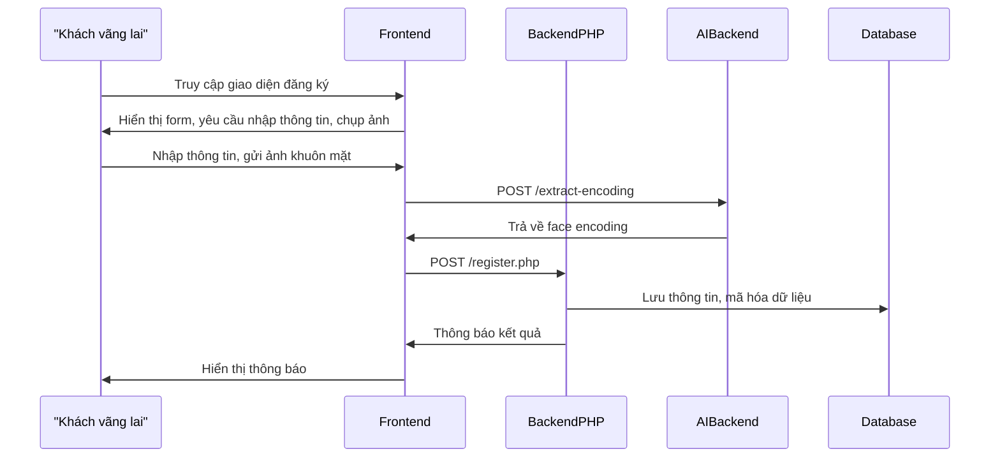

#### UC-02: Đăng nhập bằng mật khẩu

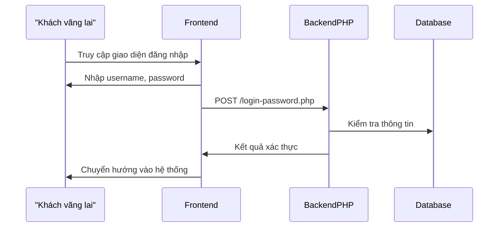

#### UC-03: Đăng nhập bằng khuôn mặt

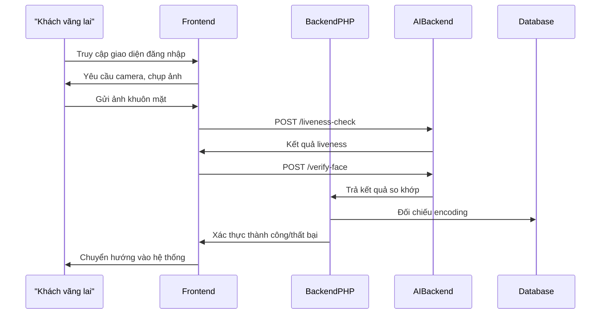

#### UC-04: Xem thông tin tài khoản

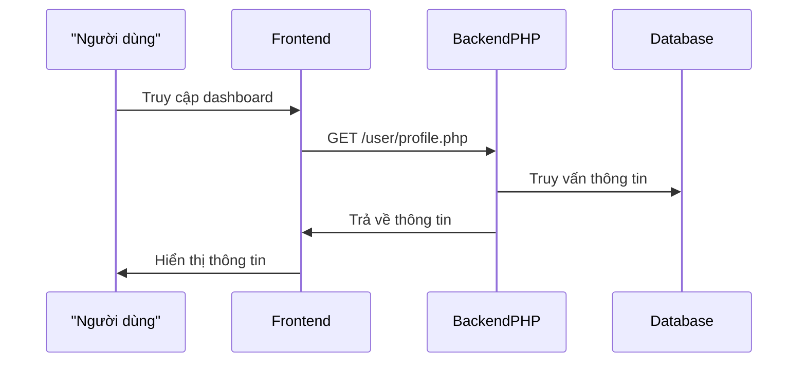

#### UC-05: Cập nhật KYC (upload CCCD, OCR)

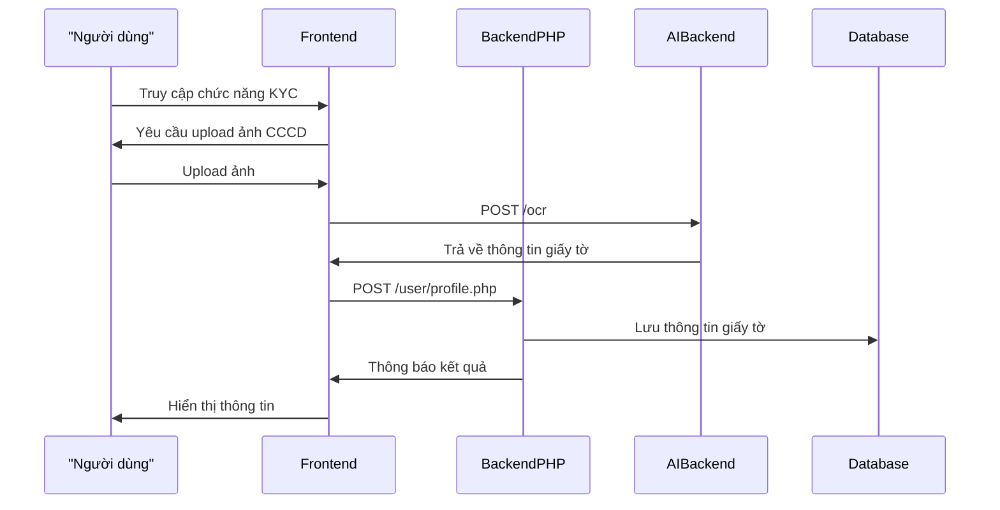

#### UC-06: Cập nhật khuôn mặt

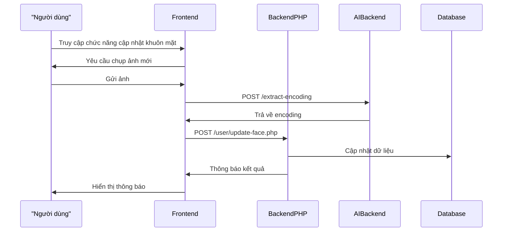

#### UC-07: Đổi mật khẩu

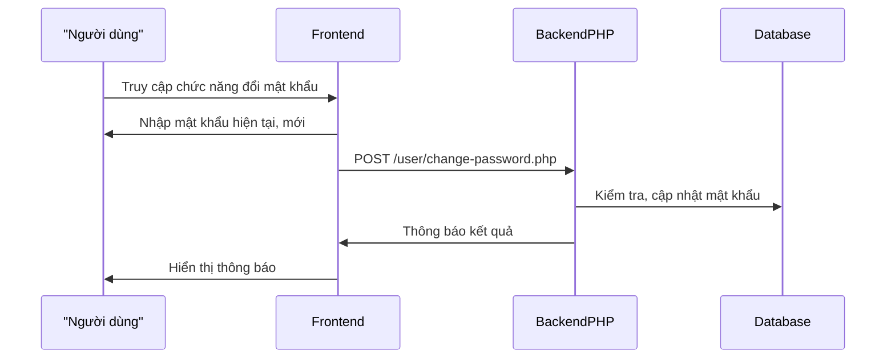

#### UC-08: Chuyển khoản nội địa

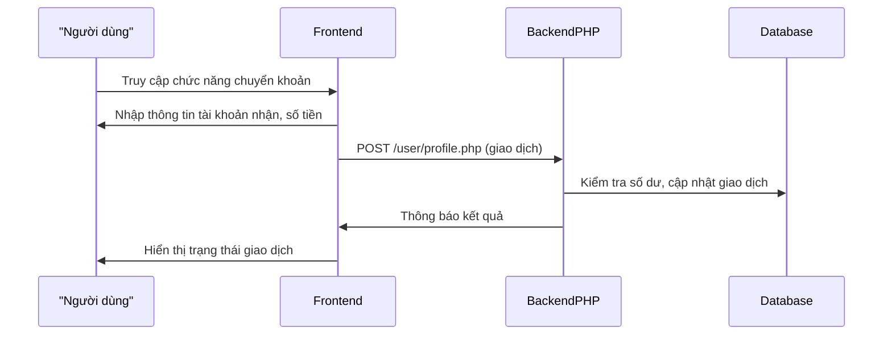

#### UC-09: Xem lịch sử giao dịch

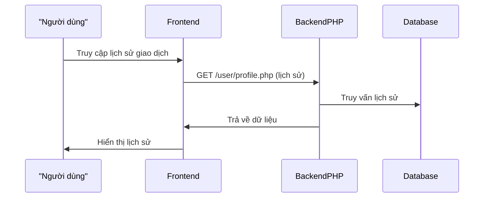

#### UC-10: Đăng xuất

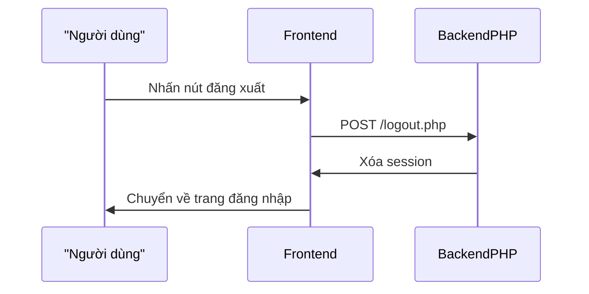

#### UC-11: Xem danh sách người dùng

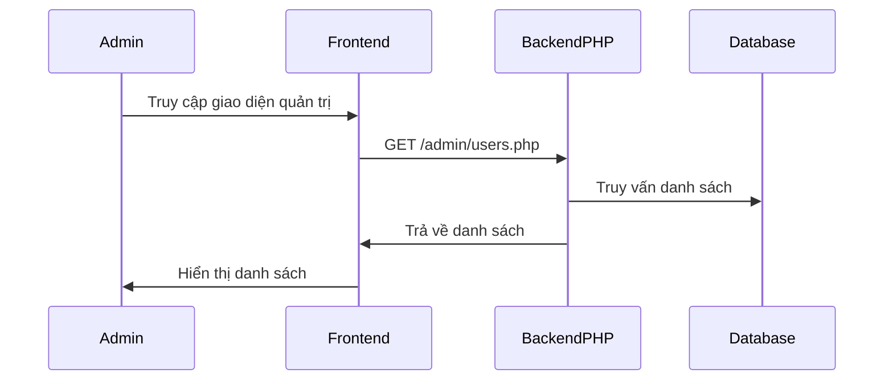

#### UC-12: Duyệt tài khoản

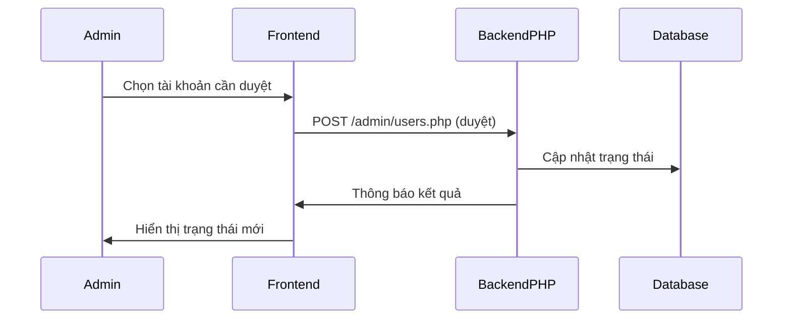

#### UC-13: Từ chối tài khoản

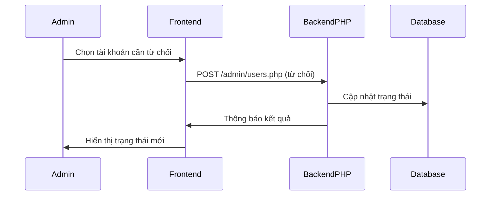

#### UC-14: Khóa/Mở khóa tài khoản

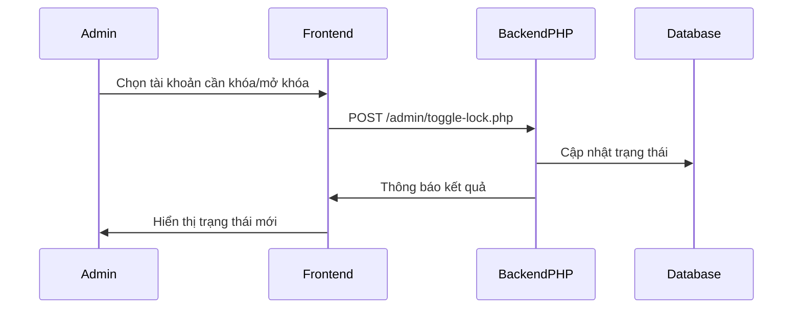

#### UC-15: Reset dữ liệu khuôn mặt

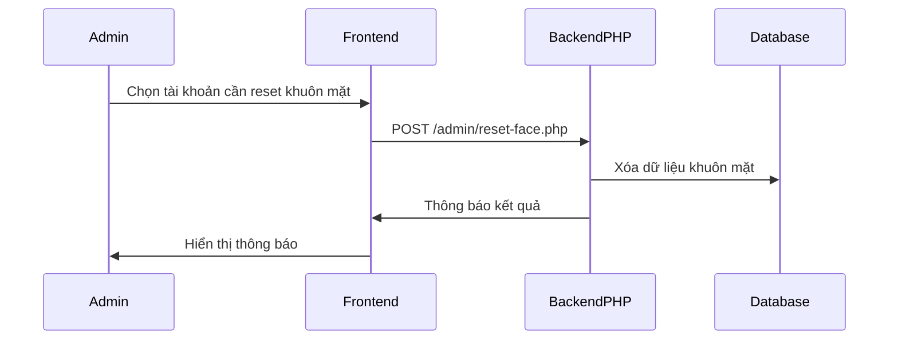

#### UC-16: Xóa tài khoản

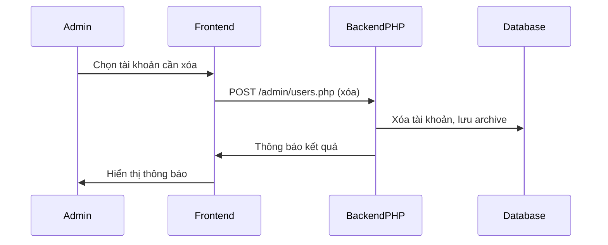

#### 3.6.x. Hướng Dẫn Đọc, Bảo Mật, Tiểu Kết

- **participant:** Đại diện cho actor, thành phần hệ thống (frontend, backend PHP, AI backend, database).
- **Mũi tên:** Thể hiện luồng dữ liệu, tương tác, gọi API, phản hồi.
- **Các bước:** Bám sát logic thực tế, liên kết với codebase, endpoint, UI.

**Lưu ý bảo mật, kiểm thử:**

- Các luồng xác thực, KYC, giao dịch đều kiểm tra JWT, session, logging, mã hóa dữ liệu, kiểm thử liveness, OCR, phân quyền.
- Các thao tác quản trị chỉ cho phép actor admin, kiểm soát phân quyền.

**Tiểu kết:**

Các sequence diagram trên là tài liệu sống, giúp phát triển, kiểm thử, bảo trì, mở rộng hệ thống, đảm bảo mọi luồng nghiệp vụ đều được kiểm soát, xác thực với code thực tế và đáp ứng yêu cầu bảo mật, pháp lý.

---

### 3.7. Yêu Cầu Chức Năng Và Phi Chức Năng

#### 3.7.1. Yêu cầu chức năng

Hệ thống phải đáp ứng đầy đủ các chức năng nghiệp vụ, được xác thực qua code thực tế, bao gồm:

**1. Đăng ký tài khoản:**

- Người dùng nhập thông tin, chụp ảnh khuôn mặt, gửi lên frontend.
- Frontend gọi AI backend để trích xuất face encoding, kiểm tra trùng lặp.
- Backend lưu thông tin, mã hóa dữ liệu vào database.

**2. Đăng nhập:**

- Hỗ trợ cả mật khẩu và khuôn mặt.
- Kiểm tra liveness, xác thực face encoding qua AI backend.
- Cấp JWT, session, ghi log đăng nhập.

**3. Cập nhật thông tin, KYC, OCR:**

- Người dùng cập nhật hồ sơ, upload giấy tờ tùy thân.
- Frontend gọi AI backend để OCR, trích xuất thông tin giấy tờ.
- Backend lưu thông tin, kiểm tra hợp lệ, ghi log.

**4. Đổi mật khẩu, cập nhật khuôn mặt:**

- Đổi mật khẩu, kiểm tra xác thực cũ, mã hóa mới.
- Cập nhật khuôn mặt, frontend gọi AI backend để lấy encoding mới.

**5. Quản lý giao dịch:**

- Chuyển khoản, xem lịch sử giao dịch, xác thực hai lớp, ghi log.

**6. Quản trị hệ thống:**

- Duyệt, từ chối, khóa/mở khóa, reset khuôn mặt, xóa tài khoản, xem hồ sơ đã xóa qua các chức năng quản trị.
- Phân quyền, kiểm soát truy cập.

**7. Tích hợp AI backend:**

- Nhận diện khuôn mặt, kiểm tra liveness, OCR giấy tờ, trả kết quả qua API RESTful.

**8. Giao tiếp API RESTful:**

- Frontend, backend PHP, AI backend trao đổi qua HTTP, bảo mật JWT, kiểm soát CORS, xác thực token.

**9. Logging, giám sát:**

- Ghi nhận mọi thao tác xác thực, thay đổi dữ liệu, truy cập admin vào nhật ký hệ thống.

#### 3.7.2. Yêu cầu phi chức năng

Hệ thống phải đảm bảo các yêu cầu phi chức năng nâng cao, học thuật, thực tiễn:

**1. Bảo mật:**

- Dữ liệu sinh trắc học (face encoding), thông tin cá nhân, nhật ký xác thực phải được mã hóa (AES, SHA256), phân quyền truy cập nghiêm ngặt.
- Sử dụng JWT, session, kiểm soát truy cập.
- Giao tiếp HTTPS, chống tấn công CSRF, XSS, SQL Injection.
- Lưu log mọi thao tác quan trọng, cảnh báo truy cập bất thường.

**2. Hiệu năng:**

- Thời gian xác thực khuôn mặt, liveness, OCR < 2 giây/lượt (đo thực tế qua log).
- Hệ thống chịu tải tối thiểu 1000 user/ngày, tối ưu truy vấn DB, AI backend đa tiến trình.

**3. Khả năng mở rộng, bảo trì:**

- Thiết kế module hóa (frontend, backend PHP, AI backend), dễ nâng cấp, tích hợp dịch vụ ngoài (ví dụ: Google Vision, hệ thống ngân hàng).
- Cấu hình động qua file, hỗ trợ backup, phục hồi dữ liệu, giám sát trạng thái hệ thống.

**4. Tuân thủ pháp lý:**

- Đáp ứng quy định về bảo vệ dữ liệu cá nhân (GDPR, Nghị định 13/2023/NĐ-CP Việt Nam).
- Lưu trữ, xử lý dữ liệu đúng mục đích, xóa dữ liệu khi người dùng yêu cầu.

**5. Trải nghiệm người dùng:**

- Giao diện thân thiện, hỗ trợ đa thiết bị, phản hồi nhanh, thông báo rõ ràng.
- Hỗ trợ tiếng Việt, tiếng Anh, dễ dàng mở rộng ngôn ngữ.

**6. Khả năng kiểm thử, giám sát:**

- Hỗ trợ kiểm thử tự động, ghi nhận log, cảnh báo lỗi, giám sát hiệu năng.
- Dễ dàng truy vết, phân tích sự cố qua log, dashboard quản trị.

### 3.8. Ràng Buộc Và Giả Định

**Ràng buộc:**

- Thiết bị người dùng phải hỗ trợ camera, internet ổn định.
- Dữ liệu khuôn mặt, embedding phải được mã hóa, lưu trữ an toàn.
- Hệ thống phải tuân thủ các quy định pháp lý về bảo mật dữ liệu cá nhân.
- Chỉ cho phép truy cập, chỉnh sửa dữ liệu với tài khoản có phân quyền phù hợp.

**Giả định:**

- Người dùng hợp tác, cung cấp ảnh khuôn mặt rõ nét, giấy tờ hợp lệ.
- Hệ thống AI backend, OCR hoạt động ổn định, chính xác.
- Các bên liên quan phối hợp chặt chẽ trong quá trình triển khai, vận hành.

### 3.9. Tiểu Kết Chương 3

Chương 3 đã cập nhật, phân tích đầy đủ các bên liên quan, danh sách Use Case chuẩn, sơ đồ, đặc tả, phân rã chức năng, luồng nghiệp vụ, yêu cầu, ràng buộc và giả định. Tất cả đều được đối chiếu xác thực với code thực tế, đảm bảo bài tiểu luận vừa học thuật, vừa thực tiễn, logic, đúng chuẩn.

Bên liên quan (stakeholders) là những cá nhân, tổ chức có quyền lợi, nghĩa vụ hoặc bị ảnh hưởng bởi hệ thống xác thực người dùng qua nhận diện khuôn mặt. Việc xác định đúng các bên liên quan giúp đảm bảo hệ thống đáp ứng đầy đủ nhu cầu thực tiễn, tối ưu hóa hiệu quả triển khai. Các bên liên quan chính gồm:

- **Người dùng cuối:** Cá nhân sử dụng hệ thống để xác thực danh tính khi truy cập dịch vụ.
- **Quản trị viên hệ thống:** Quản lý, vận hành, giám sát, xử lý sự cố, cập nhật dữ liệu người dùng.
- **Nhà phát triển phần mềm:** Thiết kế, xây dựng, bảo trì, nâng cấp hệ thống.
- **Tổ chức/doanh nghiệp triển khai:** Đơn vị sở hữu, vận hành hệ thống, chịu trách nhiệm pháp lý, bảo mật dữ liệu.
- **Cơ quan quản lý nhà nước:** Ban hành quy định pháp lý, kiểm tra, giám sát việc tuân thủ bảo mật, quyền riêng tư.
- **Đối tác tích hợp:** Các hệ thống, dịch vụ bên ngoài cần kết nối, chia sẻ dữ liệu xác thực.
