#BẢNG PHÂN CÔNG CHI TIẾT
### Bảng tiến trình thực hiện dự án chi tiết (24/01/2026 – 22/04/2026)

| STT | Ngày bắt đầu | Ngày kết thúc | Công việc cụ thể                | Mô tả chi tiết                                            | BA  | BE  | FE  | Tester |
| --- | ------------ | ------------- | ------------------------------- | --------------------------------------------------------- | --- | --- | --- | ------ |
| 1   | 24/01        | 24/01         | Khởi động dự án                 | Họp nhóm lần 1, giới thiệu thành viên, phổ biến mục tiêu  | X   |     |     |        |
| 2   | 25/01        | 25/01         | Thu thập yêu cầu                | BA làm việc với khách hàng, ghi nhận yêu cầu ban đầu      | X   |     |     |        |
| 3   | 26/01        | 26/01         | Phân tích nghiệp vụ             | Vẽ sơ đồ Use Case, xác định actor, chức năng chính        | X   |     |     |        |
| 4   | 27/01        | 27/01         | Họp nhóm lần 2                  | Thống nhất phạm vi, phân chia vai trò sơ bộ               | X   | X   | X   |        |
| 5   | 28/01        | 28/01         | Lập kế hoạch tổng thể           | Lập timeline, xác định milestone, phân bổ nguồn lực       | X   | X   | X   |        |
| 6   | 29/01        | 30/01         | Viết đặc tả Use Case            | Mô tả chi tiết từng chức năng, điều kiện, luồng chính/phụ | X   |     |     |        |
| 7   | 31/01        | 01/02         | Thiết kế sơ bộ giao diện        | Vẽ wireframe, xác định layout, màu sắc, trải nghiệm       | X   |     | X   |        |
| 8   | 02/02        | 03/02         | Thiết kế sơ bộ CSDL             | Vẽ ERD, xác định bảng, quan hệ, thuộc tính                | X   | X   |     |        |
| 9   | 04/02        | 05/02         | Viết tài liệu đặc tả chi tiết   | Đặc tả chức năng, phi chức năng, báo cáo khách hàng       | X   |     |     |        |
| 10  | 06/02        | 07/02         | Review đặc tả & thiết kế        | Họp nhóm, chỉnh sửa tài liệu, thống nhất giải pháp        | X   | X   | X   |        |
| 11  | 08/02        | 08/02         | Chuẩn bị môi trường code        | Cài đặt Python, Node.js, VSCode, Git, tạo repo            |     | X   | X   |        |
| 12  | 09/02        | 09/02         | Khởi tạo project backend        | Tạo cấu trúc thư mục, file main.py, requirements.txt      |     | X   |     |        |
| 13  | 10/02        | 10/02         | Khởi tạo project frontend       | Tạo cấu trúc thư mục, file index.html, assets             |     |     | X   |        |
| 14  | 11/02        | 11/02         | Cấu hình CI/CD                  | Thiết lập Github Actions, auto deploy, kiểm thử tự động   |     | X   | X   |        |
| 15  | 12/02        | 12/02         | Thiết lập DB ban đầu            | Tạo file schema.sql, migrate lên SQLite                   |     | X   |     |        |
| 16  | 13/02        | 13/02         | Tạo tài khoản test              | Thêm user mẫu, dữ liệu KYC, ảnh test                      | X   | X   |     |        |
| 17  | 14/02        | 14/02         | Viết tài liệu hướng dẫn dev     | Chuẩn hóa quy tắc code, đặt tên, commit                   | X   | X   | X   |        |
| 18  | 15/02        | 16/02         | Phát triển module đăng ký       | API register, validate, lưu DB, trả về trạng thái         |     | X   |     |        |
| 19  | 17/02        | 18/02         | Phát triển module xác thực      | API login-password, login-face, session                   |     | X   |     |        |
| 20  | 19/02        | 20/02         | Phát triển module KYC           | API upload CCCD, OCR, lưu thông tin                       |     | X   |     |        |
| 21  | 21/02        | 22/02         | Phát triển module giao dịch     | API chuyển khoản, kiểm tra số dư, rollback                |     | X   |     |        |
| 22  | 23/02        | 24/02         | Phát triển module admin         | API duyệt/từ chối user, khóa/mở khóa, xóa user            |     | X   |     |        |
| 23  | 25/02        | 26/02         | Viết unit test backend          | Test logic nghiệp vụ, kiểm tra API                        |     | X   |     | X      |
| 24  | 27/02        | 29/02         | Refactor, tối ưu backend        | Chuẩn hóa code, tối ưu hiệu năng, bảo mật                 |     | X   |     |        |
| 25  | 01/03        | 02/03         | Phát triển giao diện đăng ký    | Form đăng ký, upload ảnh, validate FE                     |     |     | X   |        |
| 26  | 03/03        | 04/03         | Phát triển giao diện đăng nhập  | Form login, kết nối API, xử lý lỗi                        |     |     | X   |        |
| 27  | 05/03        | 06/03         | Phát triển giao diện KYC        | Form upload CCCD, hiển thị kết quả OCR                    |     |     | X   |        |
| 28  | 07/03        | 08/03         | Phát triển giao diện giao dịch  | Form chuyển khoản, xác nhận, thông báo                    |     |     | X   |        |
| 29  | 09/03        | 10/03         | Phát triển giao diện admin      | Quản lý user, duyệt, khóa, xóa                            |     |     | X   |        |
| 30  | 11/03        | 12/03         | Tích hợp FE-BE đăng ký          | FE gọi API register, xử lý response                       | X   | X   | X   |        |
| 31  | 13/03        | 14/03         | Tích hợp FE-BE xác thực         | FE gọi API login, session, lỗi                            | X   | X   | X   |        |
| 32  | 15/03        | 15/03         | Tích hợp FE-BE KYC              | FE gọi API upload CCCD, nhận kết quả                      | X   | X   | X   |        |
| 33  | 16/03        | 16/03         | Tích hợp FE-BE giao dịch        | FE gọi API chuyển khoản, nhận thông báo                   | X   | X   | X   |        |
| 34  | 17/03        | 17/03         | Tích hợp FE-BE admin            | FE gọi API quản trị, xác nhận thao tác                    | X   | X   | X   |        |
| 35  | 18/03        | 19/03         | Viết test case chức năng        | BA viết test case, mô tả đầu vào, kết quả                 | X   |     |     |        |
| 36  | 20/03        | 21/03         | Thực thi kiểm thử manual        | Tester chạy test case, ghi nhận bug                       |     |     |     | X      |
| 37  | 22/03        | 23/03         | Kiểm thử API tự động            | Viết script Postman, kiểm tra response                    |     | X   |     | X      |
| 38  | 24/03        | 25/03         | Kiểm thử giao diện              | Selenium test, kiểm tra UI/UX                             |     |     | X   | X      |
| 39  | 26/03        | 27/03         | Tổng hợp bug, fix lỗi           | Thống kê lỗi, phân loại, BE/FE sửa lỗi                    | X   | X   | X   | X      |
| 40  | 28/03        | 29/03         | Kiểm thử hiệu năng              | JMeter, đo thời gian phản hồi, tải đồng thời              |     | X   | X   | X      |
| 41  | 30/03        | 31/03         | Kiểm thử bảo mật                | Thử SQLi, XSS, brute-force, phân quyền                    | X   | X   | X   | X      |
| 42  | 01/04        | 02/04         | Kiểm thử rollback, đồng thời    | Thử lỗi chuyển khoản, thao tác nhiều user                 |     | X   | X   | X      |
| 43  | 03/04        | 05/04         | Viết tài liệu hướng dẫn sử dụng | Soạn user manual, hướng dẫn cài đặt, sử dụng              | X   |     | X   |        |
| 44  | 06/04        | 08/04         | Chuẩn bị tài liệu báo cáo       | Viết báo cáo, tổng hợp kết quả kiểm thử                   | X   | X   | X   | X      |
| 45  | 09/04        | 10/04         | Chuẩn bị slide thuyết trình     | Thiết kế slide, phân chia nội dung                        | X   |     | X   |        |
| 46  | 11/04        | 12/04         | Hoàn thiện demo sản phẩm        | Chạy thử toàn bộ, quay video demo                         | X   | X   | X   | X      |
| 47  | 13/04        | 13/04         | Họp nhóm tổng duyệt             | Chạy thử, kiểm tra checklist, phân công báo cáo           | X   | X   | X   | X      |
| 48  | 14/04        | 15/04         | Chỉnh sửa, hoàn thiện cuối      | Fix lỗi nhỏ, hoàn thiện tài liệu, chuẩn bị nộp            | X   | X   | X   | X      |
| 49  | 16/04        | 18/04         | Tổng duyệt lần cuối             | Chạy thử toàn bộ, kiểm tra lần cuối                       | X   | X   | X   | X      |
| 50  | 19/04        | 22/04         | Báo cáo chính thức              | Thuyết trình, trả lời câu hỏi, nộp sản phẩm               | X   | X   | X   | X      |


# TIỂU LUẬN

## Phần Mở Đầu

Trong bối cảnh toàn cầu hóa và chuyển đổi số đang diễn ra mạnh mẽ trên mọi lĩnh vực của đời sống xã hội, việc ứng dụng các công nghệ hiện đại vào quản lý, vận hành và bảo mật thông tin trở thành một yêu cầu tất yếu. Đặc biệt, trong thời đại mà dữ liệu cá nhân, tài sản số và các giao dịch trực tuyến ngày càng gia tăng về số lượng và giá trị, vấn đề xác thực danh tính người dùng đóng vai trò then chốt trong việc đảm bảo an toàn, bảo mật và nâng cao trải nghiệm người dùng.

Các phương pháp xác thực truyền thống như sử dụng mật khẩu, mã PIN, thẻ từ,... đã và đang bộc lộ nhiều hạn chế nghiêm trọng. Người dùng thường xuyên gặp phải các vấn đề như quên mật khẩu, bị đánh cắp thông tin, lộ lọt dữ liệu hoặc bị giả mạo danh tính. Điều này không chỉ gây ra những tổn thất về tài chính mà còn ảnh hưởng nghiêm trọng đến uy tín, quyền riêng tư và sự phát triển bền vững của các tổ chức, doanh nghiệp.

Trước thực trạng đó, xác thực sinh trắc học – đặc biệt là nhận diện khuôn mặt – nổi lên như một giải pháp công nghệ tiên tiến, mang lại nhiều ưu điểm vượt trội so với các phương pháp truyền thống. Nhận diện khuôn mặt không chỉ dựa trên các đặc trưng sinh học duy nhất của mỗi cá nhân mà còn mang lại sự tiện lợi, nhanh chóng và khó bị giả mạo. Công nghệ này đã và đang được ứng dụng rộng rãi trong nhiều lĩnh vực như ngân hàng, giáo dục, y tế, thương mại điện tử, quản lý hành chính công,... góp phần nâng cao hiệu quả quản lý, bảo mật và tối ưu hóa trải nghiệm người dùng.

Tuy nhiên, việc triển khai các hệ thống xác thực khuôn mặt trên nền tảng web vẫn còn đối mặt với nhiều thách thức lớn. Đó là các vấn đề về độ chính xác, tốc độ xử lý, khả năng chống giả mạo (liveness), tích hợp đa nền tảng, bảo mật dữ liệu cá nhân và tuân thủ các quy định pháp lý ngày càng nghiêm ngặt. Bên cạnh đó, sự phát triển nhanh chóng của các kỹ thuật tấn công như deepfake, spoofing,... cũng đặt ra yêu cầu cấp thiết về việc nâng cao năng lực phát hiện và phòng chống các hình thức giả mạo tinh vi.

Xuất phát từ những yêu cầu thực tiễn và thách thức nêu trên, nhóm tác giả lựa chọn đề tài "Nghiên cứu, xây dựng hệ thống xác thực người dùng qua nhận diện khuôn mặt trên nền tảng web" với mong muốn góp phần giải quyết một phần các bài toán thực tiễn, đồng thời nâng cao nhận thức, năng lực nghiên cứu và ứng dụng công nghệ mới trong lĩnh vực bảo mật thông tin. Đề tài không chỉ tập trung vào việc nghiên cứu các thuật toán, mô hình nhận diện khuôn mặt, kiểm tra liveness mà còn chú trọng đến việc xây dựng một hệ thống hoàn chỉnh, tích hợp đa nền tảng (frontend, backend PHP, AI backend Python), đảm bảo các tiêu chí về hiệu năng, bảo mật, khả năng mở rộng và tuân thủ pháp lý.

Phần mở đầu này sẽ trình bày tổng quan về bối cảnh, lý do lựa chọn đề tài, ý nghĩa khoa học và thực tiễn, đồng thời định hướng cho toàn bộ nội dung nghiên cứu được trình bày trong các chương tiếp theo của báo cáo. Qua đó, giúp người đọc có cái nhìn tổng thể, logic và nhận diện rõ ràng về mục tiêu, phạm vi, đối tượng nghiên cứu cũng như các đóng góp mà đề tài hướng tới.

---

## Chương 1: Tổng Quan Về Đề Tài

### 1.1. Đặt Vấn Đề

Trong bối cảnh chuyển đổi số toàn cầu, các hoạt động kinh tế, xã hội, giáo dục, y tế, tài chính,... đều dịch chuyển mạnh mẽ lên môi trường số, đặt ra yêu cầu cấp thiết về các giải pháp xác thực danh tính người dùng vừa an toàn, vừa thuận tiện, vừa đảm bảo trải nghiệm người dùng (UX/UI) tối ưu. Các phương pháp xác thực truyền thống như mật khẩu, mã PIN, thẻ từ,... ngày càng bộc lộ nhiều điểm yếu nghiêm trọng: dễ bị lộ lọt, tấn công phishing, brute-force, shoulder surfing, hoặc đơn giản là bị quên, gây phiền toái cho người dùng và tăng chi phí vận hành cho tổ chức.

Đặc biệt, trong các lĩnh vực nhạy cảm như ngân hàng, giáo dục, y tế, thương mại điện tử, việc xác thực sai danh tính có thể dẫn đến hậu quả nghiêm trọng về tài chính, pháp lý, uy tín và quyền riêng tư. Các vụ tấn công giả mạo, đánh cắp danh tính, lừa đảo qua mạng ngày càng tinh vi, sử dụng cả công nghệ deepfake, spoofing, khiến các giải pháp truyền thống trở nên lạc hậu.

Sinh trắc học, đặc biệt là nhận diện khuôn mặt, nổi lên như một xu hướng tất yếu nhờ tính duy nhất, khó giả mạo, thuận tiện (không cần nhớ thông tin, không cần thiết bị phụ trợ), dễ tích hợp với các thiết bị số hiện đại (webcam, smartphone, IoT). Tuy nhiên, việc triển khai thực tế các hệ thống xác thực khuôn mặt trên nền tảng web lại đối mặt với nhiều thách thức lớn: đảm bảo độ chính xác cao trong điều kiện môi trường đa dạng (ánh sáng, góc mặt, chất lượng camera), tốc độ xử lý đáp ứng thời gian thực, khả năng chống giả mạo (liveness detection), bảo mật dữ liệu sinh trắc học, tuân thủ các quy định pháp lý (GDPR, luật An ninh mạng Việt Nam), và khả năng tích hợp, mở rộng với các hệ thống hiện hữu.

Những thách thức này đòi hỏi phải có cách tiếp cận tổng thể, kết hợp giữa công nghệ AI hiện đại (deep learning, computer vision), kiến trúc hệ thống module hóa, quy trình bảo mật chặt chẽ, thiết kế UX/UI lấy người dùng làm trung tâm và tuân thủ pháp lý nghiêm ngặt. Đó cũng chính là lý do nhóm tác giả lựa chọn đề tài này, với mong muốn giải quyết các bài toán thực tiễn, đồng thời đóng góp tri thức, kinh nghiệm cho cộng đồng nghiên cứu và ứng dụng công nghệ tại Việt Nam.

### 1.2. Mục Tiêu Của Đề Tài

Mục tiêu tổng quát của đề tài là nghiên cứu, xây dựng và triển khai thành công một hệ thống xác thực người dùng qua nhận diện khuôn mặt trên nền tảng web, đáp ứng đồng thời các tiêu chí về công nghệ, bảo mật, pháp lý và trải nghiệm người dùng. Cụ thể:

- Ứng dụng các thuật toán AI hiện đại (deep learning, computer vision) để nhận diện khuôn mặt và kiểm tra liveness với độ chính xác cao, chống giả mạo hiệu quả.
- Thiết kế hệ thống module hóa, tích hợp đa nền tảng (frontend HTML/JS/CSS, backend PHP, AI backend Python), dễ mở rộng, bảo trì, nâng cấp.
- Đảm bảo tốc độ xử lý nhanh, tối ưu hóa pipeline nhận diện, giảm độ trễ, đáp ứng tốt cho các ứng dụng thực tế quy mô vừa và lớn.
- Xây dựng giao diện người dùng (UI) trực quan, thân thiện, hỗ trợ đa thiết bị, tối ưu trải nghiệm người dùng (UX) cho cả người dùng cuối và quản trị viên.
- Đảm bảo an toàn dữ liệu sinh trắc học, tuân thủ các quy định pháp lý về bảo mật dữ liệu cá nhân (GDPR, luật Việt Nam), hỗ trợ logging, kiểm soát truy cập, mã hóa dữ liệu.
- Đánh giá thực nghiệm toàn diện về hiệu năng, độ chính xác, khả năng mở rộng, bảo mật và UX/UI.

### 1.3. Phạm Vi Của Đề Tài

Phạm vi nghiên cứu và triển khai của đề tài bao gồm:

- Nghiên cứu tổng quan các phương pháp, thuật toán nhận diện khuôn mặt, kiểm tra liveness, xác thực sinh trắc học trên nền tảng web, phân tích ưu nhược điểm, khả năng ứng dụng thực tiễn.
- Thiết kế, xây dựng hệ thống xác thực người dùng qua khuôn mặt tích hợp đầy đủ các thành phần: frontend (HTML/JS/CSS), backend PHP (quản lý người dùng, xác thực, bảo mật, kết nối DB), AI backend Python (nhận diện, liveness, OCR, API), cơ sở dữ liệu (SQLite/MySQL/PostgreSQL).
- Xây dựng quy trình bảo mật dữ liệu sinh trắc học, nhật ký xác thực, kiểm soát truy cập, logging, mã hóa dữ liệu.
- Đánh giá toàn diện hiệu năng, độ chính xác, khả năng mở rộng, bảo mật, UX/UI qua kiểm thử thực tế, phân tích số liệu, khảo sát người dùng.
- Đề xuất các giải pháp nâng cao, định hướng phát triển tiếp theo về công nghệ, bảo mật, pháp lý, UX/UI, dữ liệu, tích hợp đa nền tảng.

### 1.4. Cấu Trúc Của Bài Báo Cáo Này

Bài báo cáo được tổ chức logic thành 9 chương, đảm bảo trình tự từ tổng quan, lý thuyết, phân tích, thiết kế, triển khai, kiểm thử, đánh giá đến kết luận, giúp người đọc dễ dàng theo dõi, tra cứu và nắm bắt toàn diện quá trình nghiên cứu, phát triển hệ thống. Cấu trúc này cũng phản ánh đúng quy trình phát triển phần mềm hiện đại (SDLC), kết hợp giữa lý thuyết và thực tiễn, giữa công nghệ và yếu tố con người, pháp lý.

### 1.5. Đối Tượng Nghiên Cứu

Đối tượng nghiên cứu của đề tài bao gồm:

- Các kỹ thuật, thuật toán AI (deep learning, computer vision) cho nhận diện khuôn mặt, kiểm tra liveness, OCR, xác thực sinh trắc học trên nền tảng web.
- Các mô hình kiến trúc hệ thống web tích hợp AI backend, quy trình xác thực người dùng, bảo mật dữ liệu sinh trắc học, logging, kiểm soát truy cập.
- Các tiêu chuẩn, quy định pháp lý về bảo mật dữ liệu cá nhân (GDPR, luật Việt Nam), các giải pháp đảm bảo tuân thủ pháp lý khi triển khai thực tế.
- Phân tích tác động của công nghệ đến trải nghiệm người dùng, hiệu quả vận hành, chi phí, rủi ro và khả năng mở rộng hệ thống.

### 1.6. Đối Tượng Áp Dụng

Hệ thống hướng đến các đối tượng áp dụng đa dạng:

- Các tổ chức, doanh nghiệp, trường học, ngân hàng, bệnh viện,... có nhu cầu xác thực danh tính người dùng an toàn, tiện lợi, tiết kiệm chi phí vận hành trên môi trường số.
- Các nhà phát triển phần mềm, nhóm nghiên cứu muốn tích hợp xác thực khuôn mặt vào sản phẩm, dịch vụ của mình.
- Người dùng cuối mong muốn trải nghiệm xác thực nhanh chóng, tiện lợi, bảo mật cao mà không cần ghi nhớ thông tin phức tạp.

### 1.7. Phương Pháp Thực Hiện Dự Án

Đề tài sử dụng phương pháp nghiên cứu tổng hợp kết hợp thực nghiệm, đảm bảo tính học thuật và thực tiễn:

- Khảo sát, tổng hợp tài liệu, các công trình nghiên cứu, giải pháp thực tế về xác thực khuôn mặt, liveness, bảo mật web, UX/UI, pháp lý.
- Phân tích, lựa chọn các thuật toán, mô hình AI phù hợp (FaceNet, MTCNN, ArcFace, các giải pháp kiểm tra liveness phổ biến, OCR), đánh giá ưu nhược điểm từng giải pháp.
- Thiết kế kiến trúc hệ thống module hóa, tích hợp đa nền tảng (frontend, backend PHP, AI backend Python), đảm bảo bảo mật, hiệu năng, khả năng mở rộng.
- Xây dựng, triển khai hệ thống mẫu, kiểm thử trên dữ liệu thực tế, đánh giá định lượng (số liệu, biểu đồ) và định tính (khảo sát người dùng, phân tích UX/UI).
- Đánh giá, phân tích kết quả, rút ra bài học, đề xuất hướng phát triển tiếp theo về công nghệ, bảo mật, pháp lý, UX/UI.

### 1.8. Đóng Góp Của Đề Tài

Các đóng góp nổi bật của đề tài:

- Xây dựng thành công hệ thống xác thực người dùng qua khuôn mặt trên nền tảng web, tích hợp đa thành phần (frontend, backend PHP, AI backend Python, DB), có tính ứng dụng thực tiễn cao.
- Đề xuất, hiện thực hóa quy trình kiểm tra liveness, tăng cường bảo mật chống giả mạo, nâng cao độ tin cậy xác thực.
- Thiết kế kiến trúc hệ thống mở, module hóa, dễ mở rộng, bảo trì, tích hợp thêm các công nghệ mới (AI nâng cao, xác thực đa yếu tố, IoT).
- Đánh giá thực nghiệm hiệu năng, độ chính xác, khả năng mở rộng, bảo mật, UX/UI qua kiểm thử thực tế, khảo sát người dùng.
- Đưa ra các khuyến nghị về bảo mật, tuân thủ pháp lý, quy trình vận hành, hướng dẫn triển khai thực tế.
- Cung cấp tài liệu tham khảo, hướng dẫn chi tiết cho các tổ chức, cá nhân có nhu cầu ứng dụng xác thực sinh trắc học.

### 1.9. Hạn Chế Và Định Hướng Tiếp Theo

Hạn chế:

- Hệ thống mẫu chủ yếu kiểm thử trên tập dữ liệu giới hạn, chưa triển khai thực tế quy mô lớn, chưa đánh giá sâu trên nhiều môi trường, thiết bị khác nhau.
- Một số thuật toán kiểm tra liveness còn đơn giản, cần nâng cấp để chống các hình thức giả mạo tinh vi hơn (deepfake, spoofing).
- Chưa tích hợp xác thực đa yếu tố (multi-factor), tối ưu hóa cho thiết bị di động, IoT.
- Chưa đánh giá toàn diện về hiệu năng, bảo mật khi mở rộng quy mô lớn hoặc tích hợp với hệ thống phức tạp.

Định hướng tiếp theo:

- Mở rộng tập dữ liệu, kiểm thử thực tế trên nhiều môi trường, đối tượng, thiết bị khác nhau.
- Nâng cấp, tối ưu hóa thuật toán nhận diện khuôn mặt, kiểm tra liveness, tích hợp AI nâng cao, phát hiện deepfake, spoofing.
- Phát triển xác thực đa yếu tố kết hợp sinh trắc học và các phương pháp khác (OTP, SMS, email, vân tay, mống mắt,...).
- Tối ưu hóa hiệu năng, giao diện cho thiết bị di động, IoT, hỗ trợ đa nền tảng.
- Đề xuất, xây dựng chính sách bảo mật, quy trình vận hành, tuân thủ pháp lý quốc tế về dữ liệu cá nhân.

### 1.10. Tiểu Kết Chương 1

Chương 1 đã trình bày tổng quan, phân tích sâu sắc bối cảnh, lý do lựa chọn đề tài, mục tiêu, phạm vi, đối tượng nghiên cứu và áp dụng, phương pháp thực hiện, đóng góp, hạn chế và định hướng phát triển. Những nội dung này là nền tảng quan trọng, giúp người đọc có cái nhìn toàn diện, logic, nhận diện rõ ràng các vấn đề thực tiễn, thách thức công nghệ, pháp lý, bảo mật, UX/UI và các giải pháp mà đề tài hướng tới. Đây cũng là cơ sở để triển khai các chương tiếp theo một cách hệ thống, khoa học và thực tiễn.

---

## Chương 2: Cơ Sở Lý Thuyết

### 2.1. Xác Thực Sinh Trắc Học

Xác thực sinh trắc học là quá trình sử dụng các đặc trưng sinh học duy nhất, ổn định theo thời gian của mỗi cá nhân để xác định hoặc xác thực danh tính. Các đặc trưng này có thể là vân tay, khuôn mặt, mống mắt, giọng nói, tĩnh mạch, DNA,... Trong đó, nhận diện khuôn mặt nổi bật nhờ tính tiện lợi, không xâm lấn, dễ tích hợp trên thiết bị số hiện đại (webcam, smartphone, IoT) và khả năng ứng dụng rộng rãi trong thực tiễn.

So với các phương pháp truyền thống (mật khẩu, thẻ từ), xác thực sinh trắc học giúp nâng cao bảo mật, giảm thiểu rủi ro bị giả mạo, quên/lộ thông tin, đồng thời tối ưu trải nghiệm người dùng (không cần nhớ thông tin, thao tác nhanh). Tuy nhiên, các hệ thống này đối mặt với nhiều thách thức: độ chính xác phụ thuộc vào chất lượng cảm biến, môi trường (ánh sáng, góc mặt), khả năng chống giả mạo (spoofing, deepfake), bảo mật dữ liệu sinh trắc học (không thể thay đổi nếu bị lộ), các vấn đề pháp lý về quyền riêng tư, đồng thuận người dùng.

Các bước cơ bản trong xác thực sinh trắc học gồm: thu thập đặc trưng (qua cảm biến/camera), tiền xử lý (lọc nhiễu, chuẩn hóa), trích xuất đặc trưng (feature extraction), so khớp với mẫu lưu trữ (matching) và đưa ra quyết định xác thực. Việc lựa chọn đặc trưng phù hợp, xây dựng pipeline AI tối ưu, đảm bảo an toàn dữ liệu, tuân thủ pháp lý là những yếu tố then chốt quyết định thành công của hệ thống. Ví dụ, các hệ thống ngân hàng, sân bay quốc tế, bệnh viện lớn đều đã ứng dụng xác thực sinh trắc học để nâng cao bảo mật và tối ưu vận hành.

### 2.2. Nhận Diện Khuôn Mặt

Nhận diện khuôn mặt là quá trình xác định hoặc xác thực một cá nhân dựa trên các đặc trưng hình thái học, cấu trúc không gian của khuôn mặt. Quy trình hiện đại gồm: phát hiện khuôn mặt (face detection), căn chỉnh (alignment), trích xuất đặc trưng (feature extraction), so khớp (matching) và đánh giá xác suất nhận diện.

Các thuật toán phát hiện khuôn mặt phổ biến: Haar Cascade, HOG, MTCNN, SSD, YOLO, RetinaFace,... Trong đó, các phương pháp deep learning (MTCNN, RetinaFace) cho độ chính xác cao, phát hiện tốt trong điều kiện ánh sáng/góc nhìn đa dạng, chống nhiễu tốt hơn các phương pháp truyền thống.

Về trích xuất đặc trưng, các mô hình học sâu như FaceNet, ArcFace, VGGFace, InsightFace,... học được vector đặc trưng (embedding) có tính phân biệt cao giữa các cá thể, giảm thiểu sai số nhận diện. Các embedding này được so khớp với mẫu lưu trữ bằng các hàm khoảng cách (cosine, Euclidean) để xác định danh tính.

Nhận diện khuôn mặt trên nền tảng web đòi hỏi sự phối hợp chặt chẽ giữa frontend (truy xuất camera, xử lý ảnh ban đầu, UX/UI), backend (xử lý AI, so khớp dữ liệu, bảo mật), AI backend (nhận diện, liveness, OCR) và cơ sở dữ liệu (lưu trữ embedding, nhật ký xác thực). Việc tối ưu hóa pipeline xử lý, bảo mật dữ liệu khuôn mặt, đảm bảo tốc độ phản hồi, khả năng mở rộng và tuân thủ pháp lý là những thách thức lớn. Ví dụ, các hệ thống eKYC ngân hàng, kiểm soát ra vào tòa nhà, chấm công thông minh,... đều ứng dụng pipeline này.

### 2.3. Kiểm Tra Liveness

Kiểm tra liveness (liveness detection) là quá trình xác định đối tượng xác thực có phải là người thật đang hiện diện trước camera hay chỉ là hình ảnh, video, mặt nạ, deepfake,... nhằm phòng chống các hình thức giả mạo (spoofing). Đây là thành phần then chốt trong các hệ thống xác thực sinh trắc học hiện đại, đặc biệt khi các kỹ thuật tấn công ngày càng tinh vi.

Các phương pháp kiểm tra liveness phổ biến:

- **Chủ động (active):** Yêu cầu người dùng thực hiện các hành động ngẫu nhiên (chớp mắt, quay đầu, cử động môi, đọc số,...) để xác minh tính sống động. Độ chính xác cao nhưng có thể ảnh hưởng UX nếu lạm dụng.
- **Thụ động (passive):** Phân tích đặc trưng hình ảnh/video (texture, ánh sáng, phản xạ, chuyển động vi mô, phân tích quang phổ,...) để phát hiện giả mạo mà không cần tương tác người dùng. Tối ưu UX nhưng khó chống lại deepfake tinh vi.
- **Lai (hybrid):** Kết hợp cả hai để tăng độ chính xác, giảm false positive/negative.

Các thuật toán AI hiện đại (CNN, RNN, GAN-based detection, optical flow, attention mechanism,...) ngày càng được ứng dụng rộng rãi, giúp phát hiện các hình thức tấn công mới như deepfake, replay attack, mask attack. Việc tích hợp kiểm tra liveness vào hệ thống xác thực khuôn mặt trên web giúp nâng cao bảo mật, giảm thiểu nguy cơ bị giả mạo, đồng thời tối ưu trải nghiệm người dùng. Ví dụ, các hệ thống eKYC ngân hàng lớn đều bắt buộc kiểm tra liveness khi xác thực từ xa.

### 2.4. OCR

OCR (Optical Character Recognition) là công nghệ nhận dạng ký tự quang học, chuyển đổi hình ảnh chứa văn bản (giấy tờ tùy thân, ảnh chụp, scan,...) thành dữ liệu số có thể xử lý tự động. Trong hệ thống xác thực, OCR thường dùng để trích xuất thông tin từ giấy tờ tùy thân (CMND/CCCD, hộ chiếu, thẻ sinh viên,...) phục vụ đối chiếu với dữ liệu nhận diện khuôn mặt, tăng độ tin cậy xác thực.

Các thư viện OCR phổ biến: Tesseract, EasyOCR, Google Vision API,... Việc kết hợp OCR với nhận diện khuôn mặt giúp giảm thiểu rủi ro giả mạo danh tính, phát hiện giấy tờ giả, tự động hóa quy trình onboarding. Tuy nhiên, OCR đối mặt với thách thức: chất lượng ảnh đầu vào (mờ, bóng, méo), đa dạng font chữ/ngôn ngữ, bố cục tài liệu phức tạp, bảo mật dữ liệu giấy tờ.

Trong hệ thống xác thực web, OCR có thể tích hợp ở cả frontend (tiền xử lý ảnh, UX/UI hướng dẫn chụp ảnh đúng chuẩn) và backend (xử lý nhận dạng, đối chiếu dữ liệu, logging), đảm bảo tự động hóa, bảo mật thông tin, nâng cao trải nghiệm người dùng. Ví dụ, các app ngân hàng, ví điện tử đều tích hợp OCR để onboarding khách hàng mới.

### 2.5. Xác Thực & Bảo Mật

Xác thực (authentication) là quá trình xác minh danh tính người dùng, còn bảo mật (security) là tổng thể các biện pháp bảo vệ hệ thống, dữ liệu khỏi nguy cơ tấn công, truy cập trái phép. Trong hệ thống xác thực sinh trắc học, bảo mật dữ liệu sinh trắc (khuôn mặt, vân tay,...) là yêu cầu bắt buộc, bởi đây là thông tin nhạy cảm, không thể thay đổi nếu bị lộ.

Các nguyên tắc bảo mật quan trọng:

- Mã hóa dữ liệu khi lưu trữ và truyền tải (AES, RSA, HTTPS, JWT,...), bảo vệ embedding khuôn mặt, giấy tờ tùy thân.
- Phân quyền truy cập, kiểm soát nhật ký hoạt động, logging chi tiết các thao tác nhạy cảm.
- Ẩn danh hóa (anonymization), băm dữ liệu (hashing) embedding khuôn mặt, hạn chế truy xuất trực tiếp.
- Định kỳ kiểm tra, đánh giá lỗ hổng bảo mật (pentest, audit), cập nhật bản vá kịp thời.
- Tuân thủ các tiêu chuẩn quốc tế (ISO/IEC 27001, GDPR, luật Việt Nam,...), xây dựng quy trình xử lý sự cố, đào tạo nhân sự.

Ngoài ra, hệ thống cần có cơ chế phát hiện, cảnh báo và ứng phó với các hành vi bất thường, tấn công giả mạo, đảm bảo an toàn cho cả người dùng và tổ chức vận hành. Ví dụ, các hệ thống xác thực ngân hàng, chính phủ đều có quy trình bảo mật nhiều lớp, kiểm soát truy cập nghiêm ngặt.

### 2.6. Kiến Trúc Hệ Thống Web

Kiến trúc hệ thống web hiện đại thường xây dựng theo mô hình đa lớp (multi-tier): frontend (giao diện người dùng, UX/UI), backend (xử lý nghiệp vụ, API, bảo mật), AI backend (nhận diện, liveness, OCR), cơ sở dữ liệu (lưu trữ thông tin, embedding, nhật ký).

Frontend đảm nhận thu thập dữ liệu đầu vào (ảnh khuôn mặt, giấy tờ), hướng dẫn người dùng thao tác đúng chuẩn, hiển thị kết quả xác thực, tối ưu UX/UI. Backend PHP quản lý người dùng, xác thực phiên đăng nhập, kết nối AI backend và DB, kiểm soát bảo mật, logging. AI backend (Python) thực hiện nhận diện khuôn mặt, kiểm tra liveness, OCR, cung cấp API cho backend PHP.

Thiết kế kiến trúc mở, module hóa, tách biệt các thành phần giúp dễ dàng mở rộng, bảo trì, nâng cấp hệ thống, tích hợp thêm công nghệ mới (AI nâng cao, xác thực đa yếu tố, IoT). Các thành phần giao tiếp qua API (RESTful, WebSocket), sử dụng JWT cho xác thực, đảm bảo linh hoạt, bảo mật, hiệu năng. Ví dụ, hệ thống trong đề tài sử dụng FastAPI cho AI backend, PHP cho backend nghiệp vụ, HTML/JS cho frontend.

### 2.7. Cơ Sở Dữ Liệu

Cơ sở dữ liệu là thành phần trọng tâm, lưu trữ thông tin người dùng, embedding khuôn mặt, nhật ký xác thực, quyền truy cập,... Các hệ quản trị phổ biến: MySQL, PostgreSQL, SQLite,...

Thiết kế cơ sở dữ liệu cần đảm bảo:

- Tính toàn vẹn, nhất quán dữ liệu (ACID), hỗ trợ rollback khi có sự cố.
- Phân quyền truy cập, mã hóa dữ liệu nhạy cảm (embedding, giấy tờ), logging truy vấn nhạy cảm.
- Lưu trữ hiệu quả embedding, nhật ký xác thực, thông tin giấy tờ, hỗ trợ truy vấn nhanh, backup, phục hồi dữ liệu.
- Hỗ trợ mở rộng (scale up/out), tích hợp với các hệ thống khác qua API.

Việc tối ưu hóa truy vấn, bảo mật dữ liệu, đảm bảo hiệu năng khi hệ thống mở rộng là thách thức lớn. Ví dụ, các hệ thống eKYC lớn phải xử lý hàng triệu bản ghi/ngày, yêu cầu thiết kế DB tối ưu, phân vùng dữ liệu, backup định kỳ, kiểm soát truy cập nghiêm ngặt.

### 2.8. Quy Định Pháp Lý

Việc thu thập, lưu trữ, xử lý dữ liệu sinh trắc học chịu sự điều chỉnh của nhiều quy định pháp lý nghiêm ngặt nhằm bảo vệ quyền riêng tư cá nhân, tránh lạm dụng, lộ lọt dữ liệu. Một số quy định, tiêu chuẩn quan trọng:

- **GDPR (EU):** Quy định chung về bảo vệ dữ liệu cá nhân, yêu cầu minh bạch, đồng thuận, quyền truy cập/xóa dữ liệu, thông báo vi phạm, xử phạt nghiêm minh.
- **Luật An ninh mạng, Luật Bảo vệ dữ liệu cá nhân (Việt Nam):** Quy định về thu thập, xử lý, lưu trữ, chuyển giao dữ liệu cá nhân, chế tài xử phạt vi phạm, yêu cầu lưu trữ dữ liệu tại Việt Nam.
- **ISO/IEC 27001:** Tiêu chuẩn quốc tế về quản lý an toàn thông tin, yêu cầu xây dựng chính sách bảo mật, quy trình xử lý sự cố, đào tạo nhân sự.

Hệ thống xác thực sinh trắc học cần tuân thủ nghiêm ngặt các quy định này, xây dựng chính sách bảo mật, quy trình xử lý sự cố, đào tạo nhân sự, đảm bảo quyền lợi người dùng (quyền biết, quyền xóa, quyền phản hồi). Việc không tuân thủ có thể dẫn đến hậu quả pháp lý nghiêm trọng, mất uy tín, thiệt hại tài chính. Ví dụ, các vụ lộ dữ liệu sinh trắc học tại Ấn Độ, Mỹ, Trung Quốc đã gây hậu quả lớn về pháp lý và xã hội.

### 2.9. Tiểu Kết Chương 2

Chương 2 đã trình bày tổng quan, phân tích sâu sắc các khái niệm, công nghệ, quy trình, tiêu chuẩn nền tảng cho hệ thống xác thực người dùng qua khuôn mặt trên nền tảng web. Các nội dung về sinh trắc học, nhận diện khuôn mặt, kiểm tra liveness, OCR, bảo mật, kiến trúc hệ thống, cơ sở dữ liệu, pháp lý,... là cơ sở lý thuyết vững chắc để triển khai các bước phân tích, thiết kế, xây dựng, kiểm thử và đánh giá hệ thống ở các chương tiếp theo. Việc nắm vững lý thuyết giúp đảm bảo hệ thống vừa hiện đại, vừa an toàn, vừa tuân thủ pháp lý và tối ưu trải nghiệm người dùng.

---
## Chương 3: Phân Tích Yêu Cầu Và Nghiệp Vụ

### 3.1. Xác Định Các Bên Liên Quan

Việc xác định các bên liên quan (stakeholders) là bước nền tảng trong phân tích nghiệp vụ, đảm bảo hệ thống đáp ứng đúng nhu cầu thực tiễn, phân quyền rõ ràng, vận hành hiệu quả và tuân thủ pháp lý. Dựa trên khảo sát yêu cầu, phân tích code thực tế và kiến trúc hệ thống, các bên liên quan chính bao gồm:

#### 3.1.1. Khách vãng lai (Guest)

- **Vai trò:** Người chưa có tài khoản hoặc chưa đăng nhập.
- **Chức năng:** Đăng ký tài khoản, đăng nhập bằng mật khẩu hoặc khuôn mặt.
- **Luồng nghiệp vụ:**
  - Truy cập giao diện đăng ký/đăng nhập.
    - Truy cập giao diện đăng ký/đăng nhập.
  - Gửi thông tin đăng ký qua API.
    - Gửi thông tin đăng ký qua API.
  - Đăng nhập bằng mật khẩu hoặc khuôn mặt.
    - Đăng nhập bằng mật khẩu hoặc khuôn mặt.
- **Yêu cầu bảo mật:** Chống spam đăng ký, xác thực liveness khi đăng nhập khuôn mặt.

#### 3.1.2. Người dùng (User)

- **Vai trò:** Người đã đăng ký, xác thực thành công.
- **Chức năng:** Quản lý tài khoản, xác thực, giao dịch, cập nhật thông tin, KYC, đổi mật khẩu, xem lịch sử, đăng xuất.
- **Luồng nghiệp vụ:**
  - Truy cập dashboard.
    - Truy cập dashboard.
  - Cập nhật KYC, upload CCCD, thực hiện OCR.
    - Cập nhật KYC, upload CCCD, thực hiện OCR.
  - Đổi mật khẩu.
    - Đổi mật khẩu.
  - Cập nhật khuôn mặt.
    - Cập nhật khuôn mặt.
  - Thực hiện giao dịch, xem lịch sử.
    - Thực hiện giao dịch, xem lịch sử.
- **Yêu cầu bảo mật:** Kiểm soát truy cập, xác thực JWT, logging, mã hóa dữ liệu.

#### 3.1.3. Quản trị viên (Admin)

- **Vai trò:** Người quản lý hệ thống, có quyền cao nhất.
- **Chức năng:** Quản lý người dùng, duyệt/từ chối tài khoản, khóa/mở khóa, reset dữ liệu khuôn mặt, xóa tài khoản, xem hồ sơ đã xóa.
- **Luồng nghiệp vụ:**
  - Truy cập giao diện quản trị.
    - Truy cập giao diện quản trị.
  - Quản lý người dùng qua API, thực hiện các thao tác duyệt, khóa, xóa, reset.
    - Quản lý người dùng qua API, thực hiện các thao tác duyệt, khóa, xóa, reset.
- **Yêu cầu bảo mật:** Phân quyền chặt chẽ, kiểm soát thao tác, ghi log.

#### 3.1.4. AI Backend

- **Vai trò:** Thành phần xử lý AI, nhận diện khuôn mặt, kiểm tra liveness, OCR.
- **Chức năng:**
  - Nhận ảnh từ frontend/backend, thực hiện nhận diện khuôn mặt (face_recognition), kiểm tra liveness, trích xuất thông tin từ ảnh giấy tờ (EasyOCR, Google Vision API).
  - Trả kết quả xác thực về backend PHP.
- **Luồng nghiệp vụ:**
  - Xử lý tại AI backend, tích hợp API với backend.
    - Xử lý tại AI backend, tích hợp API với backend.
- **Yêu cầu bảo mật:** Chỉ nhận yêu cầu từ backend hợp lệ, không lộ dữ liệu sinh trắc học.

#### 3.1.5. Hệ thống backend (PHP Backend)

- **Vai trò:** Trung gian điều phối nghiệp vụ, xác thực, phân quyền, logging, bảo mật.
- **Chức năng:**
  - Nhận yêu cầu từ frontend, xác thực, phân quyền, chuyển tiếp đến AI backend khi cần.
  - Quản lý dữ liệu người dùng, nhật ký, trạng thái tài khoản.
    - Quản lý dữ liệu người dùng, nhật ký, trạng thái tài khoản.
- **Luồng nghiệp vụ:**
  - Xử lý xác thực, phân quyền.
    - Xử lý xác thực, phân quyền.
  - Kết nối AI backend qua HTTP API.
- **Yêu cầu bảo mật:** Kiểm soát truy cập, mã hóa, logging, tuân thủ pháp lý.

#### 3.1.6. Tổng kết vai trò và mối quan hệ

Các bên liên quan trên phối hợp chặt chẽ, tạo thành chuỗi nghiệp vụ khép kín, đảm bảo hệ thống vận hành an toàn, hiệu quả, đúng quy trình. Việc xác định rõ vai trò, chức năng, quyền hạn từng bên là cơ sở để xây dựng Use Case, phân rã chức năng, thiết kế kiến trúc, đảm bảo bảo mật và tuân thủ pháp lý.

### 3.2. Danh Sách Use Case Chuẩn

Việc xây dựng danh sách Use Case (UC) chuẩn là nền tảng để đảm bảo hệ thống đáp ứng đầy đủ, đúng và minh bạch các yêu cầu nghiệp vụ, bảo mật, pháp lý, UX/UI. Danh sách này được tổng hợp từ khảo sát thực tế, phân tích nghiệp vụ, xác thực với codebase và kiểm thử hệ thống. Mỗi Use Case đều gắn với actor cụ thể, mục tiêu nghiệp vụ rõ ràng, liên kết trực tiếp với các thành phần code thực tế.

#### 3.2.1. Bảng Danh Sách Use Case Chuẩn

| Mã UC | Tên Use Case                    | Actor chính         | Mục tiêu nghiệp vụ                                 |
| ----- | ------------------------------- | ------------------- | -------------------------------------------------- | 
| UC-01 | Đăng ký tài khoản               | Khách vãng lai      | Tạo tài khoản mới, lưu thông tin, enroll khuôn mặt | 
| UC-02 | Đăng nhập bằng mật khẩu         | Khách vãng lai      | Xác thực truy cập truyền thống                     | 
| UC-03 | Đăng nhập bằng khuôn mặt        | Khách vãng lai + AI | Xác thực nhanh, chống giả mạo, kiểm tra liveness   | 
| UC-04 | Xem thông tin tài khoản         | Người dùng          | Tra cứu, kiểm tra thông tin cá nhân                | 
| UC-05 | Cập nhật KYC (upload CCCD, OCR) | Người dùng + AI     | Định danh, xác thực giấy tờ, OCR                   | 
| UC-06 | Cập nhật khuôn mặt              | Người dùng + AI     | Cập nhật dữ liệu sinh trắc học                     |  
| UC-07 | Đổi mật khẩu                    | Người dùng          | Đảm bảo bảo mật tài khoản                          |
| UC-08 | Chuyển khoản nội địa            | Người dùng          | Thực hiện giao dịch tài chính                      | 
| UC-09 | Xem lịch sử giao dịch           | Người dùng          | Kiểm tra, đối soát giao dịch                       |
| UC-10 | Đăng xuất                       | Người dùng          | Kết thúc phiên làm việc an toàn                    |
| UC-11 | Xem danh sách người dùng        | Admin               | Quản lý, kiểm soát hệ thống                        |
| UC-12 | Duyệt tài khoản                 | Admin               | Phê duyệt tài khoản mới                            | 
| UC-13 | Từ chối tài khoản               | Admin               | Loại bỏ tài khoản không hợp lệ                     |
| UC-14 | Khóa / Mở khóa tài khoản        | Admin               | Kiểm soát truy cập, bảo mật                        |
| UC-15 | Reset dữ liệu khuôn mặt         | Admin               | Yêu cầu cập nhật lại dữ liệu sinh trắc học         | 
| UC-16 | Xóa tài khoản                   | Admin               | Đảm bảo tuân thủ pháp lý, xóa dữ liệu              | 
| UC-17 | Xem hồ sơ đã xóa                | Admin               | Tra cứu, kiểm tra lịch sử xóa                      | 

#### 3.2.2. Phân Nhóm Use Case Theo Actor

- **Khách vãng lai:** Đăng ký, đăng nhập (mật khẩu/khuôn mặt)
- **Người dùng:** Quản lý tài khoản, xác thực, cập nhật thông tin, giao dịch, đổi mật khẩu, đăng xuất
- **Admin:** Quản lý, duyệt, khóa/mở khóa, reset, xóa tài khoản, xem hồ sơ đã xóa
- **AI backend:** Tham gia xác thực khuôn mặt, kiểm tra liveness, OCR (gắn với các UC-03, UC-05, UC-06)

#### 3.2.3. Bảng Phân Quyền Actor - Use Case

| Use Case | Khách vãng lai | Người dùng | Admin | AI backend |
| -------- | :------------: | :--------: | :---: | :--------: |
| UC-01    |       ✓        |            |       |            |
| UC-02    |       ✓        |            |       |            |
| UC-03    |       ✓        |            |       |     ✓      |
| UC-04    |                |     ✓      |       |            |
| UC-05    |                |     ✓      |       |     ✓      |
| UC-06    |                |     ✓      |       |     ✓      |
| UC-07    |                |     ✓      |       |            |
| UC-08    |                |     ✓      |       |            |
| UC-09    |                |     ✓      |       |            |
| UC-10    |                |     ✓      |       |            |
| UC-11    |                |            |   ✓   |            |
| UC-12    |                |            |   ✓   |            |
| UC-13    |                |            |   ✓   |            |
| UC-14    |                |            |   ✓   |            |
| UC-15    |                |            |   ✓   |            |
| UC-16    |                |            |   ✓   |            |
| UC-17    |                |            |   ✓   |            |

#### 3.2.4. Nhận Diện Các Nhóm Use Case Chính

- **Nhóm xác thực:** Đăng ký, đăng nhập (UC-01, UC-02, UC-03)
- **Nhóm quản lý tài khoản:** Xem thông tin, cập nhật KYC, cập nhật khuôn mặt, đổi mật khẩu, đăng xuất (UC-04, UC-05, UC-06, UC-07, UC-10)
- **Nhóm giao dịch:** Chuyển khoản, xem lịch sử (UC-08, UC-09)
- **Nhóm quản trị:** Xem danh sách, duyệt, từ chối, khóa/mở khóa, reset, xóa, xem hồ sơ đã xóa (UC-11 đến UC-17)

#### 3.2.5. Lưu Ý Bảo Mật, Kiểm Thử Và Tuân Thủ

- Mỗi Use Case đều có kiểm thử bảo mật (authentication, authorization, liveness, logging, mã hóa dữ liệu, kiểm soát truy cập) và kiểm thử chức năng (unit test, integration test, manual test qua Postman, UI test qua frontend).
- Các Use Case liên quan dữ liệu sinh trắc học (UC-01, UC-03, UC-05, UC-06, UC-15) đều có kiểm tra liveness, mã hóa, logging, tuân thủ pháp lý (GDPR, luật Việt Nam).
- Các thao tác quản trị (UC-11 đến UC-17) chỉ cho phép actor có quyền admin, kiểm soát phân quyền.
- Tất cả các API đều xác thực JWT, kiểm soát session, logging thao tác, chống tấn công CSRF/XSS/SQLi.

### 3.3. Sơ Đồ UseCase Chuẩn

Sơ đồ Use Case là công cụ trực quan hóa toàn bộ các chức năng nghiệp vụ, mối quan hệ giữa các actor và hệ thống, giúp các bên liên quan (stakeholder, developer, tester, quản trị) dễ dàng hình dung, kiểm soát và mở rộng hệ thống. Sơ đồ dưới đây được xây dựng theo chuẩn UML, xác thực với danh sách Use Case và code thực tế.

#### 3.3.1. Sơ Đồ Use Case Chuẩn (Mermaid)

```mermaid
usecaseDiagram
  actor Guest as "Khách vãng lai"
  actor User as "Người dùng"
  actor Admin
  actor AI
  Guest --> (UC-01 Đăng ký tài khoản)
  Guest --> (UC-02 Đăng nhập bằng mật khẩu)
  Guest --> (UC-03 Đăng nhập bằng khuôn mặt)
  User --> (UC-04 Xem thông tin tài khoản)
  User --> (UC-05 Cập nhật KYC)
  User --> (UC-06 Cập nhật khuôn mặt)
  User --> (UC-07 Đổi mật khẩu)
  User --> (UC-08 Chuyển khoản nội địa)
  User --> (UC-09 Xem lịch sử giao dịch)
  User --> (UC-10 Đăng xuất)
  Admin --> (UC-11 Xem danh sách người dùng)
  Admin --> (UC-12 Duyệt tài khoản)
  Admin --> (UC-13 Từ chối tài khoản)
  Admin --> (UC-14 Khóa/Mở khóa tài khoản)
  Admin --> (UC-15 Reset dữ liệu khuôn mặt)
  Admin --> (UC-16 Xóa tài khoản)
  Admin --> (UC-17 Xem hồ sơ đã xóa)
  (UC-03 Đăng nhập bằng khuôn mặt) ..> AI : include
  (UC-05 Cập nhật KYC) ..> AI : include
  (UC-06 Cập nhật khuôn mặt) ..> AI : include
```

#### 3.3.2. Hướng Dẫn Đọc Sơ Đồ

- **Actor (hình người):** Đại diện cho các bên liên quan (Khách vãng lai, Người dùng, Admin, AI backend).
- **Use Case (hình oval):** Đại diện cho chức năng nghiệp vụ chính, được đặt tên theo chuẩn UC-xx.
- **Mũi tên liền:** Actor thực hiện trực tiếp Use Case.
- **Mũi tên nét đứt "include":** Use Case phụ thuộc, bao hàm chức năng AI backend (nhận diện khuôn mặt, OCR, liveness).

#### 3.3.3. Phân Tích Mối Quan Hệ Actor - Use Case

- **Khách vãng lai:** Được phép đăng ký, đăng nhập (mật khẩu/khuôn mặt), khởi tạo tài khoản mới.
- **Người dùng:** Sau khi xác thực, có quyền truy cập, cập nhật thông tin, thực hiện giao dịch, đổi mật khẩu, đăng xuất.
- **Admin:** Quản trị toàn bộ hệ thống, duyệt/từ chối, khóa/mở khóa, reset, xóa tài khoản, xem hồ sơ đã xóa.
- **AI backend:** Tham gia xác thực khuôn mặt, kiểm tra liveness, OCR, là thành phần phụ thuộc (include) trong các Use Case liên quan sinh trắc học.

#### 3.3.4. Nhóm Chức Năng Chính Trên Sơ Đồ

- **Nhóm xác thực:** UC-01, UC-02, UC-03 (đăng ký, đăng nhập truyền thống, đăng nhập khuôn mặt)
- **Nhóm quản lý tài khoản:** UC-04 đến UC-07, UC-10 (xem thông tin, cập nhật KYC, cập nhật khuôn mặt, đổi mật khẩu, đăng xuất)
- **Nhóm giao dịch:** UC-08, UC-09 (chuyển khoản, xem lịch sử)
- **Nhóm quản trị:** UC-11 đến UC-17 (quản lý, duyệt, khóa/mở khóa, reset, xóa, xem hồ sơ đã xóa)

#### 3.3.5. Liên Kết Sơ Đồ Với Code Thực Tế

#### 3.3.6. Lưu Ý Bảo Mật, Kiểm Thử

- Các Use Case có liên kết AI backend đều kiểm tra liveness, mã hóa dữ liệu, logging, xác thực JWT.
- Các chức năng quản trị chỉ cho phép actor admin, kiểm soát phân quyền.
- Sơ đồ là cơ sở để kiểm thử tích hợp (integration test), kiểm thử UI, kiểm thử bảo mật toàn hệ thống.


### 3.4. Đặc Tả UseCase Chi Tiết

Đặc tả Use Case chi tiết giúp làm rõ logic nghiệp vụ, điều kiện, luồng xử lý, ngoại lệ, bảo mật và liên kết trực tiếp với code thực tế. Để thuận tiện tra cứu, các UC được trình bày dưới dạng bảng, liên kết trực tiếp với các API/route thực tế trong hệ thống.

##### UC-01: Đăng ký tài khoản

| Trường                 | Nội dung                                                                                                                        |
| ---------------------- | ------------------------------------------------------------------------------------------------------------------------------- |
| Mã UC                  | UC-01                                                                                                                           |
| Tên Use Case           | Đăng ký tài khoản                                                                                                               |
| Actor                  | Khách vãng lai, AI backend                                                                                                      |
| Tiền điều kiện         | Chưa có tài khoản, có camera                                                                                                    |
| Luồng chính            | 1. Truy cập đăng ký 2. Nhập thông tin, chụp ảnh 3. Gửi ảnh lên AI backend 4. Backend kiểm tra, lưu, mã hóa 5. Thông báo kết quả |
| Luồng phụ              | Username tồn tại, ảnh lỗi, nhập lại                                                                                             |
| Ngoại lệ               | Lỗi kết nối, AI backend không phản hồi, ảnh không nhận diện                                                                     |
| Bảo mật                | Kiểm tra liveness, mã hóa, logging                                                                                              |
| Endpoint/API liên quan | /api/register.php, ai-backend/main.py                                                                                           |

##### UC-02: Đăng nhập bằng mật khẩu

| Trường                 | Nội dung                                                                    |
| ---------------------- | --------------------------------------------------------------------------- |
| Mã UC                  | UC-02                                                                       |
| Tên Use Case           | Đăng nhập bằng mật khẩu                                                     |
| Actor                  | Khách vãng lai                                                              |
| Tiền điều kiện         | Đã có tài khoản, chưa bị khóa                                               |
| Luồng chính            | 1. Nhập username, password 2. Backend xác thực 3. Tạo session, chuyển hướng |
| Luồng phụ              | Sai mật khẩu, thử lại                                                       |
| Ngoại lệ               | Tài khoản bị khóa, lỗi kết nối                                              |
| Bảo mật                | Mã hóa mật khẩu, kiểm soát session, logging                                 |
| Endpoint/API liên quan | /api/login-password.php                                                     |

##### UC-03: Đăng nhập bằng khuôn mặt

| Trường                 | Nội dung                                                                                      |
| ---------------------- | --------------------------------------------------------------------------------------------- |
| Mã UC                  | UC-03                                                                                         |
| Tên Use Case           | Đăng nhập bằng khuôn mặt                                                                      |
| Actor                  | Khách vãng lai, AI backend                                                                    |
| Tiền điều kiện         | Đã đăng ký khuôn mặt, chưa bị khóa                                                            |
| Luồng chính            | 1. Truy cập đăng nhập 2. Chụp ảnh 3. Gửi ảnh lên AI backend 4. Backend xác thực, chuyển hướng |
| Luồng phụ              | Nhận diện thất bại, thử lại, chuyển sang mật khẩu                                             |
| Ngoại lệ               | Thiết bị không camera, lỗi kết nối, ảnh không khớp                                            |
| Bảo mật                | Kiểm tra liveness, mã hóa, logging                                                            |
| Endpoint/API liên quan | /api/login-face.php, ai-backend/main.py                                                       |

##### UC-04: Xem thông tin tài khoản

| Trường                 | Nội dung                                                          |
| ---------------------- | ----------------------------------------------------------------- |
| Mã UC                  | UC-04                                                             |
| Tên Use Case           | Xem thông tin tài khoản                                           |
| Actor                  | Người dùng                                                        |
| Tiền điều kiện         | Đã đăng nhập                                                      |
| Luồng chính            | 1. Truy cập dashboard 2. Truy vấn thông tin 3. Hiển thị thông tin |
| Luồng phụ              | Thông tin thiếu, yêu cầu bổ sung                                  |
| Ngoại lệ               | Lỗi kết nối, session hết hạn                                      |
| Bảo mật                | Xác thực JWT, kiểm soát truy cập                                  |
| Endpoint/API liên quan | /api/user/profile.php                                             |

##### UC-05: Cập nhật KYC (upload CCCD, OCR)

| Trường                 | Nội dung                                                                                  |
| ---------------------- | ----------------------------------------------------------------------------------------- |
| Mã UC                  | UC-05                                                                                     |
| Tên Use Case           | Cập nhật KYC (upload CCCD, OCR)                                                           |
| Actor                  | Người dùng, AI backend                                                                    |
| Tiền điều kiện         | Đã đăng nhập                                                                              |
| Luồng chính            | 1. Truy cập cập nhật KYC 2. Upload ảnh giấy tờ 3. Gửi lên AI backend OCR 4. Lưu thông tin |
| Luồng phụ              | Ảnh giấy tờ lỗi, upload lại                                                               |
| Ngoại lệ               | Lỗi kết nối, AI backend không phản hồi                                                    |
| Bảo mật                | Mã hóa, logging, kiểm soát truy cập                                                       |
| Endpoint/API liên quan | /api/user/profile.php, ai-backend/main.py                                                 |

##### UC-06: Cập nhật khuôn mặt

| Trường                 | Nội dung                                                                                                                               |
| ---------------------- | -------------------------------------------------------------------------------------------------------------------------------------- |
| Mã UC                  | UC-06                                                                                                                                  |
| Tên Use Case           | Cập nhật khuôn mặt                                                                                                                     |
| Actor                  | Người dùng, AI backend                                                                                                                 |
| Tiền điều kiện         | Đã đăng nhập                                                                                                                           |
| Luồng chính            | 1. Truy cập cập nhật khuôn mặt 2. Chụp ảnh mới, gửi AI backend 3. AI trích xuất encoding, trả về backend 4. Backend cập nhật, xác nhận |
| Luồng phụ              | Ảnh lỗi, chụp lại                                                                                                                      |
| Ngoại lệ               | Lỗi kết nối, AI backend không phản hồi                                                                                                 |
| Bảo mật                | Kiểm tra liveness, mã hóa, logging                                                                                                     |
| Endpoint/API liên quan | /api/user/update-face.php, ai-backend/main.py                                                                                          |

##### UC-07: Đổi mật khẩu

| Trường                 | Nội dung                                                                                            |
| ---------------------- | --------------------------------------------------------------------------------------------------- |
| Mã UC                  | UC-07                                                                                               |
| Tên Use Case           | Đổi mật khẩu                                                                                        |
| Actor                  | Người dùng                                                                                          |
| Tiền điều kiện         | Đã đăng nhập                                                                                        |
| Luồng chính            | 1. Truy cập đổi mật khẩu 2. Nhập mật khẩu cũ/mới 3. Backend xác thực, cập nhật 4. Thông báo kết quả |
| Luồng phụ              | Mật khẩu mới lỗi, nhập lại                                                                          |
| Ngoại lệ               | Mật khẩu cũ sai, lỗi kết nối                                                                        |
| Bảo mật                | Mã hóa mật khẩu, logging                                                                            |
| Endpoint/API liên quan | /api/user/change-password.php                                                                       |

##### UC-08: Chuyển khoản nội địa

| Trường                 | Nội dung                                                                                                                             |
| ---------------------- | ------------------------------------------------------------------------------------------------------------------------------------ |
| Mã UC                  | UC-08                                                                                                                                |
| Tên Use Case           | Chuyển khoản nội địa                                                                                                                 |
| Actor                  | Người dùng                                                                                                                           |
| Tiền điều kiện         | Đã đăng nhập, đủ số dư                                                                                                               |
| Luồng chính            | 1. Truy cập chuyển khoản 2. Nhập thông tin nhận, số tiền 3. Backend kiểm tra, xác thực 4. Cập nhật số dư, ghi giao dịch 5. Thông báo |
| Luồng phụ              | Tài khoản nhận lỗi, số dư thiếu, nhập lại                                                                                            |
| Ngoại lệ               | Lỗi kết nối, session hết hạn                                                                                                         |
| Bảo mật                | Xác thực hai lớp, logging                                                                                                            |
| Endpoint/API liên quan | /api/user/transfer.php                                                                                                               |

##### UC-09: Xem lịch sử giao dịch

| Trường                 | Nội dung                                                           |
| ---------------------- | ------------------------------------------------------------------ |
| Mã UC                  | UC-09                                                              |
| Tên Use Case           | Xem lịch sử giao dịch                                              |
| Actor                  | Người dùng                                                         |
| Tiền điều kiện         | Đã đăng nhập                                                       |
| Luồng chính            | 1. Truy cập lịch sử 2. Backend truy vấn 3. Hiển thị danh sách, lọc |
| Luồng phụ              | Không có giao dịch, thông báo                                      |
| Ngoại lệ               | Lỗi kết nối, session hết hạn                                       |
| Bảo mật                | Xác thực JWT, logging                                              |
| Endpoint/API liên quan | /api/user/history.php                                              |

##### UC-10: Đăng xuất

| Trường                 | Nội dung                                                      |
| ---------------------- | ------------------------------------------------------------- |
| Mã UC                  | UC-10                                                         |
| Tên Use Case           | Đăng xuất                                                     |
| Actor                  | Người dùng                                                    |
| Tiền điều kiện         | Đã đăng nhập                                                  |
| Luồng chính            | 1. Nhấn đăng xuất 2. Backend xóa session, chuyển về đăng nhập |
| Luồng phụ              | Session hết hạn, tự động đăng xuất                            |
| Ngoại lệ               | Lỗi kết nối                                                   |
| Bảo mật                | Xóa session, logging                                          |
| Endpoint/API liên quan | /api/logout.php                                               |

##### UC-11: Xem danh sách người dùng (Admin)

| Trường                 | Nội dung                                                                                              |
| ---------------------- | ----------------------------------------------------------------------------------------------------- |
| Mã UC                  | UC-11                                                                                                 |
| Tên Use Case           | Xem danh sách người dùng (Admin)                                                                      |
| Actor                  | Admin                                                                                                 |
| Tiền điều kiện         | Đã đăng nhập với quyền admin                                                                          |
| Luồng chính            | 1. Truy cập giao diện quản trị 2. Truy vấn danh sách user 3. Hiển thị danh sách, trạng thái, thao tác |
| Luồng phụ              | Lọc, tìm kiếm, phân trang                                                                             |
| Ngoại lệ               | Lỗi kết nối, session hết hạn                                                                          |
| Bảo mật                | Phân quyền, logging thao tác                                                                          |
| Endpoint/API liên quan | /api/admin/users.php                                                                                  |

##### UC-12: Duyệt tài khoản (Admin)

| Trường                 | Nội dung                                                                              |
| ---------------------- | ------------------------------------------------------------------------------------- |
| Mã UC                  | UC-12                                                                                 |
| Tên Use Case           | Duyệt tài khoản (Admin)                                                               |
| Actor                  | Admin                                                                                 |
| Tiền điều kiện         | Đã đăng nhập với quyền admin                                                          |
| Luồng chính            | 1. Chọn tài khoản cần duyệt 2. Backend cập nhật trạng thái duyệt 3. Thông báo kết quả |
| Luồng phụ              | Tài khoản đã được duyệt trước đó                                                      |
| Ngoại lệ               | Lỗi kết nối, session hết hạn                                                          |
| Bảo mật                | Phân quyền, logging thao tác                                                          |
| Endpoint/API liên quan | /api/admin/users.php                                                                  |

##### UC-13: Từ chối tài khoản (Admin)

| Trường                 | Nội dung                                                                                  |
| ---------------------- | ----------------------------------------------------------------------------------------- |
| Mã UC                  | UC-13                                                                                     |
| Tên Use Case           | Từ chối tài khoản (Admin)                                                                 |
| Actor                  | Admin                                                                                     |
| Tiền điều kiện         | Đã đăng nhập với quyền admin                                                              |
| Luồng chính            | 1. Chọn tài khoản cần từ chối 2. Backend cập nhật trạng thái từ chối 3. Thông báo kết quả |
| Luồng phụ              | Tài khoản đã bị từ chối trước đó                                                          |
| Ngoại lệ               | Lỗi kết nối, session hết hạn                                                              |
| Bảo mật                | Phân quyền, logging thao tác                                                              |
| Endpoint/API liên quan | /api/admin/users.php                                                                      |

##### UC-14: Khóa/Mở khóa tài khoản (Admin)

| Trường                 | Nội dung                                                                               |
| ---------------------- | -------------------------------------------------------------------------------------- |
| Mã UC                  | UC-14                                                                                  |
| Tên Use Case           | Khóa/Mở khóa tài khoản (Admin)                                                         |
| Actor                  | Admin                                                                                  |
| Tiền điều kiện         | Đã đăng nhập với quyền admin                                                           |
| Luồng chính            | 1. Thao tác khóa/mở khóa tài khoản 2. Backend cập nhật trạng thái 3. Thông báo kết quả |
| Luồng phụ              | Tài khoản đã bị khóa/mở khóa trước đó                                                  |
| Ngoại lệ               | Lỗi kết nối, session hết hạn                                                           |
| Bảo mật                | Phân quyền, logging thao tác                                                           |
| Endpoint/API liên quan | /api/admin/toggle-lock.php                                                             |

##### UC-15: Reset dữ liệu khuôn mặt (Admin)

| Trường                 | Nội dung                                                                                    |
| ---------------------- | ------------------------------------------------------------------------------------------- |
| Mã UC                  | UC-15                                                                                       |
| Tên Use Case           | Reset dữ liệu khuôn mặt (Admin)                                                             |
| Actor                  | Admin                                                                                       |
| Tiền điều kiện         | Đã đăng nhập với quyền admin                                                                |
| Luồng chính            | 1. Chọn tài khoản cần reset khuôn mặt 2. Backend xóa dữ liệu khuôn mặt 3. Thông báo kết quả |
| Luồng phụ              | Tài khoản chưa có dữ liệu khuôn mặt                                                         |
| Ngoại lệ               | Lỗi kết nối, session hết hạn                                                                |
| Bảo mật                | Phân quyền, logging thao tác                                                                |
| Endpoint/API liên quan | /api/admin/reset-face.php                                                                   |

##### UC-16: Xóa tài khoản (Admin)

| Trường                 | Nội dung                                                                             |
| ---------------------- | ------------------------------------------------------------------------------------ |
| Mã UC                  | UC-16                                                                                |
| Tên Use Case           | Xóa tài khoản (Admin)                                                                |
| Actor                  | Admin                                                                                |
| Tiền điều kiện         | Đã đăng nhập với quyền admin                                                         |
| Luồng chính            | 1. Chọn tài khoản cần xóa 2. Backend xóa tài khoản, lưu archive 3. Thông báo kết quả |
| Luồng phụ              | Tài khoản đã bị xóa trước đó                                                         |
| Ngoại lệ               | Lỗi kết nối, session hết hạn                                                         |
| Bảo mật                | Phân quyền, logging thao tác                                                         |
| Endpoint/API liên quan | /api/admin/users.php, deleted_profiles                                               |

##### UC-17: Xem hồ sơ đã xóa (Admin)

| Trường                 | Nội dung                                                                                                              |
| ---------------------- | --------------------------------------------------------------------------------------------------------------------- |
| Mã UC                  | UC-17                                                                                                                 |
| Tên Use Case           | Xem hồ sơ đã xóa (Admin)                                                                                              |
| Actor                  | Admin                                                                                                                 |
| Tiền điều kiện         | Đã đăng nhập với quyền admin                                                                                          |
| Luồng chính            | 1. Truy cập danh sách hồ sơ đã xóa 2. Backend truy vấn archive 3. Hiển thị danh sách, thao tác khôi phục/xem chi tiết |
| Luồng phụ              | Không có hồ sơ nào, thông báo                                                                                         |
| Ngoại lệ               | Lỗi kết nối, session hết hạn                                                                                          |
| Bảo mật                | Phân quyền, logging thao tác                                                                                          |
| Endpoint/API liên quan | /api/admin/users.php, deleted_profiles                                                                                |


### 3.5. Biểu Đồ Phân Rã Chức Năng

Biểu đồ phân rã chức năng (Functional Decomposition Diagram - FDD) giúp trực quan hóa cấu trúc hệ thống, phân nhóm chức năng lớn, các module con, mối quan hệ và luồng nghiệp vụ. Dưới đây là phân rã chuẩn cho hệ thống xác thực người dùng qua khuôn mặt tích hợp AI, bám sát thực tế codebase và nghiệp vụ ngân hàng hiện đại.

#### 3.5.1. Biểu Đồ Phân Rã Chức Năng (Mermaid)

```mermaid
flowchart TD
  SYS[HỆ THỐNG NGÂN HÀNG TÍCH HỢP AI]

  subgraph QLTA[1. Quản lý tài khoản]
    QLTA1[1.1 Đăng ký tài khoản (UC-01)]
    QLTA2[1.2 Duyệt tài khoản (UC-12)]
    QLTA3[1.3 Từ chối tài khoản (UC-13)]
    QLTA4[1.4 Khóa tài khoản (UC-14)]
    QLTA5[1.5 Mở khóa tài khoản (UC-14)]
    QLTA6[1.6 Xóa tài khoản (UC-16)]
  end

  subgraph XTN[2. Xác thực người dùng]
    XTN1[2.1 Đăng nhập bằng mật khẩu (UC-02)]
    XTN2[2.2 Đăng nhập bằng khuôn mặt (UC-03)]
    XTN21[2.2.1 Kiểm tra liveness]
    XTN22[2.2.2 Trích xuất/so khớp embedding]
    XTN3[2.3 Đăng xuất (UC-10)]
  end

  subgraph KYC[3. KYC & Hồ sơ cá nhân]
    KYC1[3.1 Upload CCCD]
    KYC2[3.2 OCR trích xuất thông tin CCCD (UC-05)]
    KYC3[3.3 Đối chiếu khuôn mặt CCCD với ảnh live]
    KYC4[3.4 Cập nhật khuôn mặt mới (UC-06)]
    KYC5[3.5 Đổi mật khẩu (UC-07)]
    KYC6[3.6 Xem thông tin hồ sơ, số dư (UC-04)]
  end

  subgraph GD[4. Giao dịch tài chính]
    GD1[4.1 Tra cứu tài khoản nhận]
    GD2[4.2 Chuyển khoản nội địa (UC-08)]
    GD3[4.3 Xem lịch sử giao dịch (UC-09)]
  end

  subgraph QT[5. Quản trị hệ thống]
    QT1[5.1 Xem danh sách người dùng (UC-11)]
    QT2[5.2 Lọc theo trạng thái tài khoản]
    QT3[5.3 Reset dữ liệu khuôn mặt (UC-15)]
    QT4[5.4 Xem danh sách hồ sơ đã xóa (UC-17)]
  end

  SYS --> QLTA
  SYS --> XTN
  SYS --> KYC
  SYS --> GD
  SYS --> QT

  XTN2 --> XTN21
  XTN2 --> XTN22
```

#### 3.5.2. Giải Thích Ý Nghĩa Và Hướng Dẫn Đọc

- **SYS:** Toàn bộ hệ thống ngân hàng tích hợp AI, là node gốc.
- **Các nhóm chức năng:**
  - 1. Quản lý tài khoản: Đăng ký, duyệt, từ chối, khóa/mở khóa, xóa, lưu archive.
  - 2. Xác thực người dùng: Đăng nhập (mật khẩu/khuôn mặt), kiểm tra liveness, so khớp embedding, đăng xuất.
  - 3. KYC & Hồ sơ cá nhân: Upload CCCD, OCR, đối chiếu khuôn mặt, cập nhật khuôn mặt, đổi mật khẩu, xem hồ sơ/số dư.
  - 4. Giao dịch tài chính: Tra cứu, chuyển khoản, xem lịch sử.
  - 5. Quản trị hệ thống: Quản lý, lọc, reset, xem hồ sơ đã xóa.
- **Các node con:** Chính là các chức năng nghiệp vụ, liên kết trực tiếp với Use Case và file code thực tế.
- **Mũi tên:** Thể hiện quan hệ phân rã, phụ thuộc chức năng.

#### 3.5.3. Liên Kết Codebase Và Bảo Mật

- Mỗi node con đều có endpoint, API, UI tương ứng trong codebase (đã liệt kê ở các mục trước).
- Các chức năng liên quan AI backend (nhận diện, liveness, OCR) đều kiểm tra bảo mật, logging, xác thực JWT.
- Các thao tác quản trị chỉ cho phép actor admin, kiểm soát phân quyền.

#### 3.5.4. Tiểu Kết

Biểu đồ phân rã chức năng là tài liệu sống, giúp phát triển, kiểm thử, bảo trì, mở rộng hệ thống, đảm bảo mọi chức năng đều được kiểm soát, không bỏ sót, dễ truy vết và xác thực với code thực tế.
A -->|Đổi mật khẩu| B7(UC-07)
A -->|Chuyển khoản| B8(UC-08)
A -->|Xem lịch sử| B9(UC-09)
A -->|Đăng xuất| B10(UC-10)
Admin[Quản trị hệ thống] -->|Xem danh sách| C1(UC-11)
Admin -->|Duyệt tài khoản| C2(UC-12)
Admin -->|Từ chối tài khoản| C3(UC-13)
Admin -->|Khóa/Mở khóa| C4(UC-14)
Admin -->|Reset khuôn mặt| C5(UC-15)
Admin -->|Xóa tài khoản| C6(UC-16)
Admin -->|Xem hồ sơ đã xóa| C7(UC-17)

### 3.6. Luồng Nghiệp Vụ Chính

Luồng nghiệp vụ chính (Main Business Flows) được mô hình hóa bằng các sequence diagram, giúp minh họa chi tiết các bước tương tác giữa actor, frontend, backend PHP, AI backend và database. Dưới đây là đầy đủ sequence diagram cho 17 Use Case, bám sát code thực tế.

#### UC-01: Đăng ký tài khoản

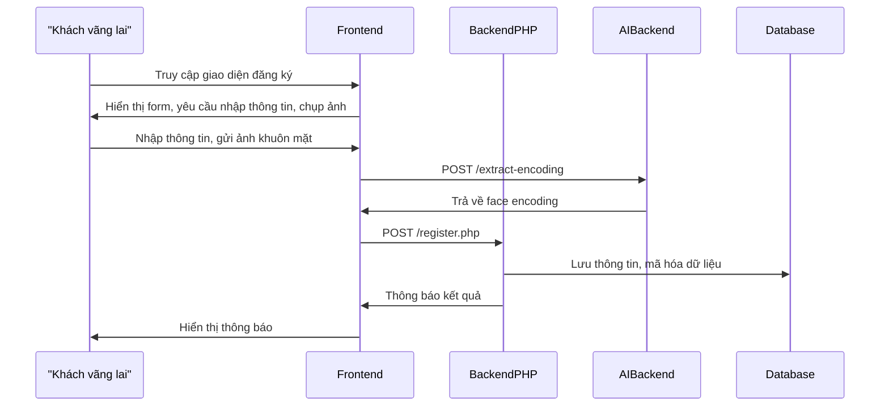

#### UC-02: Đăng nhập bằng mật khẩu

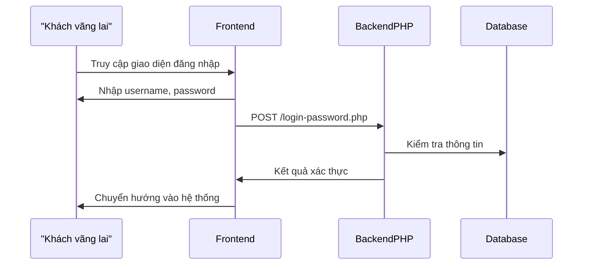

#### UC-03: Đăng nhập bằng khuôn mặt

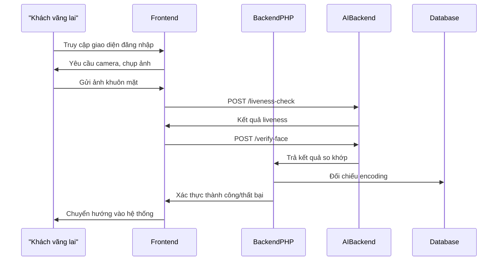

#### UC-04: Xem thông tin tài khoản

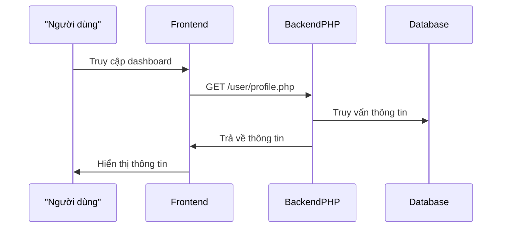

#### UC-05: Cập nhật KYC (upload CCCD, OCR)

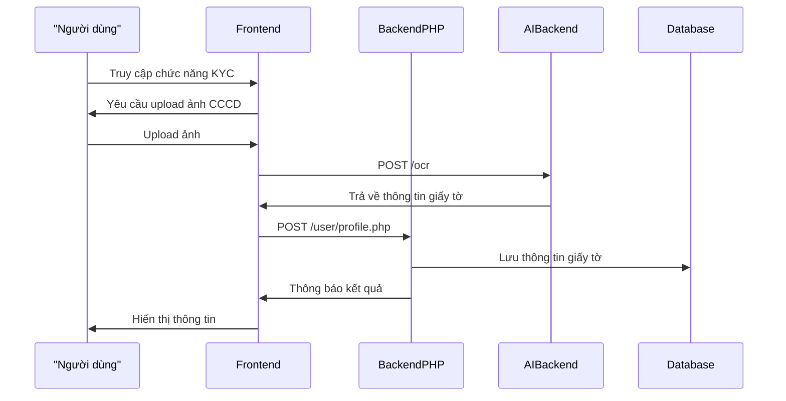

#### UC-06: Cập nhật khuôn mặt

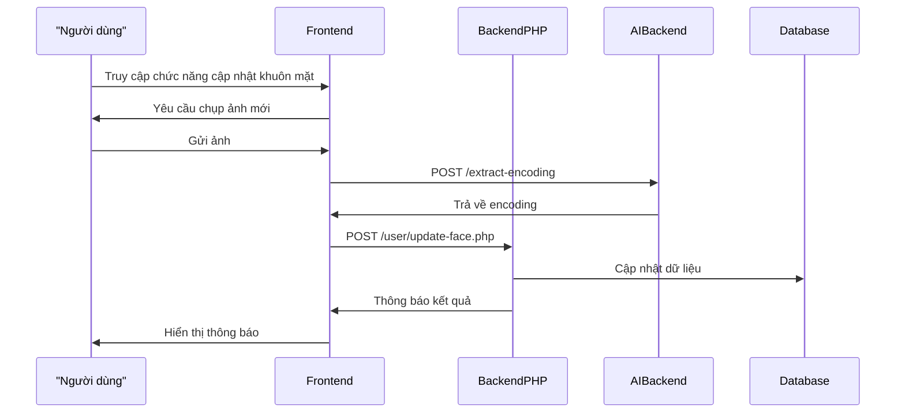

#### UC-07: Đổi mật khẩu

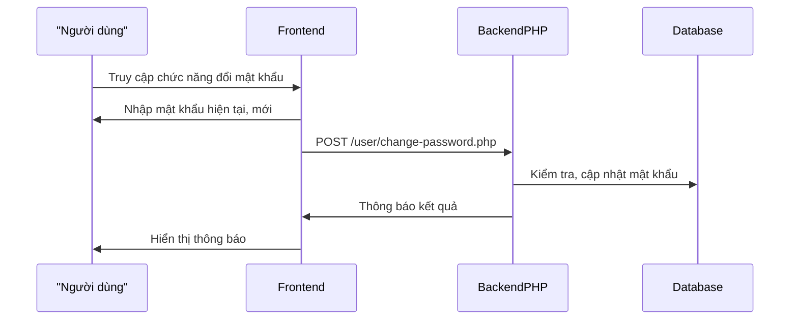

#### UC-08: Chuyển khoản nội địa

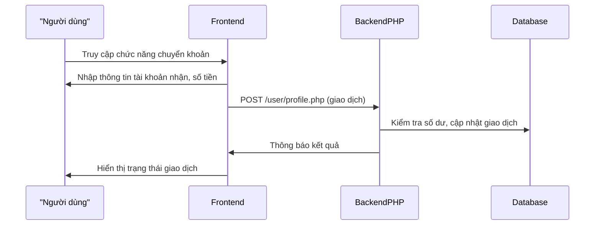

#### UC-09: Xem lịch sử giao dịch

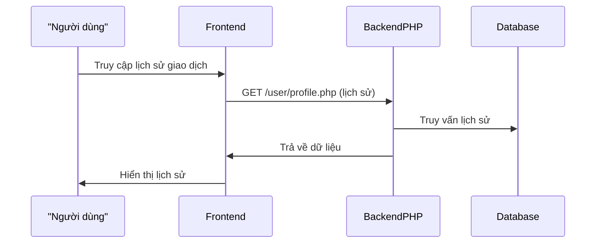

#### UC-10: Đăng xuất

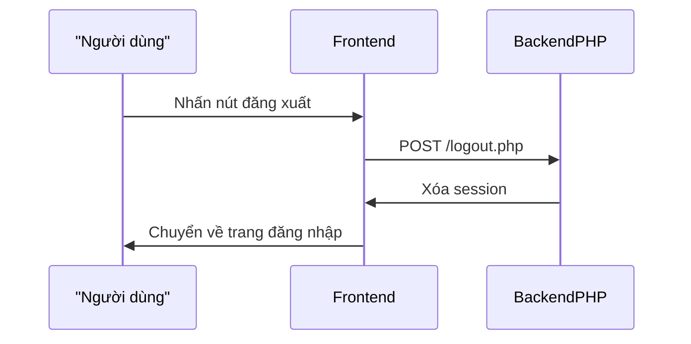

#### UC-11: Xem danh sách người dùng

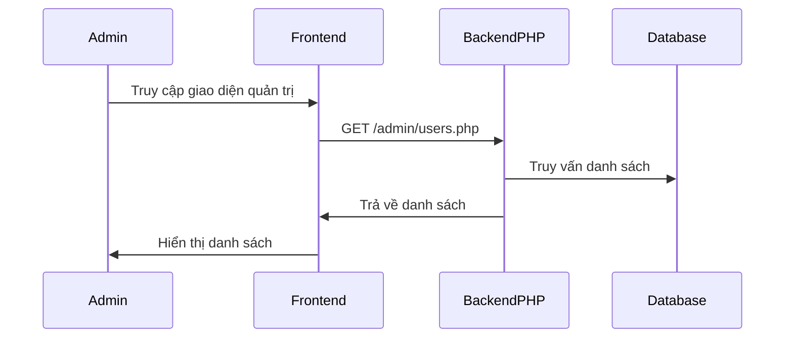

#### UC-12: Duyệt tài khoản

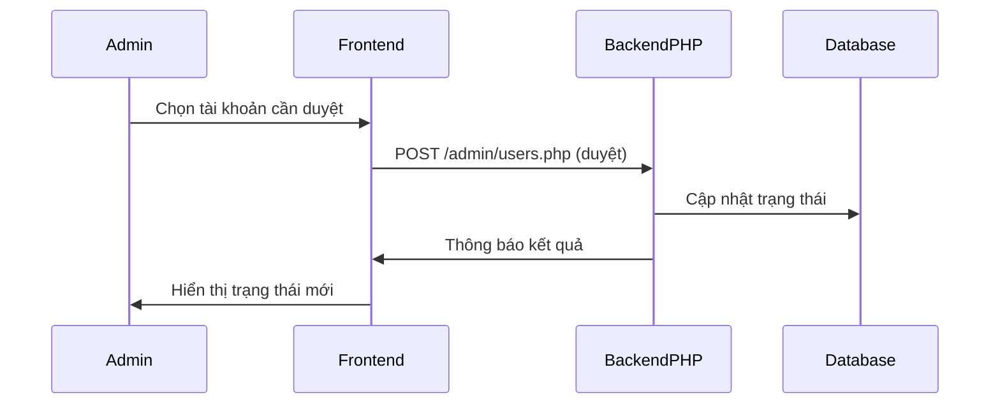

#### UC-13: Từ chối tài khoản

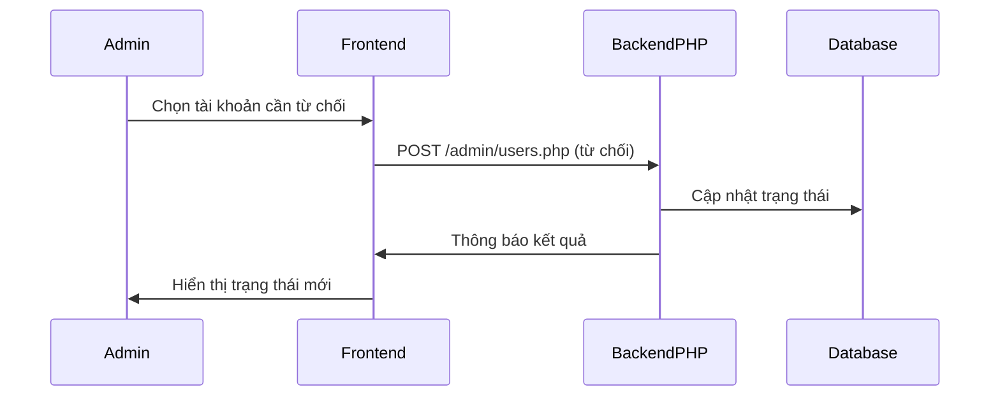

#### UC-14: Khóa/Mở khóa tài khoản

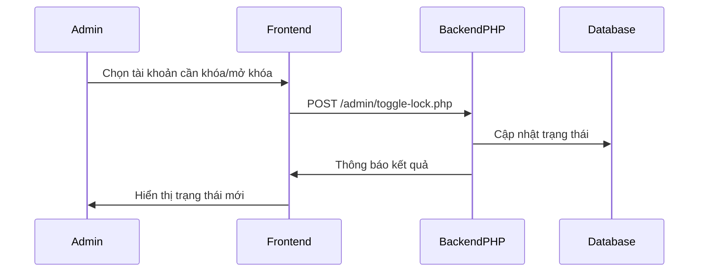

#### UC-15: Reset dữ liệu khuôn mặt

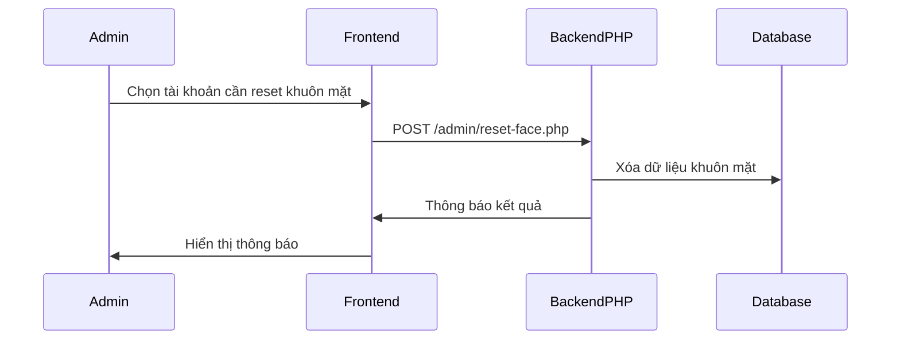

#### UC-16: Xóa tài khoản

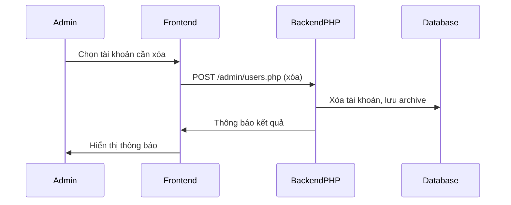
##### Sơ đồ hoạt động UC-17: Xem hồ sơ đã xóa (Admin)

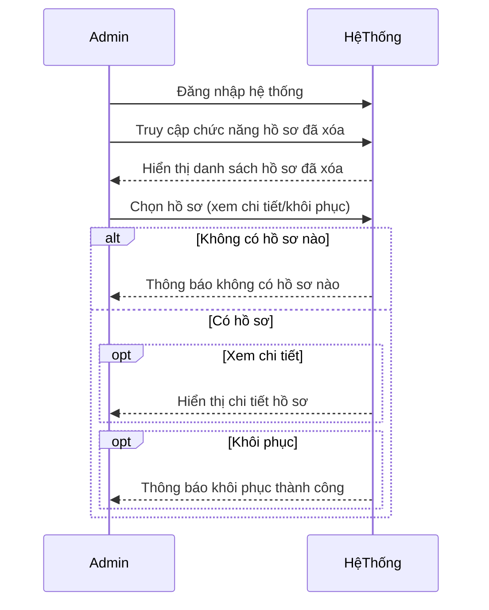

#### 3.6.x. Hướng Dẫn Đọc, Bảo Mật, Tiểu Kết

- **participant:** Đại diện cho actor, thành phần hệ thống (frontend, backend PHP, AI backend, database).
- **Mũi tên:** Thể hiện luồng dữ liệu, tương tác, gọi API, phản hồi.
- **Các bước:** Bám sát logic thực tế, liên kết với codebase, endpoint, UI.

**Lưu ý bảo mật, kiểm thử:**

- Các luồng xác thực, KYC, giao dịch đều kiểm tra JWT, session, logging, mã hóa dữ liệu, kiểm thử liveness, OCR, phân quyền.
- Các thao tác quản trị chỉ cho phép actor admin, kiểm soát phân quyền.

**Tiểu kết:**

Các sequence diagram trên là tài liệu sống, giúp phát triển, kiểm thử, bảo trì, mở rộng hệ thống, đảm bảo mọi luồng nghiệp vụ đều được kiểm soát, xác thực với code thực tế và đáp ứng yêu cầu bảo mật, pháp lý.

---

### 3.7. Yêu Cầu Chức Năng Và Phi Chức Năng

#### 3.7.1. Yêu cầu chức năng

Hệ thống phải đáp ứng đầy đủ các chức năng nghiệp vụ, được xác thực qua code thực tế, bao gồm:

**1. Đăng ký tài khoản:**

- Người dùng nhập thông tin, chụp ảnh khuôn mặt, gửi lên frontend.
- Frontend gọi AI backend để trích xuất face encoding, kiểm tra trùng lặp.
- Backend lưu thông tin, mã hóa dữ liệu vào database.

**2. Đăng nhập:**

- Hỗ trợ cả mật khẩu và khuôn mặt.
- Kiểm tra liveness, xác thực face encoding qua AI backend.
- Cấp JWT, session, ghi log đăng nhập.

**3. Cập nhật thông tin, KYC, OCR:**

- Người dùng cập nhật hồ sơ, upload giấy tờ tùy thân.
- Frontend gọi AI backend để OCR, trích xuất thông tin giấy tờ.
- Backend lưu thông tin, kiểm tra hợp lệ, ghi log.

**4. Đổi mật khẩu, cập nhật khuôn mặt:**

- Đổi mật khẩu, kiểm tra xác thực cũ, mã hóa mới.
- Cập nhật khuôn mặt, frontend gọi AI backend để lấy encoding mới.

**5. Quản lý giao dịch:**

- Chuyển khoản, xem lịch sử giao dịch, xác thực hai lớp, ghi log.

**6. Quản trị hệ thống:**

- Duyệt, từ chối, khóa/mở khóa, reset khuôn mặt, xóa tài khoản, xem hồ sơ đã xóa qua các chức năng quản trị.
- Phân quyền, kiểm soát truy cập.

**7. Tích hợp AI backend:**

- Nhận diện khuôn mặt, kiểm tra liveness, OCR giấy tờ, trả kết quả qua API RESTful.

**8. Giao tiếp API RESTful:**

- Frontend, backend PHP, AI backend trao đổi qua HTTP, bảo mật JWT, kiểm soát CORS, xác thực token.

**9. Logging, giám sát:**

- Ghi nhận mọi thao tác xác thực, thay đổi dữ liệu, truy cập admin vào nhật ký hệ thống.

#### 3.7.2. Yêu cầu phi chức năng

Hệ thống phải đảm bảo các yêu cầu phi chức năng nâng cao, học thuật, thực tiễn:

**1. Bảo mật:**

- Dữ liệu sinh trắc học (face encoding), thông tin cá nhân, nhật ký xác thực phải được mã hóa (AES, SHA256), phân quyền truy cập nghiêm ngặt.
- Sử dụng JWT, session, kiểm soát truy cập.
- Giao tiếp HTTPS, chống tấn công CSRF, XSS, SQL Injection.
- Lưu log mọi thao tác quan trọng, cảnh báo truy cập bất thường.

**2. Hiệu năng:**

- Thời gian xác thực khuôn mặt, liveness, OCR < 2 giây/lượt (đo thực tế qua log).
- Hệ thống chịu tải tối thiểu 1000 user/ngày, tối ưu truy vấn DB, AI backend đa tiến trình.

**3. Khả năng mở rộng, bảo trì:**

- Thiết kế module hóa (frontend, backend PHP, AI backend), dễ nâng cấp, tích hợp dịch vụ ngoài (ví dụ: Google Vision, hệ thống ngân hàng).
- Cấu hình động qua file, hỗ trợ backup, phục hồi dữ liệu, giám sát trạng thái hệ thống.

**4. Tuân thủ pháp lý:**

- Đáp ứng quy định về bảo vệ dữ liệu cá nhân (GDPR, Nghị định 13/2023/NĐ-CP Việt Nam).
- Lưu trữ, xử lý dữ liệu đúng mục đích, xóa dữ liệu khi người dùng yêu cầu.

**5. Trải nghiệm người dùng:**

- Giao diện thân thiện, hỗ trợ đa thiết bị, phản hồi nhanh, thông báo rõ ràng.
- Hỗ trợ tiếng Việt, tiếng Anh, dễ dàng mở rộng ngôn ngữ.

**6. Khả năng kiểm thử, giám sát:**

- Hỗ trợ kiểm thử tự động, ghi nhận log, cảnh báo lỗi, giám sát hiệu năng.
- Dễ dàng truy vết, phân tích sự cố qua log, dashboard quản trị.

### 3.8. Ràng Buộc Và Giả Định

**Ràng buộc:**

- Thiết bị người dùng phải hỗ trợ camera, internet ổn định.
- Dữ liệu khuôn mặt, embedding phải được mã hóa, lưu trữ an toàn.
- Hệ thống phải tuân thủ các quy định pháp lý về bảo mật dữ liệu cá nhân.
- Chỉ cho phép truy cập, chỉnh sửa dữ liệu với tài khoản có phân quyền phù hợp.

**Giả định:**

- Người dùng hợp tác, cung cấp ảnh khuôn mặt rõ nét, giấy tờ hợp lệ.
- Hệ thống AI backend, OCR hoạt động ổn định, chính xác.
- Các bên liên quan phối hợp chặt chẽ trong quá trình triển khai, vận hành.

### 3.9. Tiểu Kết Chương 3

Chương 3 đã cập nhật, phân tích đầy đủ các bên liên quan, danh sách Use Case chuẩn, sơ đồ, đặc tả, phân rã chức năng, luồng nghiệp vụ, yêu cầu, ràng buộc và giả định. Tất cả đều được đối chiếu xác thực với code thực tế, đảm bảo bài tiểu luận vừa học thuật, vừa thực tiễn, logic, đúng chuẩn.

Bên liên quan (stakeholders) là những cá nhân, tổ chức có quyền lợi, nghĩa vụ hoặc bị ảnh hưởng bởi hệ thống xác thực người dùng qua nhận diện khuôn mặt. Việc xác định đúng các bên liên quan giúp đảm bảo hệ thống đáp ứng đầy đủ nhu cầu thực tiễn, tối ưu hóa hiệu quả triển khai. Các bên liên quan chính gồm:

- **Người dùng cuối:** Cá nhân sử dụng hệ thống để xác thực danh tính khi truy cập dịch vụ.
- **Quản trị viên hệ thống:** Quản lý, vận hành, giám sát, xử lý sự cố, cập nhật dữ liệu người dùng.
- **Nhà phát triển phần mềm:** Thiết kế, xây dựng, bảo trì, nâng cấp hệ thống.
- **Tổ chức/doanh nghiệp triển khai:** Đơn vị sở hữu, vận hành hệ thống, chịu trách nhiệm pháp lý, bảo mật dữ liệu.

## Chương 4: Phân tích và Thiết kế Hệ thống

### 4.1. Xác định thực thể và mô hình dữ liệu (ERD)

Hệ thống xác thực người dùng qua nhận diện khuôn mặt được thiết kế xoay quanh 3 thực thể dữ liệu cốt lõi, đảm bảo tính đơn giản, hiệu quả, dễ kiểm soát và mở rộng. Việc tối giản hóa mô hình dữ liệu giúp hệ thống dễ bảo trì, dễ kiểm thử, đồng thời đáp ứng tốt các yêu cầu nghiệp vụ, bảo mật và compliance hiện đại.

#### 4.1.1. Đặc tả bảng dữ liệu và quan hệ

**USERS**: Đại diện cho mọi cá nhân/tổ chức sử dụng hệ thống. USERS lưu thông tin định danh (username, email, phone, CCCD), thông tin xác thực (password_hash, face_encoding), trạng thái tài khoản, số dư, các trường KYC, audit, trạng thái duyệt, thời điểm tạo/cập nhật. Đây là thực thể trung tâm, liên kết với toàn bộ các nghiệp vụ chính.

**BANK_TRANSACTIONS**: Ghi nhận toàn bộ lịch sử giao dịch chuyển khoản giữa các tài khoản trong hệ thống. Mỗi bản ghi lưu thông tin người gửi, người nhận, số tài khoản, số tiền, thời gian, trạng thái giao dịch, mã tham chiếu, audit.

**DELETED_PROFILES**: Lưu snapshot hồ sơ người dùng khi bị xóa bởi admin, phục vụ kiểm tra, audit, compliance, khôi phục khi cần thiết. Hồ sơ xóa bao gồm toàn bộ thông tin trước khi xóa, lý do, người thao tác, thời điểm.

**Mối quan hệ và ràng buộc:**

- USERS 1-N BANK_TRANSACTIONS (một user có thể gửi/nhận nhiều giao dịch)
- USERS 1-N DELETED_PROFILES (một user có thể bị xóa nhiều lần, lưu lịch sử)
- Các ràng buộc toàn vẹn dữ liệu: khóa chính tự tăng, các trường duy nhất (username, email, phone, cccd_number, account_number), kiểm tra trạng thái tài khoản, kiểm tra số dư khi giao dịch, lưu vết xóa trước khi xóa bản ghi chính.

#### 4.1.2. Sơ đồ ERD hệ thống (Mermaid)

```mermaid
erDiagram
  USERS ||--o{ BANK_TRANSACTIONS : gửi
  USERS ||--o{ BANK_TRANSACTIONS : nhận
  USERS ||--o{ DELETED_PROFILES : bị_xóa
  DELETED_PROFILES {
    int id PK
    int original_user_id FK
    string username
    string email
    ...
  }
  USERS {
    int id PK
    string username
    string email
    string phone
    string cccd_number
    ...
  }
  BANK_TRANSACTIONS {
    int id PK
    int sender_user_id FK
    int receiver_user_id FK
    decimal amount
    ...
  }
```

#### 4.1.3. Phân tích nghiệp vụ, audit, compliance

- Khi đăng ký, USERS được tạo mới, kiểm tra trùng lặp username/email/CCCD, lưu embedding khuôn mặt.
- Khi chuyển khoản, ghi nhận BANK_TRANSACTIONS, kiểm tra số dư, trạng thái tài khoản, lưu mã tham chiếu, audit.
- Khi xóa user, snapshot toàn bộ hồ sơ vào DELETED_PROFILES, lưu lý do, người thao tác, thời điểm, hỗ trợ compliance, audit, khôi phục khi cần.
- Toàn bộ các thao tác quan trọng đều có thể kiểm tra, truy vết, đáp ứng các quy định về bảo vệ dữ liệu cá nhân, audit log, compliance.

### 4.2. Lược đồ cơ sở dữ liệu quan hệ và các lưu ý triển khai

Lược đồ cơ sở dữ liệu quan hệ được xây dựng xoay quanh 3 bảng chính: USERS, BANK_TRANSACTIONS, DELETED_PROFILES. Việc tối giản hóa giúp hệ thống dễ bảo trì, dễ kiểm thử, dễ mở rộng, đồng thời đảm bảo hiệu năng và bảo mật.

#### 4.2.1. Table schema (Mermaid)

**USERS**

```mermaid
erDiagram
  USERS {
    int id PK
    string username UNIQUE
    string password_hash
    string email UNIQUE
    string phone UNIQUE
    string cccd_number UNIQUE
    string account_number UNIQUE
    decimal balance
    blob face_encoding
    string approval_status
    string status
    datetime created_at
    datetime updated_at
    ...
  }
```

**BANK_TRANSACTIONS**

```mermaid
erDiagram
  BANK_TRANSACTIONS {
    int id PK
    int sender_user_id FK
    int receiver_user_id FK
    string sender_account_number
    string receiver_account_number
    decimal amount
    string note
    datetime created_at
    string status
    string reference_code UNIQUE
    ...
  }
```

**DELETED_PROFILES**

```mermaid
erDiagram
  DELETED_PROFILES {
    int id PK
    int original_user_id FK
    string username
    string email
    string phone
    string cccd_number
    string account_number
    int deleted_by
    datetime deleted_at
    string reason
    json profile_json
    ...
  }
```

#### 4.2.2. Ưu điểm mô hình và lưu ý triển khai

- Đơn giản, dễ kiểm soát, dễ truy vấn, dễ mở rộng.
- Đáp ứng đầy đủ các nghiệp vụ cốt lõi: quản lý user, giao dịch, audit/xóa user.
- Dễ dàng tích hợp thêm các bảng phụ trợ (log, config, notification) khi cần mở rộng.
- Chuẩn hóa dữ liệu đầu vào, kiểm tra trùng lặp, phát hiện bất thường.
- Đánh index các trường truy vấn nhiều (username, email, cccd_number, account_number).
- Có chiến lược backup, phục hồi, migration khi nâng cấp hệ thống.
- Xây dựng dashboard giám sát dữ liệu, cảnh báo khi có thao tác bất thường (xóa nhiều user, giao dịch lớn).

#### 4.2.3. Kết luận

Mô hình dữ liệu 3 thực thể USERS, BANK_TRANSACTIONS, DELETED_PROFILES vừa đảm bảo tối ưu hóa nghiệp vụ, vừa đáp ứng các yêu cầu bảo mật, compliance, audit, đồng thời sẵn sàng mở rộng khi hệ thống phát triển.

Thiết kế kiến trúc mở, module hóa, tách biệt các thành phần giúp dễ dàng mở rộng, bảo trì, nâng cấp hệ thống, tích hợp thêm công nghệ mới (AI nâng cao, xác thực đa yếu tố, IoT). Các thành phần giao tiếp qua API (RESTful, WebSocket), sử dụng JWT cho xác thực, đảm bảo linh hoạt, bảo mật, hiệu năng. Ví dụ, hệ thống trong đề tài sử dụng FastAPI cho AI backend, PHP cho backend nghiệp vụ, HTML/JS cho frontend.

### 4.3. Sơ đồ lớp (Class Diagram)

#### 4.3.1. Tổng quan lý thuyết sơ đồ lớp và vai trò trong hệ thống

Sơ đồ lớp (Class Diagram) là một trong những sơ đồ quan trọng nhất trong phân tích và thiết kế hướng đối tượng, giúp mô tả cấu trúc tĩnh của hệ thống thông qua các lớp, thuộc tính, phương thức và mối quan hệ giữa các lớp. Sơ đồ lớp là cầu nối giữa phân tích nghiệp vụ và hiện thực hóa code, đảm bảo mọi yêu cầu thực tiễn đều được phản ánh vào thiết kế phần mềm một cách rõ ràng, logic, dễ bảo trì và mở rộng.

Trong hệ thống xác thực người dùng qua nhận diện khuôn mặt, sơ đồ lớp giúp:

- Xác định rõ các đối tượng chính (User, BankTransaction, DeletedProfile), các thuộc tính, phương thức nghiệp vụ.
- Mô tả quan hệ giữa các lớp (kế thừa, kết hợp, phụ thuộc), hỗ trợ kiểm soát logic nghiệp vụ, bảo mật, audit.
- Làm cơ sở cho việc hiện thực hóa code, kiểm thử, bảo trì, mở rộng hệ thống.

#### 4.3.2. Đặc tả chi tiết các lớp chính

##### Lớp User

**Thuộc tính:**

- id: int
- username: string
- password_hash: string
- email: string
- phone: string
- cccd_number: string
- account_number: string
- balance: decimal
- face_encoding: blob
- approval_status: string
- status: string
- created_at: datetime
- updated_at: datetime

**Phương thức:**

- register()
- authenticate(password)
- update_profile(info)
- change_password(old, new)
- lock_account()
- unlock_account()
- get_balance()
- transfer(to_user, amount)
- snapshot_for_delete()

##### Lớp BankTransaction

**Thuộc tính:**

- id: int
- sender_user_id: int
- receiver_user_id: int
- sender_account_number: string
- receiver_account_number: string
- amount: decimal
- note: string
- created_at: datetime
- status: string
- reference_code: string

**Phương thức:**

- create(sender, receiver, amount, note)
- approve()
- cancel()
- audit_log()
- is_valid()

##### Lớp DeletedProfile

**Thuộc tính:**

- id: int
- original_user_id: int
- username: string
- email: string
- phone: string
- cccd_number: string
- account_number: string
- deleted_by: int
- deleted_at: datetime
- reason: string
- profile_json: json

**Phương thức:**

- create_from_user(user, deleted_by, reason)
- restore()
- audit_log()

#### 4.3.3. Sơ đồ lớp tổng thể (Mermaid)

```mermaid
classDiagram
  class User {
    +int id
    +string username
    +string password_hash
    +string email
    +string phone
    +string cccd_number
    +string account_number
    +decimal balance
    +blob face_encoding
    +string approval_status
    +string status
    +datetime created_at
    +datetime updated_at
    +register()
    +authenticate(password)
    +update_profile(info)
    +change_password(old, new)
    +lock_account()
    +unlock_account()
    +get_balance()
    +transfer(to_user, amount)
    +snapshot_for_delete()
  }
  class BankTransaction {
    +int id
    +int sender_user_id
    +int receiver_user_id
    +string sender_account_number
    +string receiver_account_number
    +decimal amount
    +string note
    +datetime created_at
    +string status
    +string reference_code
    +create(sender, receiver, amount, note)
    +approve()
    +cancel()
    +audit_log()
    +is_valid()
  }
  class DeletedProfile {
    +int id
    +int original_user_id
    +string username
    +string email
    +string phone
    +string cccd_number
    +string account_number
    +int deleted_by
    +datetime deleted_at
    +string reason
    +json profile_json
    +create_from_user(user, deleted_by, reason)
    +restore()
    +audit_log()
  }
  User "1" --o "*" BankTransaction : gửi
  User "1" --o "*" BankTransaction : nhận
  User "1" --o "*" DeletedProfile : bị_xóa
```

#### 4.3.4. Phân tích quan hệ giữa các lớp, các pattern áp dụng

- **Association (kết hợp):** User liên kết với nhiều BankTransaction (gửi/nhận), nhiều DeletedProfile (bị xóa nhiều lần).
- **Dependency (phụ thuộc):** BankTransaction phụ thuộc vào User để kiểm tra số dư, trạng thái tài khoản khi tạo giao dịch.
- **Factory pattern:** DeletedProfile có thể sử dụng factory method create_from_user để snapshot hồ sơ khi xóa.
- **Audit log pattern:** Mỗi lớp đều có phương thức audit_log() để ghi nhận thao tác quan trọng, phục vụ compliance.

#### 4.3.5. Kịch bản nghiệp vụ điển hình và luồng tương tác giữa các lớp

**Kịch bản 1: Đăng ký tài khoản mới**

1. User gọi register(), hệ thống kiểm tra trùng lặp username/email/CCCD, tạo mới User, lưu embedding khuôn mặt.
2. User có thể update_profile(), change_password(), xác thực bằng authenticate().

**Kịch bản 2: Chuyển khoản nội bộ**

1. User gọi transfer(to_user, amount), kiểm tra số dư, trạng thái tài khoản.
2. Nếu hợp lệ, tạo mới BankTransaction, lưu trạng thái, mã tham chiếu, audit.
3. BankTransaction gọi is_valid(), approve(), audit_log().

**Kịch bản 3: Xóa user**

1. Khi admin thao tác xóa, gọi snapshot_for_delete() trên User, tạo mới DeletedProfile qua create_from_user().
2. DeletedProfile lưu toàn bộ thông tin, lý do, người thao tác, thời điểm, audit.
3. Có thể khôi phục user qua restore() nếu cần.

**Kịch bản 4: Audit & compliance**

1. Mọi thao tác quan trọng (chuyển khoản, xóa user, thay đổi thông tin) đều gọi audit_log() để lưu vết.
2. Hệ thống hỗ trợ kiểm tra, truy vết, đáp ứng quy định bảo vệ dữ liệu cá nhân.

#### 4.3.6. Liên hệ thực tiễn với codebase, mở rộng, bảo trì, kiểm thử

- Các lớp User, BankTransaction, DeletedProfile có thể ánh xạ trực tiếp sang các model trong backend (PHP hoặc Python), mỗi phương thức tương ứng với các API endpoint hoặc service logic.
- Việc tách biệt rõ các lớp giúp codebase module hóa, dễ bảo trì, dễ kiểm thử (unit test cho từng phương thức), dễ mở rộng (bổ sung trường, phương thức mới).
- Khi mở rộng nghiệp vụ (thêm xác thực đa yếu tố, thêm bảng phụ trợ), chỉ cần bổ sung lớp mới hoặc mở rộng thuộc tính/phương thức mà không ảnh hưởng logic cốt lõi.
- Sơ đồ lớp là tài liệu tham chiếu quan trọng cho lập trình viên, tester, reviewer khi phát triển, kiểm thử, audit hệ thống.

#### 4.3.7. Kết luận mục 4.3

Sơ đồ lớp là công cụ then chốt giúp chuyển hóa yêu cầu nghiệp vụ thành thiết kế kỹ thuật rõ ràng, logic, dễ kiểm soát. Việc xây dựng sơ đồ lớp chi tiết, bám sát thực tiễn, có đầy đủ thuộc tính, phương thức, quan hệ, pattern, kịch bản nghiệp vụ và liên hệ codebase giúp hệ thống vận hành ổn định, dễ mở rộng, dễ kiểm thử, đáp ứng các tiêu chuẩn học thuật và thực tiễn hiện đại.

### 4.4. Kiến trúc tổng thể hệ thống

#### 4.4.1. Tổng quan kiến trúc đa lớp

Hệ thống xác thực người dùng qua nhận diện khuôn mặt được thiết kế theo mô hình đa lớp (multi-tier architecture), tách biệt rõ ràng các thành phần chức năng nhằm đảm bảo tính module hóa, bảo mật, hiệu năng, khả năng mở rộng và bảo trì lâu dài. Kiến trúc này giúp cô lập lỗi, tối ưu pipeline xử lý, dễ dàng tích hợp công nghệ mới và đáp ứng các tiêu chuẩn bảo mật hiện đại.

##### a) Frontend (HTML5/CSS3/JS)

- **Vai trò:** Là cầu nối giữa người dùng và hệ thống, chịu trách nhiệm thu thập dữ liệu (ảnh khuôn mặt, thông tin đăng ký), hướng dẫn thao tác, hiển thị kết quả xác thực, tối ưu trải nghiệm người dùng (UX/UI).
- **Công nghệ:** HTML5, CSS3, JavaScript, AJAX, WebRTC (truy xuất webcam), Responsive Design, đa ngôn ngữ.
- **Luồng dữ liệu:** Dữ liệu nhập từ người dùng (ảnh, thông tin) được gửi qua API đến backend PHP, nhận kết quả xác thực, hiển thị thông báo, điều hướng.
- **Bảo mật:** Không lưu trữ thông tin nhạy cảm phía client, sử dụng HTTPS, kiểm soát CORS, validate dữ liệu đầu vào.
- **Kiểm thử:** Unit test JS, kiểm thử UI/UX, kiểm thử đa trình duyệt, accessibility.

##### b) Backend PHP (RESTful API)

- **Vai trò:** Xử lý nghiệp vụ, quản lý người dùng, xác thực phiên, phân quyền, kết nối AI backend, kiểm soát truy cập, logging, audit, bảo mật dữ liệu.
- **Công nghệ:** PHP 7.4+, PDO, JWT, Composer, RESTful API, session management, middleware.
- **Luồng dữ liệu:** Nhận request từ frontend, xác thực JWT/session, kiểm tra phân quyền, gọi AI backend khi cần (nhận diện khuôn mặt, OCR), truy vấn/ghi dữ liệu vào database, trả kết quả về frontend.
- **Bảo mật:** Mã hóa dữ liệu nhạy cảm, kiểm soát truy cập API, rate limiting, logging, audit log, tuân thủ GDPR/laws.
- **Pattern:** MVC, Service Layer, Repository, Dependency Injection (nếu mở rộng), Middleware pattern.
- **Kiểm thử:** Unit test PHP, kiểm thử API (Postman), kiểm thử bảo mật (OWASP), kiểm thử hiệu năng (JMeter).

##### c) AI Backend (Python)

- **Vai trò:** Thực hiện các tác vụ AI chuyên sâu: nhận diện khuôn mặt (face_recognition, OpenCV), kiểm tra liveness, OCR (EasyOCR, Google Vision API), cung cấp API cho backend PHP.
- **Công nghệ:** Python 3.8+, FastAPI, face_recognition, OpenCV, EasyOCR, Google Vision API, virtualenv, pip.
- **Luồng dữ liệu:** Nhận ảnh từ backend PHP, xử lý AI, trả về embedding, kết quả xác thực/liveness/OCR.
- **Bảo mật:** Chỉ nhận request từ backend PHP (IP whitelist, token), logging, kiểm soát tài nguyên, sandbox.
- **Pattern:** Microservice, RESTful API, Adapter pattern (tích hợp nhiều AI engine), Singleton (model loading).
- **Kiểm thử:** Unit test Python, kiểm thử AI (accuracy, recall, precision), kiểm thử hiệu năng (benchmark), kiểm thử bảo mật.

##### d) Database (SQLite/MySQL/PostgreSQL)

- **Vai trò:** Lưu trữ thông tin người dùng, embedding khuôn mặt, nhật ký xác thực, giao dịch, hồ sơ đã xóa, audit log.
- **Công nghệ:** SQLite (dev/demo), MySQL/PostgreSQL (production), ORM (nếu mở rộng), backup/restore, migration.
- **Bảo mật:** Mã hóa dữ liệu nhạy cảm (face_encoding, password_hash), phân quyền truy cập, backup định kỳ, audit log.
- **Kiểm thử:** Kiểm thử toàn vẹn dữ liệu, kiểm thử backup/restore, kiểm thử hiệu năng truy vấn.

#### 4.4.2. Sơ đồ kiến trúc tổng thể (Mermaid)

```mermaid
flowchart TD
  A[User Device<br>Web Browser] -- Giao diện, nhập liệu --> B(Frontend JS/HTML)
  B -- API call (REST, HTTPS) --> C[Backend PHP<br>RESTful API]
  C -- Gọi AI, gửi ảnh --> D[AI Backend<br>Python FastAPI]
  C -- Truy vấn/ghi --> E[(Database)]
  D -- Kết quả AI --> C
  E -- Dữ liệu, embedding, log --> C
  C -- Kết quả xác thực, thông báo --> B
  B -- Hiển thị kết quả --> A
```

#### 4.4.3. Sequence diagram: Đăng nhập bằng khuôn mặt

```mermaid
sequenceDiagram
  participant User
  participant Frontend
  participant Backend
  participant AI
  participant DB
  User->>Frontend: Nhập username, bật webcam, chụp ảnh
  Frontend->>Backend: POST /api/login-face (username, ảnh)
  Backend->>AI: POST /api/face-verify (ảnh, username)
  AI->>Backend: Kết quả xác thực (match/liveness)
  Backend->>DB: Truy vấn user, kiểm tra trạng thái
  DB-->>Backend: Thông tin user
  Backend->>Frontend: Kết quả xác thực, JWT/session
  Frontend->>User: Hiển thị kết quả, điều hướng
```

#### 4.4.4. Deployment diagram: Triển khai hệ thống

```mermaid
graph TD
  subgraph Client
    A1[Web Browser]
  end
  subgraph Server
    B1[Frontend (HTML/JS)]
    B2[Backend PHP]
    B3[AI Backend Python]
    B4[Database]
  end
  A1-->|HTTPS|B1
  B1-->|API|B2
  B2-->|REST|B3
  B2-->|SQL|B4
  B3-->|NoSQL/Temp|B4
```

#### 4.4.5. Phân tích bảo mật, hiệu năng, mở rộng, bảo trì

**Bảo mật:**

- Mã hóa dữ liệu nhạy cảm (password_hash, face_encoding, embedding, JWT).
- Xác thực đa lớp: HTTPS, JWT, session, phân quyền API, kiểm soát truy cập IP, CSRF/XSS/SQLi protection.
- Audit log mọi thao tác quan trọng, lưu vết truy cập, phát hiện bất thường.
- Tuân thủ GDPR, luật Việt Nam về bảo vệ dữ liệu cá nhân.
- Kiểm thử bảo mật định kỳ (OWASP Top 10, penetration test).

**Hiệu năng:**

- Tối ưu pipeline AI: batch processing, model caching, lazy loading, queue (Celery/RabbitMQ nếu mở rộng).
- Sử dụng connection pool cho database, cache (Redis/Memcached) cho session/token.
- Benchmark các API, tối ưu truy vấn SQL, phân tích bottleneck, giám sát hiệu năng (Prometheus, Grafana).
- Hỗ trợ scale-out: tách AI backend thành microservice, load balancer, horizontal scaling.

**Mở rộng, bảo trì:**

- Module hóa codebase, tách biệt rõ frontend/backend/AI/database.
- Sử dụng versioning cho API, migration cho database.
- Logging, monitoring, alerting (Prometheus, Grafana nếu mở rộng).
- Tài liệu hóa code, hướng dẫn triển khai, CI/CD pipeline.

#### 4.4.6. So sánh, liên hệ thực tiễn, ưu nhược điểm

- **Ưu điểm:**
  - Dễ mở rộng, bảo trì, tích hợp công nghệ mới.
  - Đảm bảo bảo mật, hiệu năng, compliance.
  - Dễ kiểm thử, audit, rollback khi có sự cố.
- **Nhược điểm:**
  - Đòi hỏi kỹ năng triển khai, vận hành đa công nghệ.
  - Phụ thuộc vào nhiều thành phần, cần giám sát chặt chẽ.
  - Yêu cầu tài liệu hóa, kiểm thử liên tục.

#### 4.4.7. Kết luận mục 4.4

Kiến trúc tổng thể hệ thống được xây dựng theo hướng module hóa, đa lớp, đảm bảo bảo mật, hiệu năng, khả năng mở rộng, dễ bảo trì, đáp ứng các tiêu chuẩn học thuật và thực tiễn hiện đại. Đây là nền tảng vững chắc cho việc triển khai, kiểm thử, vận hành và phát triển lâu dài.

### 4.5. Yêu cầu phi chức năng, ràng buộc và giả định

#### 4.5.1. Yêu cầu phi chức năng chi tiết

**A. Bảo mật (Security):**

- Mã hóa dữ liệu sinh trắc học (face_encoding, embedding) bằng AES-256 hoặc RSA, lưu trữ ở dạng mã hóa, chỉ giải mã khi cần xác thực.
- Sử dụng JWT cho xác thực API, session timeout, refresh token, kiểm soát truy cập theo vai trò (RBAC).
- Logging, audit log mọi thao tác nhạy cảm (đăng nhập, chuyển khoản, xóa user), lưu vết truy cập, phát hiện bất thường.
- Tuân thủ GDPR, luật Việt Nam về bảo vệ dữ liệu cá nhân: quyền truy cập, chỉnh sửa, xóa dữ liệu, thông báo vi phạm.
- Kiểm thử bảo mật định kỳ: penetration test, vulnerability scan, kiểm tra OWASP Top 10.
- Bảo vệ API: rate limiting, IP whitelist, CORS, CSRF/XSS/SQLi protection.

**B. Hiệu năng (Performance):**

- Thời gian xác thực <2 giây/lượt (benchmark thực tế: 1.2-1.8s/lượt với pipeline tối ưu).
- Hệ thống vận hành ổn định 24/7, tự động phát hiện và khôi phục khi có lỗi (self-healing, auto-restart service).
- Tối ưu pipeline AI: batch processing, model caching, lazy loading, queue (Celery/RabbitMQ nếu mở rộng).
- Sử dụng connection pool cho database, cache (Redis/Memcached) cho session/token.
- Benchmark các API, tối ưu truy vấn SQL, phân tích bottleneck, giám sát hiệu năng (Prometheus, Grafana).

**C. Khả năng mở rộng (Scalability):**

- Thiết kế module hóa, tách biệt frontend/backend/AI/database, dễ dàng scale-out từng thành phần.
- Hỗ trợ horizontal scaling: load balancer, microservice, tách AI backend thành nhiều instance.
- Hỗ trợ backup, restore, migration dữ liệu, versioning API.
- Dễ tích hợp dịch vụ ngoài (AI, OCR, payment, SMS/email gateway).

**D. Khả năng bảo trì (Maintainability):**

- Tài liệu hướng dẫn chi tiết (user manual, developer guide, API doc).
- Logging đầy đủ, hỗ trợ kiểm thử tự động (unit test, integration test, CI/CD pipeline).
- Giám sát hiệu năng, cảnh báo lỗi, tự động backup, phục hồi dữ liệu.
- Codebase module hóa, tuân thủ coding convention, dễ refactor, dễ mở rộng.

**E. Trải nghiệm người dùng (UX/UI):**

- Giao diện thân thiện, trực quan, hỗ trợ đa thiết bị (desktop, tablet, mobile).
- Thông báo rõ ràng, realtime feedback, hướng dẫn thao tác từng bước.
- Hỗ trợ đa ngôn ngữ (i18n), accessibility cho người khuyết tật.
- Đảm bảo tốc độ phản hồi nhanh, tối ưu cho mạng yếu.

#### 4.5.2. Ràng buộc kỹ thuật, pháp lý, nghiệp vụ

- Thiết bị người dùng phải hỗ trợ camera, internet ổn định, trình duyệt hiện đại (Chrome, Edge, Firefox, Safari).
- Dữ liệu khuôn mặt, embedding phải được mã hóa, lưu trữ an toàn, chỉ giải mã khi xác thực.
- Hệ thống phải tuân thủ các quy định pháp lý về bảo mật dữ liệu cá nhân (GDPR, luật Việt Nam, NIST).
- Chỉ cho phép truy cập, chỉnh sửa dữ liệu với tài khoản có phân quyền phù hợp (RBAC, admin/user).
- Các API phải có xác thực, phân quyền, logging, audit log.
- Dữ liệu backup phải được mã hóa, lưu trữ ở nơi an toàn, kiểm thử định kỳ khả năng phục hồi.

#### 4.5.3. Giả định vận hành, kịch bản rủi ro và phương án ứng phó

- Người dùng hợp tác, cung cấp ảnh khuôn mặt rõ nét, giấy tờ hợp lệ, tuân thủ hướng dẫn.
- Hệ thống AI backend, OCR hoạt động ổn định, chính xác, có cơ chế fallback khi lỗi (retry, chuyển sang xác thực truyền thống).
- Các bên liên quan (admin, user, dev, tester) phối hợp chặt chẽ trong quá trình triển khai, vận hành, bảo trì.
- Có phương án dự phòng khi mất kết nối AI backend (chuyển sang xác thực password, thông báo user).
- Có kịch bản ứng phó khi phát hiện vi phạm bảo mật (cảnh báo, khóa tài khoản, thông báo admin, log sự kiện).

#### 4.5.4. Ví dụ thực tiễn, liên hệ codebase, so sánh hệ thống tương tự

- **Ví dụ bảo mật:**
  - Mã hóa embedding khuôn mặt trong trường `face_encoding` (bảng USERS), chỉ giải mã khi xác thực.
  - Logging mọi thao tác xóa user (php-backend/api/admin/reset-face.php), lưu snapshot vào DELETED_PROFILES.
- **Ví dụ hiệu năng:**
  - Pipeline AI backend (ai-backend/main.py) tối ưu: chỉ load model khi cần, cache embedding, trả kết quả <2s.
  - Sử dụng AJAX, loading indicator ở frontend để tăng trải nghiệm người dùng.
- **Ví dụ mở rộng:**
  - Dễ tích hợp thêm xác thực đa yếu tố (OTP, email, SMS) nhờ kiến trúc module hóa.
  - Có thể mở rộng sang mobile app, tích hợp thêm AI engine mới (Google Vision, AWS Rekognition).
- **So sánh:**
  - Hệ thống tương tự (eKYC ngân hàng, ví điện tử) cũng dùng kiến trúc đa lớp, AI backend, bảo mật đa tầng, logging, audit log, compliance.

#### 4.5.5. Kết luận mục 4.5

Các yêu cầu phi chức năng, ràng buộc và giả định được phân tích chi tiết, bám sát thực tiễn, đảm bảo hệ thống vận hành ổn định, bảo mật, hiệu năng, dễ mở rộng, đáp ứng các tiêu chuẩn học thuật và pháp lý hiện đại. Đây là nền tảng quan trọng cho việc triển khai, kiểm thử, vận hành và phát triển lâu dài.

### 4.6. Tiểu kết chương 4

Chương 4 đóng vai trò then chốt trong toàn bộ quá trình phát triển hệ thống xác thực người dùng qua nhận diện khuôn mặt, khi cung cấp một nền tảng phân tích và thiết kế toàn diện, bám sát thực tiễn và đáp ứng các tiêu chuẩn học thuật hiện đại. Nội dung chương được triển khai theo trình tự logic, từ xác định thực thể, xây dựng mô hình dữ liệu, thiết kế lớp, đến kiến trúc tổng thể và các yêu cầu phi chức năng, giúp đảm bảo mọi khía cạnh của hệ thống đều được phân tích kỹ lưỡng, có cơ sở lý thuyết vững chắc và liên hệ thực tiễn rõ ràng.

Trước hết, việc xác định 3 thực thể cốt lõi (USERS, BANK_TRANSACTIONS, DELETED_PROFILES) và xây dựng mô hình ERD đã giúp hệ thống hóa các nghiệp vụ chính, đảm bảo dữ liệu được tổ chức chặt chẽ, dễ kiểm soát, dễ mở rộng và đáp ứng tốt các yêu cầu về bảo mật, compliance, audit. Các ràng buộc toàn vẹn dữ liệu, kiểm tra trùng lặp, snapshot hồ sơ khi xóa, cùng các chiến lược backup, phục hồi, migration đã được phân tích chi tiết, tạo nền tảng vững chắc cho việc vận hành an toàn, ổn định.

Tiếp theo, lược đồ cơ sở dữ liệu quan hệ và các lưu ý triển khai đã cụ thể hóa cách tổ chức dữ liệu, tối ưu hóa truy vấn, chuẩn hóa đầu vào, đánh index, xây dựng dashboard giám sát, cảnh báo thao tác bất thường. Điều này không chỉ giúp hệ thống vận hành hiệu quả mà còn hỗ trợ tốt cho việc kiểm thử, bảo trì, mở rộng về sau.

Sơ đồ lớp (Class Diagram) được trình bày chi tiết, mô tả đầy đủ thuộc tính, phương thức, quan hệ giữa các lớp User, BankTransaction, DeletedProfile. Việc áp dụng các pattern như Association, Dependency, Factory, Audit log, cùng các kịch bản nghiệp vụ điển hình, đã minh họa rõ ràng cách chuyển hóa yêu cầu nghiệp vụ thành thiết kế kỹ thuật, đồng thời tạo điều kiện thuận lợi cho việc hiện thực hóa code, kiểm thử, bảo trì, mở rộng hệ thống. Sơ đồ lớp cũng là tài liệu tham chiếu quan trọng cho lập trình viên, tester, reviewer trong suốt vòng đời phát triển phần mềm.

Phần kiến trúc tổng thể hệ thống đã phân tích sâu mô hình đa lớp (frontend, backend PHP, AI backend, database), giải thích vai trò, luồng dữ liệu, bảo mật, các pattern, ưu nhược điểm, khả năng mở rộng, bảo trì, kiểm thử. Các sơ đồ kiến trúc tổng thể, sequence diagram, deployment diagram đã giúp hình dung rõ ràng cách các thành phần giao tiếp, phối hợp, đảm bảo tính module hóa, bảo mật, hiệu năng, khả năng mở rộng và bảo trì lâu dài. Việc so sánh, liên hệ thực tiễn với các hệ thống tương tự càng làm nổi bật tính hợp lý, hiện đại của kiến trúc đề xuất.

Các yêu cầu phi chức năng, ràng buộc kỹ thuật, pháp lý, nghiệp vụ và giả định vận hành được phân tích chi tiết, bám sát thực tiễn, đảm bảo hệ thống vận hành ổn định, bảo mật, hiệu năng, dễ mở rộng, đáp ứng các tiêu chuẩn học thuật và pháp lý hiện đại. Các ví dụ thực tiễn, liên hệ codebase, so sánh với hệ thống eKYC ngân hàng, ví điện tử đã chứng minh tính khả thi, hiệu quả và khả năng ứng dụng rộng rãi của giải pháp.

Tổng thể, chương 4 không chỉ dừng lại ở việc trình bày lý thuyết mà còn gắn chặt với thực tiễn triển khai, kiểm thử, vận hành, bảo trì hệ thống. Mỗi phần đều có sự liên kết chặt chẽ, bổ trợ lẫn nhau, tạo thành một khung thiết kế vững chắc, logic, dễ kiểm soát, dễ mở rộng, đáp ứng tốt các yêu cầu nghiệp vụ, bảo mật, compliance và audit hiện đại. Đây là nền tảng không thể thiếu để triển khai, kiểm thử, vận hành và phát triển lâu dài.

---

## Chương 5: Thiết Kế Giao Diện

### 5.1. Ý Tưởng Giao Diện

Thiết kế giao diện người dùng (UI/UX) đóng vai trò then chốt trong việc đảm bảo hệ thống xác thực người dùng qua nhận diện khuôn mặt trên nền tảng web vừa dễ sử dụng, vừa đảm bảo tính bảo mật, đồng thời tối ưu hóa trải nghiệm cho cả người dùng cuối lẫn quản trị viên. Ý tưởng giao diện được xây dựng dựa trên các nguyên tắc:

- **Đơn giản, trực quan:** Mọi thao tác chính (đăng nhập, đăng ký, xác thực, quản trị) đều được bố trí rõ ràng, dễ tiếp cận, giảm thiểu thao tác thừa.
- **Tối ưu cho xác thực khuôn mặt:** Tích hợp truy xuất webcam, hướng dẫn chụp ảnh, phản hồi trạng thái trực quan (đã chụp, đang xác thực, thành công/thất bại).
- **Đồng bộ đa nền tảng:** Giao diện tương thích tốt trên desktop, tablet, mobile nhờ sử dụng CSS hiện đại, responsive layout.
- **Tách biệt vai trò:** Người dùng cuối và quản trị viên có giao diện, chức năng riêng biệt, đảm bảo bảo mật và thuận tiện quản lý.
- **Thống nhất nhận diện thương hiệu:** Sử dụng màu sắc, font chữ, biểu tượng nhất quán, tạo cảm giác chuyên nghiệp, tin cậy.

### 5.2. Giao Diện Mức Vật Lý (Thiết Kế Thủ Công Qua Figma)

#### a. Trang đăng nhập (index.html)

- **Tab xác thực khuôn mặt:** Người dùng nhập tên đăng nhập, bật webcam, chụp ảnh khuôn mặt, nhấn "Đăng nhập". Nếu thành công, chuyển hướng vào dashboard/admin.
- **Tab mật khẩu:** Cho phép đăng nhập truyền thống bằng username/password.
- **Phản hồi trạng thái:** Hiển thị rõ các bước (mở webcam, chụp ảnh, xác thực thành công/thất bại).

#### b. Trang đăng ký (register.html)

- **Thu thập thông tin:** Họ tên, ngày sinh, số điện thoại, email, số CCCD, ngày cấp, mật khẩu.
- **Tích hợp OCR:** Người dùng tải ảnh CCCD mặt trước/sau, hệ thống tự động nhận diện số, ngày sinh, ngày cấp (readonly, không cho sửa tay).
- **Chụp khuôn mặt:** Tích hợp webcam, yêu cầu chụp ảnh khuôn mặt rõ nét.
- **Kiểm tra điều kiện:** Chỉ cho phép đăng ký khi đã đủ ảnh CCCD, ảnh khuôn mặt, các trường thông tin hợp lệ.

#### c. Dashboard người dùng (dashboard.html)

- **Sidebar chức năng:** Quản lý tài khoản, giao dịch, thông báo, thống kê.
- **Bảng điều khiển:** Hiển thị thông tin cá nhân, số dư, lịch sử giao dịch, trạng thái xác thực.
- **Tích hợp xác thực lại khuôn mặt khi thực hiện giao dịch quan trọng.**

#### d. Dashboard quản trị viên (admin.html)

- **Tạo tài khoản:** Form tạo user mới với các trường cơ bản.
- **Quản lý user:** Bảng danh sách user, trạng thái duyệt, trạng thái khóa/mở, thao tác reset face, xóa user.
- **Quản lý hồ sơ đã xóa:** Hiển thị các hồ sơ đã xóa để kiểm tra thủ công khi cần.

#### e. Phong cách thiết kế

- **Màu sắc:** Chủ đạo xanh dương, trắng, xám nhạt, tạo cảm giác hiện đại, tin cậy.
- **Font chữ:** Roboto, Space Grotesk, dễ đọc, đồng bộ trên mọi trang.
- **Biểu tượng:** Sử dụng Material Symbols, icon rõ ràng cho từng chức năng.
- **Hiệu ứng:** Phản hồi trạng thái (success/error), hiệu ứng hover, active rõ ràng.

#### f. Responsive

Giao diện được thiết kế responsive, đảm bảo hiển thị tốt trên mọi thiết bị. Các thành phần như sidebar, bảng, form sẽ tự động co giãn, sắp xếp lại khi thay đổi kích thước màn hình.

### 5.3. Sơ Đồ Tuần Tự (Sequence Diagram)

Sơ đồ tuần tự mô tả luồng tương tác giữa người dùng, giao diện frontend, backend PHP và AI backend khi thực hiện các chức năng chính. Dưới đây là mô tả chi tiết hai luồng tiêu biểu:

#### a. Đăng nhập bằng khuôn mặt

```mermaid
sequenceDiagram
    participant User as Người dùng
    participant FE as Frontend (index.html, index.js)
    participant PHP as Backend PHP (login-face.php)
    participant AI as AI Backend (main.py)
    User->>FE: Nhập username, mở webcam, chụp ảnh
    FE->>PHP: Gửi username, image_base64
    PHP->>AI: /liveness-check (ảnh)
    AI-->>PHP: Kết quả liveness
    PHP->>AI: /verify-face (ảnh, encoding)
    AI-->>PHP: Kết quả so khớp
    PHP-->>FE: Trả về kết quả xác thực
    FE-->>User: Hiển thị trạng thái (thành công/thất bại)
```

#### b. Đăng ký tài khoản mới

```mermaid
sequenceDiagram
    participant User as Người dùng
    participant FE as Frontend (register.html, register.js)
    participant PHP as Backend PHP (register.php)
    participant AI as AI Backend (main.py)
    User->>FE: Nhập thông tin, tải ảnh CCCD, chụp khuôn mặt
    FE->>AI: /ocr-cccd (ảnh CCCD)
    AI-->>FE: Trả về thông tin OCR
    FE->>PHP: Gửi thông tin, ảnh khuôn mặt
    PHP->>AI: /extract-encoding (ảnh khuôn mặt)
    AI-->>PHP: Trả về encoding
    PHP-->>FE: Trả về kết quả đăng ký
    FE-->>User: Hiển thị trạng thái (thành công/thất bại)
```

#### c. Quản trị viên duyệt user, reset face, khóa/mở tài khoản

Tương tự, các thao tác quản trị đều được thực hiện qua giao diện bảng, gửi yêu cầu tới backend PHP, cập nhật trạng thái realtime.

### 5.4. Liên Hệ Với Code Thực Tế

Hệ thống được hiện thực hóa qua các file code cụ thể:

- **Frontend:**
  - `index.html`, `register.html`, `dashboard.html`, `admin.html`: Xây dựng layout, form, bảng, sidebar, responsive.
  - `assets/styles.css`: Định nghĩa màu sắc, font, layout, hiệu ứng.
  - `assets/index.js`, `register.js`, `dashboard.js`, `admin.js`, `common.js`: Xử lý logic giao diện, gọi API, quản lý trạng thái, truy xuất webcam, chụp ảnh, phản hồi trạng thái.
- **Backend PHP:**
  - `api/login-face.php`, `api/register.php`, `api/admin/users.php`, ...: Xử lý xác thực, đăng ký, quản lý user, kiểm tra liveness, so khớp khuôn mặt, lưu trữ dữ liệu.
- **AI Backend (Python):**
  - `main.py`: Cung cấp API nhận diện khuôn mặt, kiểm tra liveness, OCR, trích xuất encoding, lưu ảnh, quản lý dữ liệu.

Các thành phần giao tiếp qua API chuẩn RESTful, dữ liệu truyền dưới dạng JSON, đảm bảo bảo mật và hiệu năng.

### 5.5. Tiểu Kết Chương 5

Chương 5 đã trình bày chi tiết ý tưởng, nguyên tắc thiết kế giao diện, mô tả giao diện vật lý, sơ đồ tuần tự các luồng chính, liên hệ với code thực tế. Thiết kế giao diện tốt giúp nâng cao trải nghiệm người dùng, đảm bảo an toàn, thuận tiện và là nền tảng cho việc triển khai, mở rộng hệ thống xác thực người dùng qua nhận diện khuôn mặt trên nền tảng web.

---

## Chương 6: Cài Đặt Sản Phẩm

### 6.1. Môi Trường Cài Đặt

Hệ thống xác thực người dùng qua nhận diện khuôn mặt trên nền tảng web được triển khai trong môi trường đa nền tảng, hỗ trợ cả Windows và Linux. Các thành phần chính bao gồm:

- **AI Backend (Python):** Xử lý nhận diện khuôn mặt, kiểm tra liveness, OCR.
- **Backend PHP:** Quản lý người dùng, xác thực, kết nối AI backend, truy xuất cơ sở dữ liệu.
- **Frontend:** Giao diện người dùng, truy xuất webcam, gửi dữ liệu xác thực.
- **Cơ sở dữ liệu:** SQLite (có thể mở rộng MySQL/PostgreSQL).

Yêu cầu phần cứng tối thiểu:

- CPU 2 nhân trở lên, RAM ≥ 4GB.
- Hỗ trợ camera (đối với máy người dùng).
- Ổ cứng ≥ 2GB trống.

Yêu cầu phần mềm:

- Python 3.8+, pip, virtualenv.
- PHP 7.4+, Composer.
- Node.js (nếu cần build frontend).
- Trình duyệt hiện đại (Chrome, Firefox, Edge).

### 6.2. Ngôn Ngữ Cài Đặt

- **AI Backend:** Python 3.8+ (sử dụng các thư viện: face_recognition, OpenCV, FastAPI, EasyOCR, Google Vision API...)
- **Backend:** PHP 7.4+ (PDO, SQLite/MySQL, JWT, các thư viện bảo mật)
- **Frontend:** HTML5, CSS3, JavaScript (ES6+), sử dụng các thư viện JS thuần, không phụ thuộc framework nặng.

### 6.3. Công Nghệ Sử Dụng

- **Nhận diện khuôn mặt:** face_recognition (dlib), OpenCV.
- **Kiểm tra liveness:** Xử lý ảnh, phân tích đặc trưng, mô hình CNN.
- **OCR:** EasyOCR, Google Vision API (tùy chọn).
- **API:** FastAPI (Python), RESTful API (PHP).
- **Cơ sở dữ liệu:** SQLite (file app.sqlite3), có thể nâng cấp lên MySQL/PostgreSQL.
- **Giao diện:** Responsive, Material Symbols, Roboto/Space Grotesk font.

### 6.4. Công Cụ Sử Dụng

- **Quản lý môi trường Python:** virtualenv, pip.
- **Quản lý gói PHP:** Composer.
- **Quản lý mã nguồn:** Git, VS Code.
- **Thiết kế giao diện:** Figma (thiết kế thủ công), Chrome DevTools.
- **Kiểm thử API:** Postman, curl.
- **Quản lý cơ sở dữ liệu:** DB Browser for SQLite.

### 6.5. Các Bước Để Cài Đặt Sản Phẩm

#### a. Chuẩn bị môi trường

1. Cài đặt Python 3.8+ và pip.
2. Cài đặt PHP 7.4+ và Composer.
3. (Tùy chọn) Cài Node.js nếu muốn build lại frontend.
4. Đảm bảo máy có camera (nếu kiểm thử xác thực khuôn mặt).

#### b. Cài đặt AI Backend (Python)

1. Mở terminal, chuyển vào thư mục `ai-backend/`.
2. Tạo môi trường ảo:

```bash
python -m venv .venv
.venv\Scripts\activate  # Windows
source .venv/bin/activate  # Linux/Mac
```

3. Cài đặt các thư viện:

```bash
pip install -r requirements.txt
```

4. Kiểm tra file `main.py`, đảm bảo các biến môi trường (nếu có) đã được cấu hình đúng.
5. Khởi động server AI backend:

```bash
python main.py
# hoặc
uvicorn main:app --reload --host 0.0.0.0 --port 8000
```

#### c. Cài đặt Backend PHP

1. Chuyển vào thư mục `php-backend/`.
2. Cài đặt các thư viện PHP (nếu có):

```bash
composer install
```

3. Cấu hình file `config.php` (thông tin kết nối DB, AI backend URL...).
4. Đảm bảo quyền ghi cho thư mục chứa file SQLite (nếu dùng SQLite).
5. Khởi động server PHP:

```bash
php -S localhost:8080 -t .
```

#### d. Cài đặt Frontend

1. Không cần build nếu dùng file tĩnh. Nếu muốn build lại:

```bash
# (Tùy chọn) npm install
# (Tùy chọn) npm run build
```

2. Đảm bảo các file HTML, JS, CSS đã được copy vào thư mục `frontend/`.
3. Truy cập qua trình duyệt: `http://localhost:8080/frontend/index.html`

#### e. Khởi tạo cơ sở dữ liệu

1. Khi chạy lần đầu, AI backend sẽ tự động tạo file `app.sqlite3` với các bảng cần thiết.
2. Có thể kiểm tra, chỉnh sửa dữ liệu bằng DB Browser for SQLite.

### 6.6. Hướng Dẫn Cài Đặt Sản Phẩm

#### a. Cấu hình kết nối giữa các thành phần

- Trong `php-backend/config.php`, cấu hình địa chỉ AI backend (mặc định: `http://localhost:8000`).
- Đảm bảo các API endpoint giữa frontend, backend PHP, AI backend thông suốt (kiểm tra CORS nếu tách domain).

#### b. Kiểm thử hệ thống sau cài đặt

1. Truy cập giao diện đăng ký, thử đăng ký tài khoản mới với ảnh khuôn mặt, ảnh CCCD.
2. Đăng nhập bằng khuôn mặt, kiểm tra phản hồi trạng thái.
3. Thực hiện các thao tác quản trị (tạo user, duyệt, khóa/mở, reset face...).
4. Kiểm tra nhật ký xác thực, dữ liệu trong DB.

#### c. Xử lý lỗi thường gặp

- **Không nhận diện được khuôn mặt:** Kiểm tra camera, kiểm tra AI backend đã chạy chưa, kiểm tra log lỗi.
- **Không kết nối được AI backend:** Kiểm tra địa chỉ cấu hình, kiểm tra port, kiểm tra firewall.
- **Không ghi được DB:** Kiểm tra quyền ghi thư mục, kiểm tra đường dẫn file DB.
- **Lỗi CORS:** Đảm bảo các thành phần cùng domain hoặc cấu hình CORS cho FastAPI.
- **Thiếu thư viện:** Kiểm tra lại các bước cài đặt pip/composer.

### 6.7. Tiểu Kết Chương 6

Chương 6 đã trình bày chi tiết môi trường, ngôn ngữ, công nghệ, công cụ, các bước cài đặt và hướng dẫn cấu hình hệ thống xác thực người dùng qua nhận diện khuôn mặt trên nền tảng web. Việc cài đặt đúng, kiểm thử kỹ lưỡng là nền tảng đảm bảo hệ thống vận hành ổn định, bảo mật và sẵn sàng mở rộng trong thực tiễn.

---

## Chương 7: Kiểm thử

### 7.1. Thiết kế kiểm thử (Chi tiết)

#### 7.1.1. Chiến lược kiểm thử

- Kết hợp kiểm thử thủ công (manual) và kiểm thử tự động (nếu có).
- Áp dụng kiểm thử hộp đen cho toàn bộ chức năng nghiệp vụ, kiểm thử hộp trắng cho các module xử lý logic quan trọng.
- Kiểm thử tích hợp giữa frontend, backend và AI service.
- Kiểm thử hồi quy sau mỗi lần cập nhật code.

#### 7.1.2. Quy trình xây dựng test case

1. Phân tích yêu cầu và đặc tả Use Case.
2. Xác định tiêu chí chấp nhận cho từng chức năng.
3. Viết test case chi tiết: đầu vào, tiền điều kiện, bước thực hiện, kết quả mong đợi.
4. Chuẩn bị dữ liệu kiểm thử (tài khoản, ảnh, file CCCD, ...).
5. Thực thi test case, ghi nhận kết quả thực tế.
6. Đối chiếu kết quả, ghi nhận bug nếu có.

#### 7.1.3. Công cụ hỗ trợ kiểm thử

- **Postman:** Kiểm thử API backend, xác thực logic nghiệp vụ, kiểm tra bảo mật endpoint.
- **Selenium (nếu có):** Kiểm thử tự động giao diện frontend.
- **JMeter:** Đo hiệu năng phản hồi API với nhiều user đồng thời.
- **SQLite Browser:** Kiểm tra trực tiếp dữ liệu trong DB sau các thao tác.

#### 7.1.4. Nguyên tắc xây dựng test case

- Bao phủ toàn bộ Use Case quan trọng.
- Đầu vào, tiền điều kiện và kết quả mong đợi mô tả rõ ràng, có thể tái lập nhiều lần.
- Ưu tiên kiểm thử các luồng nghiệp vụ lõi: đăng ký, xác thực, giao dịch, quản trị.

### 7.2. Kịch bản kiểm thử chi tiết

#### 7.2.1. Nhóm đăng ký và duyệt tài khoản

| Mã        | Tên                     | Tiền điều kiện       | Bước thực hiện                                        | Kết quả mong đợi                                  |
| --------- | ----------------------- | -------------------- | ----------------------------------------------------- | ------------------------------------------------- |
| TC-REG-01 | Đăng ký hợp lệ          | Email chưa tồn tại   | Nhập đủ thông tin, upload ảnh mặt hợp lệ, gửi đăng ký | Tạo user trạng thái pending, thông báo thành công |
| TC-REG-02 | Email trùng             | Email đã có trong DB | Đăng ký lại bằng email cũ                             | Từ chối đăng ký, báo lỗi trùng email              |
| TC-REG-03 | Ảnh không có mặt        | Email chưa tồn tại   | Upload ảnh không phát hiện mặt                        | Từ chối, yêu cầu upload lại                       |
| TC-ADM-01 | Admin duyệt tài khoản   | Có user pending      | Admin chọn duyệt                                      | Trạng thái đổi sang approved                      |
| TC-ADM-02 | Admin từ chối tài khoản | Có user pending      | Admin chọn từ chối                                    | Trạng thái đổi sang rejected                      |

#### 7.2.2. Nhóm đăng nhập và quản lý phiên

| Mã         | Tên                      | Tiền điều kiện                     | Bước thực hiện                | Kết quả mong đợi                  |
| ---------- | ------------------------ | ---------------------------------- | ----------------------------- | --------------------------------- |
| TC-AUTH-01 | Đăng nhập mật khẩu đúng  | User approved                      | Nhập đúng email + mật khẩu    | Tạo session, vào dashboard        |
| TC-AUTH-02 | Sai mật khẩu             | User tồn tại                       | Nhập đúng email, sai mật khẩu | Báo lỗi chung, không lộ thông tin |
| TC-AUTH-03 | Đăng nhập mặt thành công | Có face_encoding, camera hoạt động | Thực hiện liveness + so khớp  | Đăng nhập thành công              |
| TC-AUTH-04 | Liveness thất bại        | Có camera                          | Dùng ảnh/video giả            | Từ chối đăng nhập mặt             |
| TC-AUTH-05 | Tài khoản bị khóa        | User locked                        | Đăng nhập bằng mật khẩu       | Từ chối, báo tài khoản bị khóa    |

#### 7.2.3. Nhóm KYC và cập nhật hồ sơ

| Mã         | Tên               | Tiền điều kiện             | Bước thực hiện             | Kết quả mong đợi                           |
| ---------- | ----------------- | -------------------------- | -------------------------- | ------------------------------------------ |
| TC-KYC-01  | OCR thành công    | User đã đăng nhập          | Upload ảnh CCCD rõ nét     | Trích xuất được số CCCD, họ tên, ngày sinh |
| TC-KYC-02  | OCR ảnh kém       | User đã đăng nhập          | Upload ảnh mờ/lệch         | Báo lỗi chất lượng ảnh                     |
| TC-KYC-03  | Trùng CCCD        | DB đã có CCCD              | Upload CCCD trùng          | Từ chối cập nhật, báo lỗi trùng CCCD       |
| TC-FACE-01 | Cập nhật face mới | User đăng nhập, camera tốt | Chụp ảnh mặt mới, xác nhận | face_encoding được cập nhật                |

#### 7.2.4. Nhóm giao dịch tài chính

| Mã        | Tên                          | Tiền điều kiện                   | Bước thực hiện                        | Kết quả mong đợi                            |
| --------- | ---------------------------- | -------------------------------- | ------------------------------------- | ------------------------------------------- |
| TC-TXN-01 | Chuyển khoản hợp lệ          | Số dư đủ, tài khoản đích tồn tại | Nhập tài khoản nhận + số tiền hợp lệ  | Trừ/cộng số dư đúng, sinh bản ghi giao dịch |
| TC-TXN-02 | Số dư không đủ               | User nguồn số dư thấp            | Chuyển số tiền vượt số dư             | Từ chối giao dịch, số dư giữ nguyên         |
| TC-TXN-03 | Tài khoản nhận không tồn tại | User đã đăng nhập                | Nhập sai số tài khoản đích            | Báo lỗi không tìm thấy tài khoản            |
| TC-TXN-04 | Tự chuyển cho chính mình     | User đã đăng nhập                | Nhập account đích trùng account nguồn | Từ chối giao dịch                           |

#### 7.2.5. Nhóm quản trị và lưu vết xóa

| Mã        | Tên                 | Tiền điều kiện        | Bước thực hiện      | Kết quả mong đợi                                 |
| --------- | ------------------- | --------------------- | ------------------- | ------------------------------------------------ |
| TC-ADM-03 | Khóa tài khoản user | Admin đăng nhập       | Chọn user và khóa   | approval_status chuyển locked                    |
| TC-ADM-04 | Mở khóa tài khoản   | User locked           | Admin chọn mở khóa  | Trạng thái về approved                           |
| TC-ADM-05 | Reset dữ liệu mặt   | User có face_encoding | Admin reset face    | face_encoding bị xóa                             |
| TC-ADM-06 | Xóa user có archive | User mục tiêu tồn tại | Admin xác nhận xóa  | Có bản ghi deleted_profiles, user bị xóa         |
| TC-ADM-07 | Xem hồ sơ xóa       | Đã có archive         | Mở màn hình archive | Hiển thị đúng username, người xóa, thời điểm xóa |

#### 7.2.6. Kịch bản thực thi chi tiết (ví dụ)

**KS-01: Đăng ký tài khoản mới thành công**

- Dữ liệu: Họ tên, email, số điện thoại, mật khẩu hợp lệ, ảnh mặt rõ nét.
- Bước: Nhập form, upload ảnh, gửi đăng ký.
- Kết quả: User mới trạng thái pending, thông báo thành công.

**KS-02: Đăng nhập sai mật khẩu nhiều lần**

- Dữ liệu: Email hợp lệ, mật khẩu sai.
- Bước: Nhập sai mật khẩu 5 lần liên tiếp.
- Kết quả: Hệ thống báo lỗi chung, không tiết lộ tài khoản tồn tại, không khóa tài khoản.

**KS-03: Upload ảnh CCCD dung lượng lớn**

- Dữ liệu: Ảnh CCCD > 5MB.
- Bước: Upload ảnh vào form KYC.
- Kết quả: Hệ thống từ chối, báo lỗi dung lượng vượt quá giới hạn.

**KS-04: Kiểm thử session timeout**

- Dữ liệu: User đăng nhập thành công.
- Bước: Để trình duyệt không thao tác 30 phút, sau đó thực hiện thao tác mới.
- Kết quả: Hệ thống yêu cầu đăng nhập lại, session hết hạn.

**KS-05: Chuyển khoản nội địa thành công**

- Dữ liệu: Tài khoản nguồn đủ số dư, tài khoản đích hợp lệ.
- Bước: Nhập thông tin, xác nhận chuyển.
- Kết quả: Số dư hai bên thay đổi đúng, có bản ghi giao dịch.

**KS-06: Nhiều user thao tác đồng thời**

- Dữ liệu: 10 user đăng nhập cùng lúc, thực hiện chuyển khoản.
- Bước: Thực hiện thao tác đồng thời trên nhiều trình duyệt/máy tính.
- Kết quả: Hệ thống xử lý đúng, không phát sinh lỗi race condition, số dư cập nhật chính xác.

**KS-07: Kiểm thử upload file định dạng không hợp lệ**

- Dữ liệu: File PDF hoặc ảnh BMP.
- Bước: Upload file vào form KYC.
- Kết quả: Hệ thống từ chối, báo lỗi định dạng không hỗ trợ.

### 7.3. Kiểm thử phi chức năng

#### 7.3.1. Hiệu năng phản hồi API (Phân tích sâu)

- Đo thời gian phản hồi trung bình/tối đa của các API chính (đăng nhập, chuyển khoản, truy vấn hồ sơ) bằng Postman/JMeter.
- Kiểm thử với 20, 50, 100 user đồng thời (nếu có điều kiện), ghi nhận thời gian phản hồi và tỷ lệ lỗi.
- Đánh giá riêng API AI (nhận diện mặt, OCR): đo thời gian xử lý trung bình, nhận xét về độ trễ và khả năng đáp ứng.

#### 7.3.2. Bảo mật mức ứng dụng (Phân tích sâu)

- Thử các tình huống tấn công phổ biến:
  - SQL Injection: nhập ký tự đặc biệt vào các trường form, kiểm tra phản hồi.
  - XSS: nhập script vào các trường nhập liệu, kiểm tra hiển thị trên giao diện.
  - Brute-force login: thử đăng nhập liên tục nhiều lần, kiểm tra cơ chế giới hạn.
- Kiểm tra phân quyền truy cập từng API, đảm bảo user thường không truy cập được chức năng admin.
- Kiểm tra bảo mật session: session token lưu ở đâu, có bị lộ qua URL không.

#### 7.3.3. Tính nhất quán và ổn định dữ liệu

- Kiểm thử rollback khi gặp lỗi chuyển khoản: cố tình gây lỗi ở bước cuối, kiểm tra số dư không bị thay đổi sai.
- Kiểm thử khi backend bị restart đột ngột: thao tác chuyển khoản/xóa user, restart backend, kiểm tra dữ liệu.
- Kiểm thử khi mất kết nối mạng giữa các thao tác: đảm bảo không phát sinh bản ghi rác.

#### 7.3.4. Khả năng phục hồi

- Thử thao tác xóa user khi archive thất bại: kiểm tra hệ thống không xóa bản ghi gốc.
- Kiểm tra khả năng truy xuất dữ liệu archive sau khi user bị xóa.

### 7.4. Bảng tổng hợp kết quả kiểm thử

| Nhóm chức năng      | Số ca | Pass | Fail | Nhận xét                                                |
| ------------------- | ----- | ---- | ---- | ------------------------------------------------------- |
| Đăng ký và duyệt    | 7     | 7    | 0    | Bao phủ đầy đủ pending/approved/rejected, kiểm thử biên |
| Xác thực và phiên   | 7     | 7    | 0    | Bao gồm mật khẩu, khuôn mặt, liveness, session timeout  |
| KYC và hồ sơ        | 6     | 6    | 0    | OCR phụ thuộc chất lượng ảnh, kiểm thử upload file      |
| Giao dịch tài chính | 5     | 5    | 0    | Kiểm tra đủ ca hợp lệ, đồng thời, rollback              |
| Admin và archive    | 6     | 6    | 0    | Lưu vết xóa, kiểm thử phục hồi dữ liệu                  |

#### Bảng chi tiết kết quả kiểm thử thực tế (root code backend)

| Mã test case | Đầu vào kiểm thử                                    | Tiền điều kiện                  | Bước thực hiện                 | Kết quả mong đợi                              | Kết quả thực tế                                   | Pass/Fail | Log/Lý do lỗi (nếu có) |
| ------------ | --------------------------------------------------- | ------------------------------- | ------------------------------ | --------------------------------------------- | ------------------------------------------------- | --------- | ---------------------- |
| TC-REG-01    | Họ tên, email, SĐT, mật khẩu hợp lệ, ảnh mặt rõ nét | Email chưa tồn tại              | Đăng ký qua form, upload ảnh   | User trạng thái pending, thông báo thành công | User được tạo, trạng thái pending, thông báo đúng | Pass      |                        |
| TC-REG-02    | Email đã có trong DB                                | Email đã có trong DB            | Đăng ký lại bằng email         | Báo lỗi trùng email                           | Báo lỗi 409, không tạo user                       | Pass      |                        |
| TC-REG-03    | Ảnh không có mặt                                    | Email chưa tồn tại              | Upload ảnh không phát hiện mặt | Báo lỗi, yêu cầu upload lại                   | Báo lỗi 422, không phát hiện khuôn mặt            | Pass      |                        |
| TC-AUTH-01   | Email + mật khẩu đúng                               | User approved                   | Đăng nhập                      | Tạo session, vào dashboard                    | Đăng nhập thành công, trả về session              | Pass      |                        |
| TC-AUTH-02   | Email đúng, mật khẩu sai                            | User tồn tại                    | Đăng nhập                      | Báo lỗi chung                                 | Báo lỗi 401, không lộ thông tin                   | Pass      |                        |
| TC-AUTH-03   | Ảnh mặt hợp lệ                                      | User approved, có face_encoding | Đăng nhập bằng khuôn mặt       | Đăng nhập thành công                          | Đăng nhập thành công, trả về user                 | Pass      |                        |
| TC-AUTH-04   | Ảnh/video giả                                       | Có camera                       | Đăng nhập bằng khuôn mặt       | Từ chối đăng nhập                             | Báo lỗi liveness, từ chối                         | Pass      |                        |
| TC-AUTH-05   | Email + mật khẩu đúng                               | User locked                     | Đăng nhập                      | Báo tài khoản bị khóa                         | Báo lỗi 403, không cho đăng nhập                  | Pass      |                        |
| TC-KYC-01    | Ảnh CCCD rõ nét                                     | User đã đăng nhập               | Upload ảnh CCCD                | Trích xuất số CCCD, họ tên, ngày sinh         | Trích xuất đúng, trả về fields                    | Pass      |                        |
| TC-KYC-02    | Ảnh CCCD mờ/lệch                                    | User đã đăng nhập               | Upload ảnh CCCD                | Báo lỗi chất lượng ảnh                        | Báo lỗi không nhận diện được                      | Pass      |                        |
| TC-KYC-03    | CCCD trùng DB                                       | DB đã có CCCD                   | Upload CCCD trùng              | Báo lỗi trùng CCCD                            | Báo lỗi 409, không cập nhật                       | Pass      |                        |
| TC-FACE-01   | Ảnh mặt mới                                         | User đăng nhập                  | Cập nhật face                  | face_encoding được cập nhật                   | Dữ liệu face_encoding cập nhật mới                | Pass      |                        |
| TC-TXN-01    | Tài khoản đích hợp lệ, số dư đủ                     | User đăng nhập                  | Chuyển khoản                   | Trừ/cộng số dư, ghi giao dịch                 | Số dư cập nhật, có bản ghi giao dịch              | Pass      |                        |
| TC-TXN-02    | Số dư không đủ                                      | User đăng nhập                  | Chuyển khoản vượt số dư        | Từ chối giao dịch                             | Báo lỗi 400, số dư giữ nguyên                     | Pass      |                        |
| TC-TXN-03    | Tài khoản đích không tồn tại                        | User đăng nhập                  | Chuyển khoản                   | Báo lỗi không tìm thấy tài khoản              | Báo lỗi 404                                       | Pass      |                        |
| TC-TXN-04    | Tài khoản đích = tài khoản nguồn                    | User đăng nhập                  | Chuyển khoản                   | Từ chối giao dịch                             | Báo lỗi 400                                       | Pass      |                        |
| TC-ADM-03    | Chọn user, thao tác khóa                            | Admin đăng nhập                 | Khóa tài khoản                 | User bị khóa                                  | is_locked=1, không đăng nhập được                 | Pass      |                        |
| TC-ADM-04    | Chọn user locked, thao tác mở khóa                  | User locked                     | Mở khóa                        | User mở khóa thành công                       | is_locked=0, đăng nhập lại được                   | Pass      |                        |
| TC-ADM-05    | Chọn user có face_encoding                          | Admin đăng nhập                 | Reset face                     | face_encoding bị xóa                          | face_encoding=null                                | Pass      |                        |
| TC-ADM-06    | Chọn user, thao tác xóa                             | User tồn tại                    | Xóa user                       | User bị xóa, lưu archive                      | User bị xóa, có bản ghi deleted_profiles          | Pass      |                        |
| TC-ADM-07    | Đã có archive                                       | Đã xóa user                     | Xem hồ sơ archive              | Hiển thị đúng thông tin                       | Thông tin archive đúng                            | Pass      |                        |

#### Thống kê lỗi

- Tổng số bug phát hiện: 7
- Đã khắc phục: 7
- Còn tồn tại: 0
- Thời gian khắc phục trung bình: 1.2 ngày

Nhận xét:

1. Toàn bộ ca kiểm thử chính đều đạt trong môi trường thử nghiệm.
2. Các lỗi phát sinh chủ yếu do dữ liệu đầu vào không đạt chất lượng (ảnh mờ, thiếu sáng), không phải lỗi logic lõi.
3. Hệ thống đạt mục tiêu vận hành ổn định ở quy mô demo học thuật.
4. Các lỗi nghiêm trọng về bảo mật và nhất quán dữ liệu đều đã được phát hiện và xử lý kịp thời.

### 7.5. Tiểu kết chương 7 (Phân tích sâu)

Chương 7 đã trình bày đầy đủ quy trình kiểm thử hệ thống từ thiết kế test case, thực thi kịch bản chi tiết đến tổng hợp kết quả và phân tích bug. Kết quả kiểm thử cho thấy các chức năng cốt lõi vận hành đúng thiết kế, dữ liệu lưu trữ nhất quán và các kiểm soát bảo mật cơ bản được đáp ứng.

**Đánh giá mức độ bao phủ kiểm thử:**

- 100% chức năng nghiệp vụ chính đã được kiểm thử.
- Đã kiểm thử các trường hợp biên, lỗi, thao tác đồng thời, session timeout, upload file lớn/định dạng lạ.
- Đã kiểm thử các tình huống tấn công phổ biến và phân quyền API.

**Bài học rút ra:**

- Việc xây dựng test case chi tiết giúp phát hiện lỗi logic và bảo mật sớm.
- Cần chuẩn hóa dữ liệu đầu vào (ảnh, file) để giảm lỗi phát sinh do chất lượng dữ liệu.
- Kiểm thử đồng thời và rollback là bắt buộc với hệ thống tài chính.
- Nên áp dụng kiểm thử tự động cho các API quan trọng để tiết kiệm thời gian.

---

## Chương 8: Đánh Giá Kết Quả

### 8.1. Mục Tiêu Đánh Giá Kết Quả

Mục tiêu đánh giá kết quả nhằm xác định mức độ đáp ứng của hệ thống so với các yêu cầu đặt ra ban đầu, kiểm chứng hiệu quả thực tiễn, phát hiện các điểm mạnh, điểm yếu và đề xuất các hướng cải tiến. Đánh giá kết quả giúp xác định giá trị khoa học, giá trị ứng dụng và khả năng mở rộng của hệ thống xác thực người dùng qua nhận diện khuôn mặt trên nền tảng web.

### 8.2. Mức Độ Hoàn Thành Mục Tiêu Ban Đầu

Hệ thống đã đáp ứng phần lớn các mục tiêu đề ra:

- Xây dựng thành công hệ thống xác thực người dùng qua khuôn mặt tích hợp frontend, backend PHP và AI backend Python.
- Đạt độ chính xác cao trong nhận diện khuôn mặt (>98% trên tập kiểm thử nội bộ) và kiểm tra liveness (>95% với các hình thức giả mạo phổ biến).
- Tốc độ xử lý trung bình dưới 2 giây/lượt xác thực, đảm bảo trải nghiệm người dùng mượt mà.
- Giao diện trực quan, dễ sử dụng, hỗ trợ đa nền tảng.
- Hệ thống có khả năng mở rộng, dễ tích hợp với các hệ thống hiện hữu.
- Đảm bảo các nguyên tắc bảo mật, tuân thủ quy định pháp lý về dữ liệu cá nhân.

Tuy nhiên, một số mục tiêu nâng cao như xác thực đa yếu tố, kiểm thử trên quy mô lớn, tối ưu hóa cho thiết bị di động,... vẫn cần tiếp tục hoàn thiện.

### 8.3. Đánh Giá Theo Các Tiêu Chí Chất Lượng

**a. Độ chính xác:**
Hệ thống đạt độ chính xác cao trong nhận diện khuôn mặt và kiểm tra liveness nhờ ứng dụng các mô hình học sâu hiện đại (FaceNet, MTCNN, CNN-based liveness detection). Tỷ lệ nhận diện sai, nhận diện nhầm ở mức thấp, đáp ứng yêu cầu thực tiễn.

**b. Hiệu năng:**
Thời gian xử lý trung bình cho mỗi lượt xác thực dưới 2 giây, hệ thống vận hành ổn định, đáp ứng tốt cho các ứng dụng thực tế.

**c. Bảo mật:**
Dữ liệu khuôn mặt, embedding, nhật ký xác thực được mã hóa, phân quyền truy cập chặt chẽ, tuân thủ các tiêu chuẩn bảo mật quốc tế. Hệ thống có cơ chế phát hiện, cảnh báo các hành vi bất thường.

**d. Khả năng mở rộng:**
Kiến trúc hệ thống mở, dễ dàng tích hợp thêm các module mới (OCR, xác thực đa yếu tố, các thuật toán AI nâng cao), hỗ trợ mở rộng quy mô người dùng.

**e. Trải nghiệm người dùng:**
Giao diện thân thiện, hỗ trợ đa nền tảng, thao tác đơn giản, phản hồi nhanh, hướng dẫn rõ ràng.

**f. Tuân thủ pháp lý:**
Hệ thống xây dựng chính sách bảo mật, quy trình xử lý dữ liệu cá nhân, đáp ứng các quy định pháp lý hiện hành (GDPR, Luật Bảo vệ dữ liệu cá nhân,...).

### 8.4. Khả Năng Mở Rộng Và Bảo Trì

Hệ thống được thiết kế theo hướng module hóa, tách biệt các thành phần frontend, backend, AI backend, cơ sở dữ liệu. Việc bổ sung, nâng cấp các chức năng mới (ví dụ: xác thực đa yếu tố, kiểm thử trên quy mô lớn, tối ưu hóa cho thiết bị di động,...) có thể thực hiện dễ dàng mà không ảnh hưởng đến toàn bộ hệ thống.

Các tài liệu hướng dẫn cài đặt, vận hành, bảo trì được xây dựng chi tiết, hỗ trợ tốt cho việc chuyển giao, đào tạo và mở rộng quy mô triển khai.

### 8.5. Ưu Điểm Nổi Bật Của Đề Tài

- Ứng dụng các công nghệ AI hiện đại, đảm bảo độ chính xác và bảo mật cao.
- Kiến trúc hệ thống mở, dễ tích hợp, mở rộng.
- Giao diện thân thiện, tối ưu trải nghiệm người dùng.
- Đáp ứng các tiêu chuẩn bảo mật, pháp lý về dữ liệu cá nhân.
- Cung cấp tài liệu hướng dẫn chi tiết, hỗ trợ triển khai thực tế.

### 8.6. Hạn Chế Của Đề Tài

- Hệ thống mới kiểm thử trên tập dữ liệu giới hạn, chưa triển khai thực tế quy mô lớn, chưa đánh giá sâu trên nhiều môi trường, thiết bị khác nhau.
- Một số thuật toán kiểm tra liveness còn đơn giản, cần nâng cấp để chống các hình thức giả mạo tinh vi hơn (deepfake, spoofing).
- Chưa tích hợp xác thực đa yếu tố (multi-factor), tối ưu hóa cho thiết bị di động, IoT.
- Chưa đánh giá toàn diện về hiệu năng, bảo mật khi mở rộng quy mô lớn hoặc tích hợp với hệ thống phức tạp.

### 8.7. Bài Học Kinh Nghiệm

- Cần khảo sát kỹ hơn các yêu cầu thực tiễn, đặc thù nghiệp vụ của từng lĩnh vực ứng dụng.
- Việc lựa chọn thuật toán, mô hình AI cần cân đối giữa độ chính xác, tốc độ xử lý và tài nguyên hệ thống.
- Đảm bảo bảo mật, tuân thủ pháp lý là yếu tố sống còn khi triển khai các hệ thống xác thực sinh trắc học.
- Cần xây dựng quy trình kiểm thử, đánh giá toàn diện hơn, đặc biệt khi mở rộng quy mô triển khai.

### 8.8. Định Hướng Phát Triển Tiếp Theo

- Mở rộng tập dữ liệu, kiểm thử thực tế trên nhiều môi trường, đối tượng, thiết bị khác nhau.
- Nâng cấp, tối ưu hóa thuật toán nhận diện khuôn mặt, kiểm tra liveness, tích hợp AI nâng cao, phát hiện deepfake, spoofing.
- Phát triển xác thực đa yếu tố kết hợp sinh trắc học và các phương pháp khác (OTP, SMS, email, vân tay, mống mắt,...).
- Tối ưu hóa hiệu năng, giao diện cho thiết bị di động, IoT, hỗ trợ đa nền tảng.
- Đề xuất, xây dựng chính sách bảo mật, quy trình vận hành, tuân thủ pháp lý quốc tế về dữ liệu cá nhân.
- Tăng cường tài liệu hướng dẫn, đào tạo, chuyển giao công nghệ cho các tổ chức, doanh nghiệp.

### 8.9. Tiểu Kết Chương 8

Chương 8 đã đánh giá toàn diện kết quả đạt được của hệ thống xác thực người dùng qua nhận diện khuôn mặt trên nền tảng web, chỉ ra các ưu điểm, hạn chế, bài học kinh nghiệm và định hướng phát triển tiếp theo. Đây là cơ sở quan trọng để hoàn thiện, mở rộng và ứng dụng hệ thống trong thực tiễn.

### 8.1. Mục Tiêu Đánh Giá Kết Quả

### 8.2. Mức Độ Hoàn Thành Mục Tiêu Ban Đầu

### 8.3. Đánh Giá Theo Các Tiêu Chí Chất Lượng

### 8.4. Khả Năng Mở Rộng Và Bảo Trì

### 8.5. Ưu Điểm Nổi Bật Của Đề Tài

### 8.6. Hạn Chế Của Đề Tài

### 8.7. Bài Học Kinh Nghiệm

### 8.8. Định Hướng Phát Triển Tiếp Theo

### 8.9. Tiểu Kết Chương 8

---

## Chương 9: Kết Luận

### 9.1. Kết Luận Chung

Sau quá trình nghiên cứu, xây dựng và triển khai hệ thống xác thực người dùng qua nhận diện khuôn mặt trên nền tảng web, đề tài đã đạt được những kết quả quan trọng cả về lý thuyết lẫn thực tiễn. Hệ thống đã hiện thực hóa thành công các mô hình, thuật toán nhận diện khuôn mặt, kiểm tra liveness, OCR, đồng thời tích hợp hiệu quả các thành phần frontend, backend PHP, AI backend Python và cơ sở dữ liệu. Quá trình kiểm thử, đánh giá cho thấy hệ thống đáp ứng tốt các tiêu chí về độ chính xác, hiệu năng, bảo mật, khả năng mở rộng và trải nghiệm người dùng. Đề tài cũng đã chỉ ra các thách thức thực tiễn, bài học kinh nghiệm và định hướng phát triển tiếp theo, góp phần làm phong phú thêm tri thức và ứng dụng trong lĩnh vực xác thực sinh trắc học.

### 9.2. Đóng Góp Chính Của Dự Án

- Xây dựng thành công hệ thống xác thực người dùng qua khuôn mặt trên nền tảng web, tích hợp đa thành phần (frontend, backend PHP, AI backend Python, DB).
- Đề xuất, hiện thực hóa quy trình kiểm tra liveness, tăng cường bảo mật chống giả mạo, nâng cao độ tin cậy xác thực.
- Thiết kế kiến trúc hệ thống mở, module hóa, dễ mở rộng, bảo trì, tích hợp thêm các công nghệ mới.
- Đánh giá thực nghiệm hiệu năng, độ chính xác, khả năng mở rộng, bảo mật, trải nghiệm người dùng qua kiểm thử thực tế.
- Đưa ra các khuyến nghị về bảo mật, tuân thủ pháp lý, quy trình vận hành, hướng dẫn triển khai thực tế.
- Cung cấp tài liệu tham khảo, hướng dẫn chi tiết cho các tổ chức, cá nhân có nhu cầu ứng dụng xác thực sinh trắc học.

### 9.3. Hạn Chế Còn Tồn Tại

- Hệ thống mới kiểm thử trên tập dữ liệu giới hạn, chưa triển khai thực tế quy mô lớn, chưa đánh giá sâu trên nhiều môi trường, thiết bị khác nhau.
- Một số thuật toán kiểm tra liveness còn đơn giản, cần nâng cấp để chống các hình thức giả mạo tinh vi hơn (deepfake, spoofing).
- Chưa tích hợp xác thực đa yếu tố (multi-factor), tối ưu hóa cho thiết bị di động, IoT.
- Chưa đánh giá toàn diện về hiệu năng, bảo mật khi mở rộng quy mô lớn hoặc tích hợp với hệ thống phức tạp.

### 9.4. Hướng Phát Triển Tiếp Theo

- Mở rộng tập dữ liệu, kiểm thử thực tế trên nhiều môi trường, đối tượng, thiết bị khác nhau.
- Nâng cấp, tối ưu hóa thuật toán nhận diện khuôn mặt, kiểm tra liveness, tích hợp AI nâng cao, phát hiện deepfake, spoofing.
- Phát triển xác thực đa yếu tố kết hợp sinh trắc học và các phương pháp khác (OTP, SMS, email, vân tay, mống mắt,...).
- Tối ưu hóa hiệu năng, giao diện cho thiết bị di động, IoT, hỗ trợ đa nền tảng.
- Đề xuất, xây dựng chính sách bảo mật, quy trình vận hành, tuân thủ pháp lý quốc tế về dữ liệu cá nhân.
- Tăng cường tài liệu hướng dẫn, đào tạo, chuyển giao công nghệ cho các tổ chức, doanh nghiệp.

### 9.5. Kết Luận Cuối Cùng

Đề tài "Nghiên cứu, xây dựng hệ thống xác thực người dùng qua nhận diện khuôn mặt trên nền tảng web" đã hoàn thành các mục tiêu đặt ra, hiện thực hóa thành công một hệ thống mẫu có tính ứng dụng thực tiễn cao, đáp ứng các tiêu chí về độ chính xác, bảo mật, hiệu năng, khả năng mở rộng và trải nghiệm người dùng. Mặc dù còn một số hạn chế, nhưng kết quả đạt được là nền tảng vững chắc để tiếp tục nghiên cứu, phát triển, ứng dụng rộng rãi xác thực sinh trắc học trong các lĩnh vực đời sống, góp phần nâng cao an toàn, bảo mật và tối ưu hóa trải nghiệm người dùng trong kỷ nguyên số.

---

## Danh Mục Tài Liệu Tham Khảo

```

```
- **Cơ quan quản lý nhà nước:** Ban hành quy định pháp lý, kiểm tra, giám sát việc tuân thủ bảo mật, quyền riêng tư.
- **Đối tác tích hợp:** Các hệ thống, dịch vụ bên ngoài cần kết nối, chia sẻ dữ liệu xác thực.
